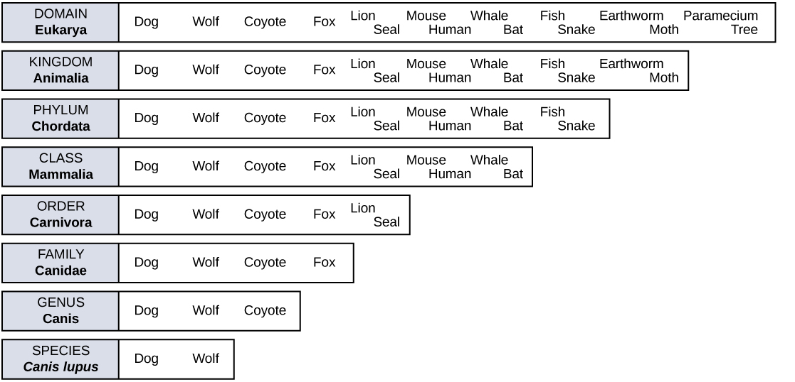

By the end of this section, you will be able to:
* Identify and describe the properties of life
* Describe the levels of organization among living things
* List examples of different sub disciplines in biology

**Biology**{: data-type="term"} is the science that studies life. What exactly is life? This may sound like a silly question with an obvious answer, but it is not easy to define life. For example, a branch of biology called virology studies viruses, which exhibit some of the characteristics of living entities but lack others. It turns out that although viruses can attack living organisms, cause diseases, and even reproduce, they do not meet the criteria that biologists use to define life.

From its earliest beginnings, biology has wrestled with four questions: What are the shared properties that make something “alive”? How do those various living things function? When faced with the remarkable diversity of life, how do we organize the different kinds of organisms so that we can better understand them? And, finally—what biologists ultimately seek to understand—how did this diversity arise and how is it continuing? As new organisms are discovered every day, biologists continue to seek answers to these and other questions.

### Properties of Life

All groups of living organisms share several key characteristics or functions: order, sensitivity or response to stimuli, reproduction, adaptation, growth and development, regulation, homeostasis, and energy processing. When viewed together, these eight characteristics serve to define life.

#### Order

Organisms are highly organized structures that consist of one or more cells. Even very simple, single-celled organisms are remarkably complex. Inside each cell, atoms make up molecules. These in turn make up cell components or organelles. Multicellular organisms, which may consist of millions of individual cells, have an advantage over single-celled organisms in that their cells can be specialized to perform specific functions, and even sacrificed in certain situations for the good of the organism as a whole. How these specialized cells come together to form organs such as the heart, lung, or skin in organisms like the toad shown in [\[link\]](#fig-ch01_01_01) will be discussed later.

 &quot;/Wikimedia Commons)"){: #fig-ch01_01_01}

#### Sensitivity or Response to Stimuli

Organisms respond to diverse stimuli. For example, plants can bend toward a source of light or respond to touch ([\[link\]](#fig-ch01_01_02)). Even tiny bacteria can move toward or away from chemicals (a process called chemotaxis) or light (phototaxis). Movement toward a stimulus is considered a positive response, while movement away from a stimulus is considered a negative response.

 will instantly droop and fold when touched. After a few minutes, the plant returns to its normal state. (credit: Alex Lomas)"){: #fig-ch01_01_02}

Concept in Action

Watch this [video][1]{: target="_window"} to see how the sensitive plant responds to a touch stimulus.

#### Reproduction

Single-celled organisms reproduce by first duplicating their DNA, which is the genetic material, and then dividing it equally as the cell prepares to divide to form two new cells. Many multicellular organisms (those made up of more than one cell) produce specialized reproductive cells that will form new individuals. When reproduction occurs, DNA containing genes is passed along to an organism’s offspring. These genes are the reason that the offspring will belong to the same species and will have characteristics similar to the parent, such as fur color and blood type.

#### Adaptation

All living organisms exhibit a “fit” to their environment. Biologists refer to this fit as adaptation and it is a consequence of evolution by natural selection, which operates in every lineage of reproducing organisms. Examples of adaptations are diverse and unique, from heat-resistant Archaea that live in boiling hot springs to the tongue length of a nectar-feeding moth that matches the size of the flower from which it feeds. All adaptations enhance the reproductive potential of the individual exhibiting them, including their ability to survive to reproduce. Adaptations are not constant. As an environment changes, natural selection causes the characteristics of the individuals in a population to track those changes.

#### Growth and Development

Organisms grow and develop according to specific instructions coded for by their genes. These genes provide instructions that will direct cellular growth and development, ensuring that a species’ young ([\[link\]](#fig-ch01_01_03)) will grow up to exhibit many of the same characteristics as its parents.

"){: #fig-ch01_01_03}

#### Regulation

Even the smallest organisms are complex and require multiple regulatory mechanisms to coordinate internal functions, such as the transport of nutrients, response to stimuli, and coping with environmental stresses. For example, organ systems such as the digestive or circulatory systems perform specific functions like carrying oxygen throughout the body, removing wastes, delivering nutrients to every cell, and cooling the body.

#### Homeostasis

To function properly, cells require appropriate conditions such as proper temperature, pH, and concentrations of diverse chemicals. These conditions may, however, change from one moment to the next. Organisms are able to maintain internal conditions within a narrow range almost constantly, despite environmental changes, through a process called **homeostasis**{: data-type="term"} or “steady state”—the ability of an organism to maintain constant internal conditions. For example, many organisms regulate their body temperature in a process known as thermoregulation. Organisms that live in cold climates, such as the polar bear ([\[link\]](#fig-ch01_01_04)), have body structures that help them withstand low temperatures and conserve body heat. In hot climates, organisms have methods (such as perspiration in humans or panting in dogs) that help them to shed excess body heat.

 "){: #fig-ch01_01_04}

#### Energy Processing

All organisms (such as the California condor shown in [\[link\]](#fig-ch01_01_05)) use a source of energy for their metabolic activities. Some organisms capture energy from the Sun and convert it into chemical energy in food; others use chemical energy from molecules they take in.

 "){: #fig-ch01_01_05}

### Levels of Organization of Living Things

Living things are highly organized and structured, following a hierarchy on a scale from small to large. The **atom**{: data-type="term"} is the smallest and most fundamental unit of matter. It consists of a nucleus surrounded by electrons. Atoms form molecules. A **molecule**{: data-type="term"} is a chemical structure consisting of at least two atoms held together by a chemical bond. Many molecules that are biologically important are **macromolecules**{: data-type="term"}, large molecules that are typically formed by combining smaller units called monomers. An example of a macromolecule is deoxyribonucleic acid (DNA) ([\[link\]](#fig-ch01_01_06)), which contains the instructions for the functioning of the organism that contains it.

 "){: #fig-ch01_01_06}

Concept in Action

To see an animation of this DNA molecule, click [here][2]{: target="_window"}.

Some cells contain aggregates of macromolecules surrounded by membranes; these are called **organelles**{: data-type="term"}. Organelles are small structures that exist within cells and perform specialized functions. All living things are made of cells; the **cell**{: data-type="term"} itself is the smallest fundamental unit of structure and function in living organisms. (This requirement is why viruses are not considered living: they are not made of cells. To make new viruses, they have to invade and hijack a living cell; only then can they obtain the materials they need to reproduce.) Some organisms consist of a single cell and others are multicellular. Cells are classified as prokaryotic or eukaryotic. **Prokaryotes**{: data-type="term"} are single-celled organisms that lack organelles surrounded by a membrane and do not have nuclei surrounded by nuclear membranes; in contrast, the cells of **eukaryotes**{: data-type="term"} do have membrane-bound organelles and nuclei.

In most multicellular organisms, cells combine to make **tissues**{: data-type="term"}, which are groups of similar cells carrying out the same function. **Organs**{: data-type="term"} are collections of tissues grouped together based on a common function. Organs are present not only in animals but also in plants. An **organ system**{: data-type="term"} is a higher level of organization that consists of functionally related organs. For example vertebrate animals have many organ systems, such as the circulatory system that transports blood throughout the body and to and from the lungs; it includes organs such as the heart and blood vessels. **Organisms**{: data-type="term"} are individual living entities. For example, each tree in a forest is an organism. Single-celled prokaryotes and single-celled eukaryotes are also considered organisms and are typically referred to as microorganisms.

Art Connection

![A flow chart shows the hierarchy of living organisms. From smallest to largest, this hierarchy includes: 1 An atom, with protons, neutrons and electrons. 2 Molecules such as the phospholipid shown, made up of atoms. 3 Organelles, such as Golgi apparatus and nuclei, that exist inside cells. 4 Cells, such as a red blood cell. 5 Tissues, such as human skin tissue. 6 Organs such as the stomach and intestine make up the human digestive system, an example of an organ system. 7 Organisms, populations and communities. In a park, each person is an organism. Together, all the people make up a population. All the plant and animal species in the park comprise a community. 8 Ecosystems: The ecosystem of Central Park in New York includes living organisms and the environment in which they live. 9 The biosphere: encompasses all the ecosystems on Earth.](../resources/Figure_01_01_07.png "From an atom to the entire Earth, biology examines all aspects of life. (credit &quot;molecule&quot;: modification of work by Jane Whitney; credit &quot;organelles&quot;: modification of work by Louisa Howard; credit &quot;cells&quot;: modification of work by Bruce Wetzel, Harry Schaefer, National Cancer Institute; credit &quot;tissue&quot;: modification of work by &quot;Kilbad&quot;/Wikimedia Commons; credit &quot;organs&quot;: modification of work by Mariana Ruiz Villareal, Joaquim Alves Gaspar; credit &quot;organisms&quot;: modification of work by Peter Dutton; credit &quot;ecosystem&quot;: modification of work by &quot;gigi4791&quot;/Flickr; credit &quot;biosphere&quot;: modification of work by NASA)"){: #fig-ch01_01_07}

Which of the following statements is false?

1.  Tissues exist within organs which exist within organ systems.
2.  Communities exist within populations which exist within ecosystems.
3.  Organelles exist within cells which exist within tissues.
4.  Communities exist within ecosystems which exist in the biosphere.
{: data-number-style="lower-alpha"}

All the individuals of a species living within a specific area are collectively called a **population**{: data-type="term"}. For example, a forest may include many white pine trees. All of these pine trees represent the population of white pine trees in this forest. Different populations may live in the same specific area. For example, the forest with the pine trees includes populations of flowering plants and also insects and microbial populations. A **community**{: data-type="term"} is the set of populations inhabiting a particular area. For instance, all of the trees, flowers, insects, and other populations in a forest form the forest’s community. The forest itself is an ecosystem. An **ecosystem**{: data-type="term"} consists of all the living things in a particular area together with the abiotic, or non-living, parts of that environment such as nitrogen in the soil or rainwater. At the highest level of organization ([\[link\]](#fig-ch01_01_07)), the **biosphere**{: data-type="term"} is the collection of all ecosystems, and it represents the zones of life on Earth. It includes land, water, and portions of the atmosphere.

### The Diversity of Life

The science of biology is very broad in scope because there is a tremendous diversity of life on Earth. The source of this diversity is **evolution**{: data-type="term"}, the process of gradual change during which new species arise from older species. Evolutionary biologists study the evolution of living things in everything from the microscopic world to ecosystems.

In the 18th century, a scientist named Carl Linnaeus first proposed organizing the known species of organisms into a hierarchical taxonomy. In this system, species that are most similar to each other are put together within a grouping known as a genus. Furthermore, similar genera (the plural of genus) are put together within a family. This grouping continues until all organisms are collected together into groups at the highest level. The current taxonomic system now has eight levels in its hierarchy, from lowest to highest, they are: species, genus, family, order, class, phylum, kingdom, domain. Thus species are grouped within genera, genera are grouped within families, families are grouped within orders, and so on ([\[link\]](#fig-ch01_01_08)).

 {: #fig-ch01_01_08}

The highest level, domain, is a relatively new addition to the system since the 1990s. Scientists now recognize three domains of life, the Eukarya, the Archaea, and the Bacteria. The domain Eukarya contains organisms that have cells with nuclei. It includes the kingdoms of fungi, plants, animals, and several kingdoms of protists. The Archaea, are single-celled organisms without nuclei and include many extremophiles that live in harsh environments like hot springs. The Bacteria are another quite different group of single-celled organisms without nuclei ([\[link\]](#fig-ch01_01_09)). Both the Archaea and the Bacteria are prokaryotes, an informal name for cells without nuclei. The recognition in the 1990s that certain “bacteria,” now known as the Archaea, were as different genetically and biochemically from other bacterial cells as they were from eukaryotes, motivated the recommendation to divide life into three domains. This dramatic change in our knowledge of the tree of life demonstrates that classifications are not permanent and will change when new information becomes available.

In addition to the hierarchical taxonomic system, Linnaeus was the first to name organisms using two unique names, now called the binomial naming system. Before Linnaeus, the use of common names to refer to organisms caused confusion because there were regional differences in these common names. Binomial names consist of the genus name (which is capitalized) and the species name (all lower-case). Both names are set in italics when they are printed. Every species is given a unique binomial which is recognized the world over, so that a scientist in any location can know which organism is being referred to. For example, the North American blue jay is known uniquely as *Cyanocitta cristata*. Our own species is *Homo sapiens*.

  bacterial cells belong to the domain Bacteria, while the (b) extremophiles, seen all together as colored mats in this hot spring, belong to domain Archaea. Both the (c) sunflower and (d) lion are part of domain Eukarya. (credit a: modification of work by Rocky Mountain Laboratories, NIAID, NIH; credit b: modification of work by Steve Jurvetson; credit c: modification of work by Michael Arrighi; credit d: modification of work by Frank Vassen)"){: #fig-ch01_01_09}

Evolution in Action

Carl Woese and the Phylogenetic TreeThe evolutionary relationships of various life forms on Earth can be summarized in a phylogenetic tree. A **phylogenetic tree**{: data-type="term"} is a diagram showing the evolutionary relationships among biological species based on similarities and differences in genetic or physical traits or both. A phylogenetic tree is composed of branch points, or nodes, and branches. The internal nodes represent ancestors and are points in evolution when, based on scientific evidence, an ancestor is thought to have diverged to form two new species. The length of each branch can be considered as estimates of relative time.

In the past, biologists grouped living organisms into five kingdoms: animals, plants, fungi, protists, and bacteria. The pioneering work of American microbiologist Carl Woese in the early 1970s has shown, however, that life on Earth has evolved along three lineages, now called domains—Bacteria, Archaea, and Eukarya. Woese proposed the domain as a new taxonomic level and Archaea as a new domain, to reflect the new phylogenetic tree ([\[link\]](#fig-ch01_01_10)). Many organisms belonging to the Archaea domain live under extreme conditions and are called extremophiles. To construct his tree, Woese used genetic relationships rather than similarities based on morphology (shape). Various genes were used in phylogenetic studies. Woese’s tree was constructed from comparative sequencing of the genes that are universally distributed, found in some slightly altered form in every organism, conserved (meaning that these genes have remained only slightly changed throughout evolution), and of an appropriate length.

"){: #fig-ch01_01_10}

### Branches of Biological Study

The scope of biology is broad and therefore contains many branches and sub disciplines. Biologists may pursue one of those sub disciplines and work in a more focused field. For instance, molecular biology studies biological processes at the molecular level, including interactions among molecules such as DNA, RNA, and proteins, as well as the way they are regulated. Microbiology is the study of the structure and function of microorganisms. It is quite a broad branch itself, and depending on the subject of study, there are also microbial physiologists, ecologists, and geneticists, among others.

Another field of biological study, neurobiology, studies the biology of the nervous system, and although it is considered a branch of biology, it is also recognized as an interdisciplinary field of study known as neuroscience. Because of its interdisciplinary nature, this sub discipline studies different functions of the nervous system using molecular, cellular, developmental, medical, and computational approaches.

 "){: #fig-ch01_01_11}

Paleontology, another branch of biology, uses fossils to study life’s history ([\[link\]](#fig-ch01_01_11)). Zoology and botany are the study of animals and plants, respectively. Biologists can also specialize as biotechnologists, ecologists, or physiologists, to name just a few areas. Biotechnologists apply the knowledge of biology to create useful products. Ecologists study the interactions of organisms in their environments. Physiologists study the workings of cells, tissues and organs. This is just a small sample of the many fields that biologists can pursue. From our own bodies to the world we live in, discoveries in biology can affect us in very direct and important ways. We depend on these discoveries for our health, our food sources, and the benefits provided by our ecosystem. Because of this, knowledge of biology can benefit us in making decisions in our day-to-day lives.

The development of technology in the twentieth century that continues today, particularly the technology to describe and manipulate the genetic material, DNA, has transformed biology. This transformation will allow biologists to continue to understand the history of life in greater detail, how the human body works, our human origins, and how humans can survive as a species on this planet despite the stresses caused by our increasing numbers. Biologists continue to decipher huge mysteries about life suggesting that we have only begun to understand life on the planet, its history, and our relationship to it. For this and other reasons, the knowledge of biology gained through this textbook and other printed and electronic media should be a benefit in whichever field you enter.

Careers in Action

Forensic ScientistForensic science is the application of science to answer questions related to the law. Biologists as well as chemists and biochemists can be forensic scientists. Forensic scientists provide scientific evidence for use in courts, and their job involves examining trace material associated with crimes. Interest in forensic science has increased in the last few years, possibly because of popular television shows that feature forensic scientists on the job. Also, the development of molecular techniques and the establishment of DNA databases have updated the types of work that forensic scientists can do. Their job activities are primarily related to crimes against people such as murder, rape, and assault. Their work involves analyzing samples such as hair, blood, and other body fluids and also processing DNA ([\[link\]](#fig-ch01_01_12)) found in many different environments and materials. Forensic scientists also analyze other biological evidence left at crime scenes, such as insect parts or pollen grains. Students who want to pursue careers in forensic science will most likely be required to take chemistry and biology courses as well as some intensive math courses.

"){: #fig-ch01_01_12}

### Section Summary

Biology is the science of life. All living organisms share several key properties such as order, sensitivity or response to stimuli, reproduction, adaptation, growth and development, regulation, homeostasis, and energy processing. Living things are highly organized following a hierarchy that includes atoms, molecules, organelles, cells, tissues, organs, and organ systems. Organisms, in turn, are grouped as populations, communities, ecosystems, and the biosphere. Evolution is the source of the tremendous biological diversity on Earth today. A diagram called a phylogenetic tree can be used to show evolutionary relationships among organisms. Biology is very broad and includes many branches and sub disciplines. Examples include molecular biology, microbiology, neurobiology, zoology, and botany, among others.

### Art Connections

[[link]](#fig-ch01_01_07) Which of the following statements is false?

1.  Tissues exist within organs which exist within organ systems.
2.  Communities exist within populations which exist within ecosystems.
3.  Organelles exist within cells which exist within tissues.
4.  Communities exist within ecosystems which exist in the biosphere.
{: data-number-style="upper-alpha"}

[[link]](#fig-ch01_01_07) B

### Multiple Choice

The smallest unit of biological structure that meets the functional requirements of “living” is the \_\_\_\_\_\_\_\_.

1.  organ
2.  organelle
3.  cell
4.  macromolecule
{: data-number-style="lower-alpha"}

C

Which of the following sequences represents the hierarchy of biological organization from the most complex to the least complex level?

1.  organelle, tissue, biosphere, ecosystem, population
2.  organ, organism, tissue, organelle, molecule
3.  organism, community, biosphere, molecule, tissue, organ
4.  biosphere, ecosystem, community, population, organism
{: data-number-style="lower-alpha"}

D

### Free Response

Using examples, explain how biology can be studied from a microscopic approach to a global approach.

Researchers can approach biology from the smallest to the largest, and everything in between. For instance, an ecologist may study a population of individuals, the population’s community, the community’s ecosystem, and the ecosystem’s part in the biosphere. When studying an individual organism, a biologist could examine the cell and its organelles, the tissues that the cells make up, the organs and their respective organ systems, and the sum total—the organism itself.

### Glossary
{: data-type="glossary-title"}

atom
: a basic unit of matter that cannot be broken down by normal chemical reactions
^

biology
: the study of living organisms and their interactions with one another and their environments
^

biosphere
: a collection of all ecosystems on Earth
^

cell
: the smallest fundamental unit of structure and function in living things
^

community
: a set of populations inhabiting a particular area
^

ecosystem
: all living things in a particular area together with the abiotic, nonliving parts of that environment
^

eukaryote
: an organism with cells that have nuclei and membrane-bound organelles
^

evolution
: the process of gradual change in a population that can also lead to new species arising from older species
^

homeostasis
: the ability of an organism to maintain constant internal conditions
^

macromolecule
: a large molecule typically formed by the joining of smaller molecules
^

molecule
: a chemical structure consisting of at least two atoms held together by a chemical bond
^

organ
: a structure formed of tissues operating together to perform a common function
^

organ system
: the higher level of organization that consists of functionally related organs
^

organelle
: a membrane-bound compartment or sac within a cell
^

organism
: an individual living entity
^

phylogenetic tree
: a diagram showing the evolutionary relationships among biological species based on similarities and differences in genetic or physical traits or both
^

population
: all individuals within a species living within a specific area
^

prokaryote
: a unicellular organism that lacks a nucleus or any other membrane-bound organelle
^

tissue
: a group of similar cells carrying out the same function

[1]: http://openstaxcollege.org/l/thigmonasty
[2]: http://openstaxcollege.org/l/rotating_DNA2
