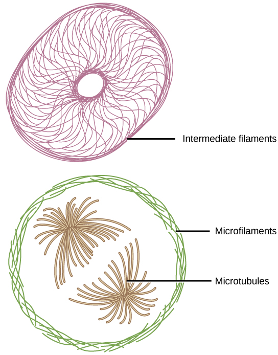
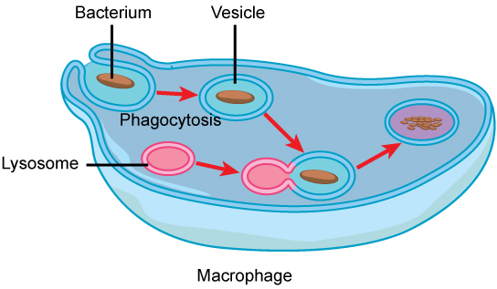

By the end of this section, you will be able to:
* Describe the structure of eukaryotic plant and animal cells
* State the role of the plasma membrane
* Summarize the functions of the major cell organelles
* Describe the cytoskeleton and extracellular matrix

At this point, it should be clear that eukaryotic cells have a more complex structure than do prokaryotic cells. Organelles allow for various functions to occur in the cell at the same time. Before discussing the functions of organelles within a eukaryotic cell, let us first examine two important components of the cell: the plasma membrane and the cytoplasm.

Art Connection

<figure markdown="1" id="fig-ch03_03_01" data-orient="vertical">
<figcaption>
This figure shows (a) a typical animal cell and (b) a typical plant cell.
</figcaption>
![Part a: This illustration shows a typical eukaryotic cell, which is egg shaped. The fluid inside the cell is called the cytoplasm, and the cell is surrounded by a cell membrane. The nucleus takes up about one-half of the width of the cell. Inside the nucleus is the chromatin, which is comprised of DNA and associated proteins. A region of the chromatin is condensed into the nucleolus, a structure in which ribosomes are synthesized. The nucleus is encased in a nuclear envelope, which is perforated by protein-lined pores that allow entry of material into the nucleus.  The nucleus is surrounded by the rough and smooth endoplasmic reticulum, or ER. The smooth ER is the site of lipid synthesis. The rough ER has embedded ribosomes that give it a bumpy appearance. It synthesizes membrane and secretory proteins. Besides the ER, many other organelles float inside the cytoplasm. These include the Golgi apparatus, which modifies proteins and lipids synthesized in the ER. The Golgi apparatus is made of layers of flat membranes. Mitochondria, which produce energy for the cell, have an outer membrane and a highly folded inner membrane. Other, smaller organelles include peroxisomes that metabolize waste, lysosomes that digest food, and vacuoles. Ribosomes, responsible for protein synthesis, also float freely in the cytoplasm and are depicted as small dots. The last cellular component shown is the cytoskeleton, which has four different types of components: microfilaments, intermediate filaments, microtubules, and centrosomes. Microfilaments are fibrous proteins that line the cell membrane and make up the cellular cortex. Intermediate filaments are fibrous proteins that hold organelles in place. Microtubules form the mitotic spindle and maintain cell shape. Centrosomes are made of two tubular structures at right angles to one another. They form the microtubule-organizing center.](../resources/Figure_03_03_01a_new.png){: data-media-type="image/jpg"}

![Part b: This illustration depicts a typical eukaryotic plant cell. The nucleus of a plant cell contains chromatin and a nucleolus, the same as in an animal cell. Other structures that a plant cell has in common with an animal cell include rough and smooth ER, the Golgi apparatus, mitochondria, peroxisomes, and ribosomes. The fluid inside the plant cell is called the cytoplasm, just as in an animal cell. The plant cell has three of the four cytoskeletal components found in animal cells: microtubules, intermediate filaments, and microfilaments. Plant cells do not have centrosomes. Plants have five structures not found in animals cells: plasmodesmata, chloroplasts, plastids, a central vacuole, and a cell wall. Plasmodesmata form channels between adjacent plant cells. Chloroplasts are responsible for photosynthesis; they have an outer membrane, an inner membrane, and stack of membranes inside the inner membrane. The central vacuole is a very large, fluid-filled structure that maintains pressure against the cell wall. Plastids store pigments. The cell wall is localized outside the cell membrane.](../resources/Figure_03_03_01b_new.png){: data-media-type="image/jpg"}

</figure>

What structures does a plant cell have that an animal cell does not have? What structures does an animal cell have that a plant cell does not have?

<!-- <para><link window="new"  target-id="fig-ch03_03_01" document=""/>Plant cells have plasmodesmata, a cell wall, a large central vacuole, chloroplasts, and plastids. Animal cells have lysosomes and centrosomes.</para> -->

# The Plasma Membrane

Like prokaryotes, eukaryotic cells have a **plasma membrane**{: data-type="term"} ([\[link\]](#fig-ch03_03_02)) made up of a phospholipid bilayer with embedded proteins that separates the internal contents of the cell from its surrounding environment. A phospholipid is a lipid molecule composed of two fatty acid chains, a glycerol backbone, and a phosphate group. The plasma membrane regulates the passage of some substances, such as organic molecules, ions, and water, preventing the passage of some to maintain internal conditions, while actively bringing in or removing others. Other compounds move passively across the membrane.

![the plasma membrane is composed of a phospholipid bilayer. in the bilayer, the two long hydrophobic tails of phospholipids face toward the center, and the hydrophilic head group faces the exterior. Integral membrane proteins and protein channels span the entire bilayer. Protein channels have a pore in the middle. Peripheral membrane proteins sit on the surface of the phospholipids and are associated with the head groups. On the exterior side of the membrane, carbohydrates are attached to certain proteins and lipids. Filaments of the cytoskeleton line the interior of the membrane.](../resources/Figure_03_03_02.jpg "The plasma membrane is a phospholipid bilayer with embedded proteins. There are other components, such as cholesterol and carbohydrates, which can be found in the membrane in addition to phospholipids and protein."){: #fig-ch03_03_02 data-media-type="image/jpg"}

The plasma membranes of cells that specialize in absorption are folded into fingerlike projections called microvilli (singular = microvillus). This folding increases the surface area of the plasma membrane. Such cells are typically found lining the small intestine, the organ that absorbs nutrients from digested food. This is an excellent example of form matching the function of a structure.

People with celiac disease have an immune response to gluten, which is a protein found in wheat, barley, and rye. The immune response damages microvilli, and thus, afflicted individuals cannot absorb nutrients. This leads to malnutrition, cramping, and diarrhea. Patients suffering from celiac disease must follow a gluten-free diet.

# The Cytoplasm

The **cytoplasm**{: data-type="term"} comprises the contents of a cell between the plasma membrane and the nuclear envelope (a structure to be discussed shortly). It is made up of organelles suspended in the gel-like **cytosol**{: data-type="term"}, the cytoskeleton, and various chemicals ([\[link\]](#fig-ch03_03_01)). Even though the cytoplasm consists of 70 to 80 percent water, it has a semi-solid consistency, which comes from the proteins within it. However, proteins are not the only organic molecules found in the cytoplasm. Glucose and other simple sugars, polysaccharides, amino acids, nucleic acids, fatty acids, and derivatives of glycerol are found there too. Ions of sodium, potassium, calcium, and many other elements are also dissolved in the cytoplasm. Many metabolic reactions, including protein synthesis, take place in the cytoplasm.

# The Cytoskeleton

If you were to remove all the organelles from a cell, would the plasma membrane and the cytoplasm be the only components left? No. Within the cytoplasm, there would still be ions and organic molecules, plus a network of protein fibers that helps to maintain the shape of the cell, secures certain organelles in specific positions, allows cytoplasm and vesicles to move within the cell, and enables unicellular organisms to move independently. Collectively, this network of protein fibers is known as the **cytoskeleton**{: data-type="term"}. There are three types of fibers within the cytoskeleton: microfilaments, also known as actin filaments, intermediate filaments, and microtubules ([\[link\]](#fig-ch03_03_03)).

 {: #fig-ch03_03_03 data-media-type="image/jpg"}

Microfilaments are the thinnest of the cytoskeletal fibers and function in moving cellular components, for example, during cell division. They also maintain the structure of microvilli, the extensive folding of the plasma membrane found in cells dedicated to absorption. These components are also common in muscle cells and are responsible for muscle cell contraction. Intermediate filaments are of intermediate diameter and have structural functions, such as maintaining the shape of the cell and anchoring organelles. Keratin, the compound that strengthens hair and nails, forms one type of intermediate filament. Microtubules are the thickest of the cytoskeletal fibers. These are hollow tubes that can dissolve and reform quickly. Microtubules guide organelle movement and are the structures that pull chromosomes to their poles during cell division. They are also the structural components of flagella and cilia. In cilia and flagella, the microtubules are organized as a circle of nine double microtubules on the outside and two microtubules in the center.

The centrosome is a region near the nucleus of animal cells that functions as a microtubule-organizing center. It contains a pair of centrioles, two structures that lie perpendicular to each other. Each centriole is a cylinder of nine triplets of microtubules.

The centrosome replicates itself before a cell divides, and the centrioles play a role in pulling the duplicated chromosomes to opposite ends of the dividing cell. However, the exact function of the centrioles in cell division is not clear, since cells that have the centrioles removed can still divide, and plant cells, which lack centrioles, are capable of cell division.

## Flagella and Cilia

**Flagella**{: data-type="term"} (singular = flagellum) are long, hair-like structures that extend from the plasma membrane and are used to move an entire cell, (for example, sperm, *Euglena*). When present, the cell has just one flagellum or a few flagella. When **cilia**{: data-type="term"} (singular = cilium) are present, however, they are many in number and extend along the entire surface of the plasma membrane. They are short, hair-like structures that are used to move entire cells (such as paramecium) or move substances along the outer surface of the cell (for example, the cilia of cells lining the fallopian tubes that move the ovum toward the uterus, or cilia lining the cells of the respiratory tract that move particulate matter toward the throat that mucus has trapped).

# The Endomembrane System

The **endomembrane system**{: data-type="term"} (*endo* = within) is a group of membranes and organelles ([\[link\]](#fig-ch03_03_04)) in eukaryotic cells that work together to modify, package, and transport lipids and proteins. It includes the nuclear envelope, lysosomes, and vesicles, the endoplasmic reticulum and Golgi apparatus, which we will cover shortly. Although not technically *within* the cell, the plasma membrane is included in the endomembrane system because, as you will see, it interacts with the other endomembranous organelles.

## The Nucleus

Typically, the nucleus is the most prominent organelle in a cell ([\[link\]](#fig-ch03_03_01)). The **nucleus**{: data-type="term"} (plural = nuclei) houses the cell’s DNA in the form of chromatin and directs the synthesis of ribosomes and proteins. Let us look at it in more detail ([\[link\]](#fig-ch03_03_05)).

 &#x2014;an outer membrane and an inner membrane&#x2014;in contrast to the plasma membrane ([link]), which consists of only one phospholipid bilayer. (credit: modification of work by NIGMS, NIH)"){: #fig-ch03_03_05 data-media-type="image/jpg"}

The **nuclear envelope**{: data-type="term"} is a double-membrane structure that constitutes the outermost portion of the nucleus ([\[link\]](#fig-ch03_03_05)). Both the inner and outer membranes of the nuclear envelope are phospholipid bilayers.

The nuclear envelope is punctuated with pores that control the passage of ions, molecules, and RNA between the nucleoplasm and the cytoplasm.

To understand chromatin, it is helpful to first consider chromosomes. Chromosomes are structures within the nucleus that are made up of DNA, the hereditary material, and proteins. This combination of DNA and proteins is called chromatin. In eukaryotes, chromosomes are linear structures. Every species has a specific number of chromosomes in the nucleus of its body cells. For example, in humans, the chromosome number is 46, whereas in fruit flies, the chromosome number is eight.

Chromosomes are only visible and distinguishable from one another when the cell is getting ready to divide. When the cell is in the growth and maintenance phases of its life cycle, the chromosomes resemble an unwound, jumbled bunch of threads.

We already know that the nucleus directs the synthesis of ribosomes, but how does it do this? Some chromosomes have sections of DNA that encode ribosomal RNA. A darkly staining area within the nucleus, called the **nucleolus**{: data-type="term"} (plural = nucleoli), aggregates the ribosomal RNA with associated proteins to assemble the ribosomal subunits that are then transported through the nuclear pores into the cytoplasm.

## The Endoplasmic Reticulum

The **endoplasmic reticulum (ER)**{: data-type="term"} ([\[link\]](#fig-ch03_03_04)) is a series of interconnected membranous tubules that collectively modify proteins and synthesize lipids. However, these two functions are performed in separate areas of the endoplasmic reticulum: the rough endoplasmic reticulum and the smooth endoplasmic reticulum, respectively.

The hollow portion of the ER tubules is called the lumen or cisternal space. The membrane of the ER, which is a phospholipid bilayer embedded with proteins, is continuous with the nuclear envelope.

The **rough endoplasmic reticulum (RER)**{: data-type="term"} is so named because the ribosomes attached to its cytoplasmic surface give it a studded appearance when viewed through an electron microscope.

The ribosomes synthesize proteins while attached to the ER, resulting in transfer of their newly synthesized proteins into the lumen of the RER where they undergo modifications such as folding or addition of sugars. The RER also makes phospholipids for cell membranes.

If the phospholipids or modified proteins are not destined to stay in the RER, they will be packaged within vesicles and transported from the RER by budding from the membrane ([\[link\]](#fig-ch03_03_04)). Since the RER is engaged in modifying proteins that will be secreted from the cell, it is abundant in cells that secrete proteins, such as the liver.

The **smooth endoplasmic reticulum (SER)**{: data-type="term"} is continuous with the RER but has few or no ribosomes on its cytoplasmic surface (see [\[link\]](#fig-ch03_03_01)). The SER’s functions include synthesis of carbohydrates, lipids (including phospholipids), and steroid hormones; detoxification of medications and poisons; alcohol metabolism; and storage of calcium ions.

## The Golgi Apparatus

We have already mentioned that vesicles can bud from the ER, but where do the vesicles go? Before reaching their final destination, the lipids or proteins within the transport vesicles need to be sorted, packaged, and tagged so that they wind up in the right place. The sorting, tagging, packaging, and distribution of lipids and proteins take place in the **Golgi apparatus**{: data-type="term"} (also called the Golgi body), a series of flattened membranous sacs ([\[link\]](#fig-ch03_03_06)).

 "){: #fig-ch03_03_06 data-media-type="image/jpg"}

The Golgi apparatus has a receiving face near the endoplasmic reticulum and a releasing face on the side away from the ER, toward the cell membrane. The transport vesicles that form from the ER travel to the receiving face, fuse with it, and empty their contents into the lumen of the Golgi apparatus. As the proteins and lipids travel through the Golgi, they undergo further modifications. The most frequent modification is the addition of short chains of sugar molecules. The newly modified proteins and lipids are then tagged with small molecular groups to enable them to be routed to their proper destinations.

Finally, the modified and tagged proteins are packaged into vesicles that bud from the opposite face of the Golgi. While some of these vesicles, transport vesicles, deposit their contents into other parts of the cell where they will be used, others, secretory vesicles, fuse with the plasma membrane and release their contents outside the cell.

The amount of Golgi in different cell types again illustrates that form follows function within cells. Cells that engage in a great deal of secretory activity (such as cells of the salivary glands that secrete digestive enzymes or cells of the immune system that secrete antibodies) have an abundant number of Golgi.

In plant cells, the Golgi has an additional role of synthesizing polysaccharides, some of which are incorporated into the cell wall and some of which are used in other parts of the cell.

## Lysosomes

In animal cells, the **lysosomes**{: data-type="term"} are the cell’s “garbage disposal.” Digestive enzymes within the lysosomes aid the breakdown of proteins, polysaccharides, lipids, nucleic acids, and even worn-out organelles. In single-celled eukaryotes, lysosomes are important for digestion of the food they ingest and the recycling of organelles. These enzymes are active at a much lower pH (more acidic) than those located in the cytoplasm. Many reactions that take place in the cytoplasm could not occur at a low pH, thus the advantage of compartmentalizing the eukaryotic cell into organelles is apparent.

Lysosomes also use their hydrolytic enzymes to destroy disease-causing organisms that might enter the cell. A good example of this occurs in a group of white blood cells called macrophages, which are part of your body’s immune system. In a process known as phagocytosis, a section of the plasma membrane of the macrophage invaginates (folds in) and engulfs a pathogen. The invaginated section, with the pathogen inside, then pinches itself off from the plasma membrane and becomes a vesicle. The vesicle fuses with a lysosome. The lysosome’s hydrolytic enzymes then destroy the pathogen ([\[link\]](#fig-ch03_03_07)).

 {: #fig-ch03_03_07 data-media-type="image/jpg"}

## Vesicles and Vacuoles

**Vesicles**{: data-type="term"} and **vacuoles**{: data-type="term"} are membrane-bound sacs that function in storage and transport. Vacuoles are somewhat larger than vesicles, and the membrane of a vacuole does not fuse with the membranes of other cellular components. Vesicles can fuse with other membranes within the cell system. Additionally, enzymes within plant vacuoles can break down macromolecules.

Art Connection

![This figure shows the nucleus, rough ER, Golgi apparatus, vesicles, and plasma membrane. The right side of the rough ER is shown with an integral membrane protein embedded in it. The part of the protein facing the inside of the ER has a carbohydrate attached to it. The protein is shown leaving the ER in a vesicle that fuses with the cis face of the Golgi apparatus. The Golgi apparatus consists of several layers of membranes, called cisternae. As the protein passes through the cisternae, it is further modified by the addition of more carbohydrates. Eventually, it leaves the trans face of the Golgi in a vesicle. The vesicle fuses with the cell membrane so that the carbohydrate that was on the inside of the vesicle faces the outside of the membrane. At the same time, the contents of the vesicle are released from the cell.](../resources/Figure_03_03_04.png "The endomembrane system works to modify, package, and transport lipids and proteins. (credit: modification of work by Magnus Manske)"){: #fig-ch03_03_04 data-media-type="image/png"}

Why does the *cis* face of the Golgi not face the plasma membrane?

<!-- <para><link window="new"  target-id="fig-ch03_03_04" document=""/> Because that face receives chemicals from the ER, which is toward the center of the cell.</para> -->

# Ribosomes

**Ribosomes**{: data-type="term"} are the cellular structures responsible for protein synthesis. When viewed through an electron microscope, free ribosomes appear as either clusters or single tiny dots floating freely in the cytoplasm. Ribosomes may be attached to either the cytoplasmic side of the plasma membrane or the cytoplasmic side of the endoplasmic reticulum ([\[link\]](#fig-ch03_03_01)). Electron microscopy has shown that ribosomes consist of large and small subunits. Ribosomes are enzyme complexes that are responsible for protein synthesis.

Because protein synthesis is essential for all cells, ribosomes are found in practically every cell, although they are smaller in prokaryotic cells. They are particularly abundant in immature red blood cells for the synthesis of hemoglobin, which functions in the transport of oxygen throughout the body.

# Mitochondria

**Mitochondria**{: data-type="term"} (singular = mitochondrion) are often called the “powerhouses” or “energy factories” of a cell because they are responsible for making adenosine triphosphate (ATP), the cell’s main energy-carrying molecule. The formation of ATP from the breakdown of glucose is known as cellular respiration. Mitochondria are oval-shaped, double-membrane organelles ([\[link\]](#fig-ch03_03_08)) that have their own ribosomes and DNA. Each membrane is a phospholipid bilayer embedded with proteins. The inner layer has folds called cristae, which increase the surface area of the inner membrane. The area surrounded by the folds is called the mitochondrial matrix. The cristae and the matrix have different roles in cellular respiration.

In keeping with our theme of form following function, it is important to point out that muscle cells have a very high concentration of mitochondria because muscle cells need a lot of energy to contract.

 "){: #fig-ch03_03_08 data-media-type="image/jpg"}

# Peroxisomes

**Peroxisomes**{: data-type="term"} are small, round organelles enclosed by single membranes. They carry out oxidation reactions that break down fatty acids and amino acids. They also detoxify many poisons that may enter the body. Alcohol is detoxified by peroxisomes in liver cells. A byproduct of these oxidation reactions is hydrogen peroxide, H2O2, which is contained within the peroxisomes to prevent the chemical from causing damage to cellular components outside of the organelle. Hydrogen peroxide is safely broken down by peroxisomal enzymes into water and oxygen.

# Animal Cells versus Plant Cells

Despite their fundamental similarities, there are some striking differences between animal and plant cells (see [\[link\]](#fs-idp27375984)). Animal cells have centrioles, centrosomes (discussed under the cytoskeleton), and lysosomes, whereas plant cells do not. Plant cells have a cell wall, chloroplasts, plasmodesmata, and plastids used for storage, and a large central vacuole, whereas animal cells do not.

## The Cell Wall

In [\[link\]](#fig-ch03_03_01)**b**, the diagram of a plant cell, you see a structure external to the plasma membrane called the cell wall. The **cell wall**{: data-type="term"} is a rigid covering that protects the cell, provides structural support, and gives shape to the cell. Fungal and protist cells also have cell walls.

While the chief component of prokaryotic cell walls is peptidoglycan, the major organic molecule in the plant cell wall is cellulose, a polysaccharide made up of long, straight chains of glucose units. When nutritional information refers to dietary fiber, it is referring to the cellulose content of food.

## Chloroplasts

Like mitochondria, chloroplasts also have their own DNA and ribosomes. **Chloroplasts**{: data-type="term"} function in photosynthesis and can be found in eukaryotic cells such as plants and algae. In photosynthesis, carbon dioxide, water, and light energy are used to make glucose and oxygen. This is the major difference between plants and animals: Plants (autotrophs) are able to make their own food, like glucose, whereas animals (heterotrophs) must rely on other organisms for their organic compounds or food source.

Like mitochondria, chloroplasts have outer and inner membranes, but within the space enclosed by a chloroplast’s inner membrane is a set of interconnected and stacked, fluid-filled membrane sacs called thylakoids ([\[link\]](#fig-ch03_03_09)). Each stack of thylakoids is called a granum (plural = grana). The fluid enclosed by the inner membrane and surrounding the grana is called the stroma.

 {: #fig-ch03_03_09 data-media-type="image/jpg"}

The chloroplasts contain a green pigment called chlorophyll, which captures the energy of sunlight for photosynthesis. Like plant cells, photosynthetic protists also have chloroplasts. Some bacteria also perform photosynthesis, but they do not have chloroplasts. Their photosynthetic pigments are located in the thylakoid membrane within the cell itself.

Evolution in Action

EndosymbiosisWe have mentioned that both mitochondria and chloroplasts contain DNA and ribosomes. Have you wondered why? Strong evidence points to endosymbiosis as the explanation.

Symbiosis is a relationship in which organisms from two separate species live in close association and typically exhibit specific adaptations to each other. Endosymbiosis (*endo-*= within) is a relationship in which one organism lives inside the other. Endosymbiotic relationships abound in nature. Microbes that produce vitamin K live inside the human gut. This relationship is beneficial for us because we are unable to synthesize vitamin K. It is also beneficial for the microbes because they are protected from other organisms and are provided a stable habitat and abundant food by living within the large intestine.

Scientists have long noticed that bacteria, mitochondria, and chloroplasts are similar in size. We also know that mitochondria and chloroplasts have DNA and ribosomes, just as bacteria do. Scientists believe that host cells and bacteria formed a mutually beneficial endosymbiotic relationship when the host cells ingested aerobic bacteria and cyanobacteria but did not destroy them. Through evolution, these ingested bacteria became more specialized in their functions, with the aerobic bacteria becoming mitochondria and the photosynthetic bacteria becoming chloroplasts.

## The Central Vacuole

Previously, we mentioned vacuoles as essential components of plant cells. If you look at [\[link\]](#fig-ch03_03_01), you will see that plant cells each have a large, central vacuole that occupies most of the cell. The **central vacuole**{: data-type="term"} plays a key role in regulating the cell’s concentration of water in changing environmental conditions. In plant cells, the liquid inside the central vacuole provides turgor pressure, which is the outward pressure caused by the fluid inside the cell. Have you ever noticed that if you forget to water a plant for a few days, it wilts? That is because as the water concentration in the soil becomes lower than the water concentration in the plant, water moves out of the central vacuoles and cytoplasm and into the soil. As the central vacuole shrinks, it leaves the cell wall unsupported. This loss of support to the cell walls of a plant results in the wilted appearance. Additionally, this fluid has a very bitter taste, which discourages consumption by insects and animals. The central vacuole also functions to store proteins in developing seed cells.

# Extracellular Matrix of Animal Cells

Most animal cells release materials into the extracellular space. The primary components of these materials are glycoproteins and the protein collagen. Collectively, these materials are called the **extracellular matrix**{: data-type="term"} ([\[link\]](#fig-ch03_03_10)). Not only does the extracellular matrix hold the cells together to form a tissue, but it also allows the cells within the tissue to communicate with each other.

 ![This illustration shows the plasma membrane. Embedded in the plasma membrane are integral membrane proteins called integrins. On the exterior of the cell is a vast network of collagen fibers, which are attached to the integrins via a protein called fibronectin. Proteoglycan complexes also extend from the plasma membrane into the extracellular matrix. A magnified view shows that each proteoglycan complex is composed of a polysaccharide core. Proteins branch from this core, and carbohydrates branch from the proteins. The inside of the cytoplasmic membrane is lined with microfilaments of the cytoskeleton.](../resources/Figure_03_03_10.jpg "The extracellular matrix consists of a network of substances secreted by cells."){: #fig-ch03_03_10 data-media-type="image/jpg"}

Blood clotting provides an example of the role of the extracellular matrix in cell communication. When the cells lining a blood vessel are damaged, they display a protein receptor called tissue factor. When tissue factor binds with another factor in the extracellular matrix, it causes platelets to adhere to the wall of the damaged blood vessel, stimulates adjacent smooth muscle cells in the blood vessel to contract (thus constricting the blood vessel), and initiates a series of steps that stimulate the platelets to produce clotting factors.

# Intercellular Junctions

Cells can also communicate with each other by direct contact, referred to as intercellular junctions. There are some differences in the ways that plant and animal cells do this. **Plasmodesmata**{: data-type="term"} (singular = plasmodesma) are junctions between plant cells, whereas animal cell contacts include tight and gap junctions, and desmosomes.

In general, long stretches of the plasma membranes of neighboring plant cells cannot touch one another because they are separated by the cell walls surrounding each cell. Plasmodesmata are numerous channels that pass between the cell walls of adjacent plant cells, connecting their cytoplasm and enabling signal molecules and nutrients to be transported from cell to cell ([\[link\]](#fig-ch03_03_11)**a**).

 ![Part a shows two plant cells side-by-side. A channel, or plasmodesma, in the cell wall allows fluid and small molecules to pass from the cytoplasm of one cell to the cytoplasm of another. Part b shows two cell membranes joined together by a matrix of tight junctions. Part c shows two cells fused together by a desmosome. Cadherins extend out from each cell and join the two cells together. Intermediate filaments connect to cadherins on the inside of the cell. Part d shows two cells joined together with protein pores called gap junctions that allow water and small molecules to pass through.](../resources/Figure_03_03_11abcd.jpg "There are four kinds of connections between cells. (a) A plasmodesma is a channel between the cell walls of two adjacent plant cells. (b) Tight junctions join adjacent animal cells. (c) Desmosomes join two animal cells together. (d) Gap junctions act as channels between animal cells. (credit b, c, d: modification of work by Mariana Ruiz Villareal)"){: #fig-ch03_03_11 data-media-type="image/jpg"}

A **tight junction**{: data-type="term"} is a watertight seal between two adjacent animal cells ([\[link\]](#fig-ch03_03_11)**b**). Proteins hold the cells tightly against each other. This tight adhesion prevents materials from leaking between the cells. Tight junctions are typically found in the epithelial tissue that lines internal organs and cavities, and composes most of the skin. For example, the tight junctions of the epithelial cells lining the urinary bladder prevent urine from leaking into the extracellular space.

Also found only in animal cells are **desmosomes**{: data-type="term"}, which act like spot welds between adjacent epithelial cells ([\[link\]](#fig-ch03_03_11)**c**). They keep cells together in a sheet-like formation in organs and tissues that stretch, like the skin, heart, and muscles.

**Gap junctions**{: data-type="term"} in animal cells are like plasmodesmata in plant cells in that they are channels between adjacent cells that allow for the transport of ions, nutrients, and other substances that enable cells to communicate ([\[link\]](#fig-ch03_03_11)**d**). Structurally, however, gap junctions and plasmodesmata differ.

<table summary="03_03_01"><thead>
<tr>
<th colspan="5">Components of Prokaryotic and Eukaryotic Cells and Their Functions</th>
</tr>
<tr>
<th>Cell Component</th>
<th>Function</th>
<th>Present in Prokaryotes?</th>
<th>Present in Animal Cells?</th>
<th>Present in Plant Cells?</th>
</tr>
</thead><tbody>
<tr>
<td>Plasma membrane</td>
<td>Separates cell from external environment; controls passage of organic molecules, ions, water, oxygen, and wastes into and out of the cell</td>
<td>Yes</td>
<td>Yes</td>
<td>Yes</td>
</tr>
<tr>
<td>Cytoplasm</td>
<td>Provides structure to cell; site of many metabolic reactions; medium in which organelles are found</td>
<td>Yes</td>
<td>Yes</td>
<td>Yes</td>
</tr>
<tr>
<td>Nucleoid</td>
<td>Location of DNA</td>
<td>Yes</td>
<td>No</td>
<td>No</td>
</tr>
<tr>
<td>Nucleus</td>
<td>Cell organelle that houses DNA and directs synthesis of ribosomes and proteins</td>
<td>No</td>
<td>Yes</td>
<td>Yes</td>
</tr>
<tr>
<td>Ribosomes</td>
<td>Protein synthesis</td>
<td>Yes</td>
<td>Yes</td>
<td>Yes</td>
</tr>
<tr>
<td>Mitochondria</td>
<td>ATP production/cellular respiration</td>
<td>No</td>
<td>Yes</td>
<td>Yes</td>
</tr>
<tr>
<td>Peroxisomes</td>
<td>Oxidizes and breaks down fatty acids and amino acids, and detoxifies poisons</td>
<td>No</td>
<td>Yes</td>
<td>Yes</td>
</tr>
<tr>
<td>Vesicles and vacuoles</td>
<td>Storage and transport; digestive function in plant cells</td>
<td>No</td>
<td>Yes</td>
<td>Yes</td>
</tr>
<tr>
<td>Centrosome</td>
<td>Unspecified role in cell division in animal cells; organizing center of microtubules in animal cells</td>
<td>No</td>
<td>Yes</td>
<td>No</td>
</tr>
<tr>
<td>Lysosomes</td>
<td>Digestion of macromolecules; recycling of worn-out organelles</td>
<td>No</td>
<td>Yes</td>
<td>No</td>
</tr>
<tr>
<td>Cell wall</td>
<td>Protection, structural support and maintenance of cell shape</td>
<td>Yes, primarily peptidoglycan in bacteria but not Archaea</td>
<td>No</td>
<td>Yes, primarily cellulose</td>
</tr>
<tr>
<td>Chloroplasts</td>
<td>Photosynthesis</td>
<td>No</td>
<td>No</td>
<td>Yes</td>
</tr>
<tr>
<td>Endoplasmic reticulum</td>
<td>Modifies proteins and synthesizes lipids</td>
<td>No</td>
<td>Yes</td>
<td>Yes</td>
</tr>
<tr>
<td>Golgi apparatus</td>
<td>Modifies, sorts, tags, packages, and distributes lipids and proteins</td>
<td>No</td>
<td>Yes</td>
<td>Yes</td>
</tr>
<tr>
<td>Cytoskeleton</td>
<td>Maintains cell’s shape, secures organelles in specific positions, allows cytoplasm and vesicles to move within the cell, and enables unicellular organisms to move independently</td>
<td>Yes</td>
<td>Yes</td>
<td>Yes</td>
</tr>
<tr>
<td>Flagella</td>
<td>Cellular locomotion</td>
<td>Some</td>
<td>Some</td>
<td>No, except for some plant sperm.</td>
</tr>
<tr>
<td>Cilia</td>
<td>Cellular locomotion, movement of particles along extracellular surface of plasma membrane, and filtration</td>
<td>No</td>
<td>Some</td>
<td>No</td>
</tr>
</tbody></table>

This table provides the components of prokaryotic and eukaryotic cells and their respective functions.

# Section Summary

Like a prokaryotic cell, a eukaryotic cell has a plasma membrane, cytoplasm, and ribosomes, but a eukaryotic cell is typically larger than a prokaryotic cell, has a true nucleus (meaning its DNA is surrounded by a membrane), and has other membrane-bound organelles that allow for compartmentalization of functions. The plasma membrane is a phospholipid bilayer embedded with proteins. The nucleolus within the nucleus is the site for ribosome assembly. Ribosomes are found in the cytoplasm or are attached to the cytoplasmic side of the plasma membrane or endoplasmic reticulum. They perform protein synthesis. Mitochondria perform cellular respiration and produce ATP. Peroxisomes break down fatty acids, amino acids, and some toxins. Vesicles and vacuoles are storage and transport compartments. In plant cells, vacuoles also help break down macromolecules.

Animal cells also have a centrosome and lysosomes. The centrosome has two bodies, the centrioles, with an unknown role in cell division. Lysosomes are the digestive organelles of animal cells.

Plant cells have a cell wall, chloroplasts, and a central vacuole. The plant cell wall, whose primary component is cellulose, protects the cell, provides structural support, and gives shape to the cell. Photosynthesis takes place in chloroplasts. The central vacuole expands, enlarging the cell without the need to produce more cytoplasm.

The endomembrane system includes the nuclear envelope, the endoplasmic reticulum, Golgi apparatus, lysosomes, vesicles, as well as the plasma membrane. These cellular components work together to modify, package, tag, and transport membrane lipids and proteins.

The cytoskeleton has three different types of protein elements. Microfilaments provide rigidity and shape to the cell, and facilitate cellular movements. Intermediate filaments bear tension and anchor the nucleus and other organelles in place. Microtubules help the cell resist compression, serve as tracks for motor proteins that move vesicles through the cell, and pull replicated chromosomes to opposite ends of a dividing cell. They are also the structural elements of centrioles, flagella, and cilia.

Animal cells communicate through their extracellular matrices and are connected to each other by tight junctions, desmosomes, and gap junctions. Plant cells are connected and communicate with each other by plasmodesmata.

# Art Connections

[[link]](#fig-ch03_03_01) What structures does a plant cell have that an animal cell does not have? What structures does an animal cell have that a plant cell does not have?

[[link]](#fig-ch03_03_01) Plant cells have plasmodesmata, a cell wall, a large central vacuole, chloroplasts, and plastids. Animal cells have lysosomes and centrosomes.

[[link]](#fig-ch03_03_04) Why does the *cis* face of the Golgi not face the plasma membrane?

[[link]](#fig-ch03_03_04) Because that face receives chemicals from the ER, which is toward the center of the cell.

# Multiple Choice

Which of the following is found both in eukaryotic and prokaryotic cells?

1.  nucleus
2.  mitochondrion
3.  vacuole
4.  ribosome
{: data-number-style="lower-alpha"}

D

Which of the following is not a component of the endomembrane system?

1.  mitochondrion
2.  Golgi apparatus
3.  endoplasmic reticulum
4.  lysosome
{: data-number-style="lower-alpha"}

A

# Free Response

In the context of cell biology, what do we mean by form follows function? What are at least two examples of this concept?

“Form follows function” refers to the idea that the function of a body part dictates the form of that body part. As an example, organisms like birds or fish that fly or swim quickly through the air or water have streamlined bodies that reduce drag. At the level of the cell, in tissues involved in secretory functions, such as the salivary glands, the cells have abundant Golgi.

