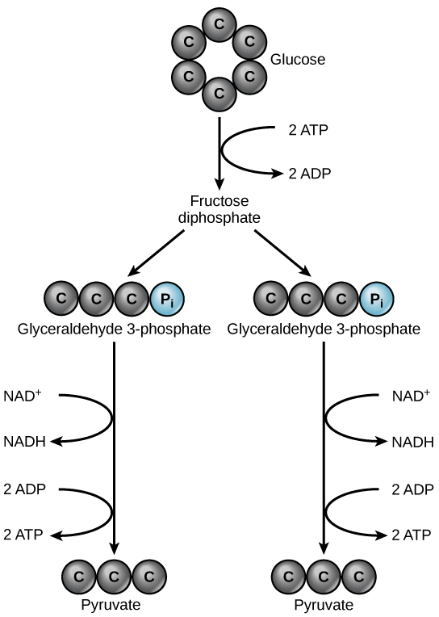

By the end of this section, you will be able to:
* Explain how ATP is used by the cell as an energy source
* Describe the overall result in terms of molecules produced of the breakdown of glucose by glycolysis

Even exergonic, energy-releasing reactions require a small amount of activation energy to proceed. However, consider endergonic reactions, which require much more energy input because their products have more free energy than their reactants. Within the cell, where does energy to power such reactions come from? The answer lies with an energy-supplying molecule called adenosine triphosphate, or **ATP**{: data-type="term"}. ATP is a small, relatively simple molecule, but within its bonds contains the potential for a quick burst of energy that can be harnessed to perform cellular work. This molecule can be thought of as the primary energy currency of cells in the same way that money is the currency that people exchange for things they need. ATP is used to power the majority of energy-requiring cellular reactions.

### ATP in Living Systems

A living cell cannot store significant amounts of free energy. Excess free energy would result in an increase of heat in the cell, which would denature enzymes and other proteins, and thus destroy the cell. Rather, a cell must be able to store energy safely and release it for use only as needed. Living cells accomplish this using ATP, which can be used to fill any energy need of the cell. How? It functions as a rechargeable battery.

When ATP is broken down, usually by the removal of its terminal phosphate group, energy is released. This energy is used to do work by the cell, usually by the binding of the released phosphate to another molecule, thus activating it. For example, in the mechanical work of muscle contraction, ATP supplies energy to move the contractile muscle proteins.

#### ATP Structure and Function

At the heart of ATP is a molecule of adenosine monophosphate (AMP), which is composed of an adenine molecule bonded to both a ribose molecule and a single phosphate group ([\[link\]](#fig-ch04_02_01)). Ribose is a five-carbon sugar found in RNA and AMP is one of the nucleotides in RNA. The addition of a second phosphate group to this core molecule results in adenosine <u>di</u>phosphate (ADP); the addition of a third phosphate group forms adenosine <u>tri</u>phosphate (ATP).

{: #fig-ch04_02_01}

The addition of a phosphate group to a molecule requires a high amount of energy and results in a high-energy bond. Phosphate groups are negatively charged and thus repel one another when they are arranged in series, as they are in ADP and ATP. This repulsion makes the ADP and ATP molecules inherently unstable. The release of one or two phosphate groups from ATP, a process called hydrolysis, releases energy.

### Glycolysis

You have read that nearly all of the energy used by living things comes to them in the bonds of the sugar, glucose. **Glycolysis**{: data-type="term"} is the first step in the breakdown of glucose to extract energy for cell metabolism. Many living organisms carry out glycolysis as part of their metabolism. Glycolysis takes place in the cytoplasm of most prokaryotic and all eukaryotic cells.

Glycolysis begins with the six-carbon, ring-shaped structure of a single glucose molecule and ends with two molecules of a three-carbon sugar called pyruvate. Glycolysis consists of two distinct phases. In the first part of the glycolysis pathway, energy is used to make adjustments so that the six-carbon sugar molecule can be split evenly into two three-carbon pyruvate molecules. In the second part of glycolysis, ATP and nicotinamide-adenine dinucleotide (NADH) are produced ([\[link\]](#fig-ch04_02_02)).

If the cell cannot catabolize the pyruvate molecules further, it will harvest only two ATP molecules from one molecule of glucose. For example, mature mammalian red blood cells are only capable of glycolysis, which is their sole source of ATP. If glycolysis is interrupted, these cells would eventually die.

 {: #fig-ch04_02_02}

### Section Summary

ATP functions as the energy currency for cells. It allows cells to store energy briefly and transport it within itself to support endergonic chemical reactions. The structure of ATP is that of an RNA nucleotide with three phosphate groups attached. As ATP is used for energy, a phosphate group is detached, and ADP is produced. Energy derived from glucose catabolism is used to recharge ADP into ATP.

Glycolysis is the first pathway used in the breakdown of glucose to extract energy. Because it is used by nearly all organisms on earth, it must have evolved early in the history of life. Glycolysis consists of two parts: The first part prepares the six-carbon ring of glucose for separation into two three-carbon sugars. Energy from ATP is invested into the molecule during this step to energize the separation. The second half of glycolysis extracts ATP and high-energy electrons from hydrogen atoms and attaches them to NAD+. Two ATP molecules are invested in the first half and four ATP molecules are formed during the second half. This produces a net gain of two ATP molecules per molecule of glucose for the cell.

### Multiple Choice

Energy is stored long-term in the bonds of \_\_\_\_\_ and used short-term to perform work from a(n) \_\_\_\_\_ molecule.

1.  ATP : glucose
2.  an anabolic molecule : catabolic molecule
3.  glucose : ATP
4.  a catabolic molecule : anabolic molecule
{: data-number-style="lower-alpha"}

C

The energy currency used by cells is \_\_\_\_\_.

1.  ATP
2.  ADP
3.  AMP
4.  adenosine
{: data-number-style="lower-alpha"}

A

The glucose that enters the glycolysis pathway is split into two molecules of \_\_\_\_\_\_\_\_\_.

1.  ATP
2.  phosphate
3.  NADH
4.  pyruvate
{: data-number-style="lower-alpha"}

D

### Free Response

Both prokaryotic and eukaryotic organisms carry out some form of glycolysis. How does that fact support or not support the assertion that glycolysis is one of the oldest metabolic pathways?

If glycolysis evolved relatively late, it likely would not be as universal in organisms as it is. It probably evolved in very primitive organisms and persisted, with the addition of other pathways of carbohydrate metabolism that evolved later.

### Glossary
{: data-type="glossary-title"}

ATP
: (also, adenosine triphosphate) the cell’s energy currency
^

glycolysis
: the process of breaking glucose into two three-carbon molecules with the production of ATP and NADH

