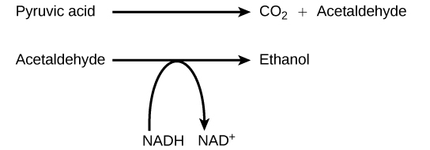
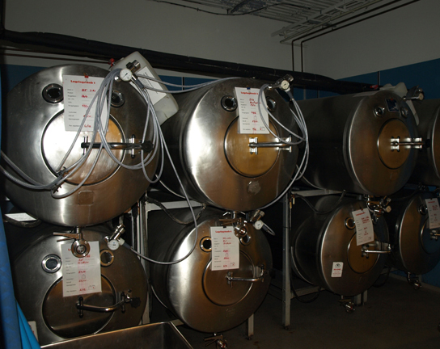

By the end of this section, you will be able to:
* Discuss the fundamental difference between anaerobic cellular respiration and fermentation
* Describe the type of fermentation that readily occurs in animal cells and the conditions that initiate that fermentation

In aerobic respiration, the final electron acceptor is an oxygen molecule, O2. If aerobic respiration occurs, then ATP will be produced using the energy of the high-energy electrons carried by NADH or FADH2 to the electron transport chain. If aerobic respiration does not occur, NADH must be reoxidized to NAD+ for reuse as an electron carrier for glycolysis to continue. How is this done? Some living systems use an organic molecule as the final electron acceptor. Processes that use an organic molecule to regenerate NAD+ from NADH are collectively referred to as **fermentation**{: data-type="term"}. In contrast, some living systems use an inorganic molecule as a final electron acceptor; both methods are a type of **anaerobic cellular respiration**{: data-type="term"}. Anaerobic respiration enables organisms to convert energy for their use in the absence of oxygen.

# Lactic Acid Fermentation

The fermentation method used by animals and some bacteria like those in yogurt is lactic acid fermentation ([\[link\]](#fig-ch04_04_01)). This occurs routinely in mammalian red blood cells and in skeletal muscle that has insufficient oxygen supply to allow aerobic respiration to continue (that is, in muscles used to the point of fatigue). In muscles, lactic acid produced by fermentation must be removed by the blood circulation and brought to the liver for further metabolism. The chemical reaction of lactic acid fermentation is the following:

<math xmlns="http://www.w3.org/1998/Math/MathML" display="block"> <mrow> <mtext>Pyruvic acid </mtext><mo>+</mo><mtext>NADH</mtext><mrow><mo>↔</mo></mrow><mtext>lactic acid</mtext><mo>+</mo><msup> <mrow> <mtext>NAD</mtext> </mrow> <mtext>+</mtext> </msup> </mrow> </math>

The enzyme that catalyzes this reaction is lactate dehydrogenase. The reaction can proceed in either direction, but the left-to-right reaction is inhibited by acidic conditions. This lactic acid build-up causes muscle stiffness and fatigue. Once the lactic acid has been removed from the muscle and is circulated to the liver, it can be converted back to pyruvic acid and further catabolized for energy.

Art Connection

{: #fig-ch04_04_01}

Tremetol, a metabolic poison found in white snake root plant, prevents the metabolism of lactate. When cows eat this plant, Tremetol is concentrated in the milk. Humans who consume the milk become ill. Symptoms of this disease, which include vomiting, abdominal pain, and tremors, become worse after exercise. Why do you think this is the case?

<!-- <para>The illness is caused by lactic acid build-up. Lactic acid levels rise after exercise, making the symptoms worse. Milk sickness is rare today, but was common in the Midwestern United States in the early 1800s.</para> -->

# Alcohol Fermentation

Another familiar fermentation process is alcohol fermentation ([\[link\]](#fig-ch04_04_02)), which produces ethanol, an alcohol. The alcohol fermentation reaction is the following:

 {: #fig-ch04_04_02}

In the first reaction, a carboxyl group is removed from pyruvic acid, releasing carbon dioxide as a gas. The loss of carbon dioxide reduces the molecule by one carbon atom, making acetaldehyde. The second reaction removes an electron from NADH, forming NAD+ and producing ethanol from the acetaldehyde, which accepts the electron. The fermentation of pyruvic acid by yeast produces the ethanol found in alcoholic beverages ([\[link\]](#fig-ch04_04_03)). If the carbon dioxide produced by the reaction is not vented from the fermentation chamber, for example in beer and sparkling wines, it remains dissolved in the medium until the pressure is released. Ethanol above 12 percent is toxic to yeast, so natural levels of alcohol in wine occur at a maximum of 12 percent.

 {: #fig-ch04_04_03}

# Anaerobic Cellular Respiration

Certain prokaryotes, including some species of bacteria and Archaea, use anaerobic respiration. For example, the group of Archaea called methanogens reduces carbon dioxide to methane to oxidize NADH. These microorganisms are found in soil and in the digestive tracts of ruminants, such as cows and sheep. Similarly, sulfate-reducing bacteria and Archaea, most of which are anaerobic ([\[link\]](#fig-ch04_04_04)), reduce sulfate to hydrogen sulfide to regenerate NAD+ from NADH.

 "){: #fig-ch04_04_04}

Concept in Action

  
Visit this [site][1]{: target="_window"} to see anaerobic cellular respiration in action.

Other fermentation methods occur in bacteria. Many prokaryotes are facultatively anaerobic. This means that they can switch between aerobic respiration and fermentation, depending on the availability of oxygen. Certain prokaryotes, like *Clostridia* bacteria, are obligate anaerobes. Obligate anaerobes live and grow in the absence of molecular oxygen. Oxygen is a poison to these microorganisms and kills them upon exposure. It should be noted that all forms of fermentation, except lactic acid fermentation, produce gas. The production of particular types of gas is used as an indicator of the fermentation of specific carbohydrates, which plays a role in the laboratory identification of the bacteria. The various methods of fermentation are used by different organisms to ensure an adequate supply of NAD+ for the sixth step in glycolysis. Without these pathways, that step would not occur, and no ATP would be harvested from the breakdown of glucose.

# Section Summary

If NADH cannot be metabolized through aerobic respiration, another electron acceptor is used. Most organisms will use some form of fermentation to accomplish the regeneration of NAD+, ensuring the continuation of glycolysis. The regeneration of NAD+ in fermentation is not accompanied by ATP production; therefore, the potential for NADH to produce ATP using an electron transport chain is not utilized.

# Art Connections   {#eip-200}

[[link]](#fig-ch04_04_01) Tremetol, a metabolic poison found in white snake root plant, prevents the metabolism of lactate. When cows eat this plant, Tremetol is concentrated in the milk. Humans who consume the milk become ill. Symptoms of this disease, which include vomiting, abdominal pain, and tremors, become worse after exercise. Why do you think this is the case?

[[link]](#fig-ch04_04_01) The illness is caused by lactic acid build-up. Lactic acid levels rise after exercise, making the symptoms worse. Milk sickness is rare today, but was common in the Midwestern United States in the early 1800s.

# Review Questions

Which of the following fermentation methods can occur in animal skeletal muscles?

1.  lactic acid fermentation
2.  alcohol fermentation
3.  mixed acid fermentation
4.  propionic fermentation
{: data-number-style="lower-alpha"}

A

# Free Response

When muscle cells run out of oxygen, what happens to the potential for energy extraction from sugars and what pathways do the cell use?

Without oxygen, oxidative phosphorylation and the citric acid cycle stop, so ATP is no longer generated through this mechanism, which extracts the greatest amount of energy from a sugar molecule. In addition, NADH accumulates, preventing glycolysis from going forward because of an absence of NAD+. Lactic acid fermentation uses the electrons in NADH to generate lactic acid from pyruvate, which allows glycolysis to continue and thus a smaller amount of ATP can be generated by the cell.

[1]: http://openstaxcollege.org/l/fermentation2
