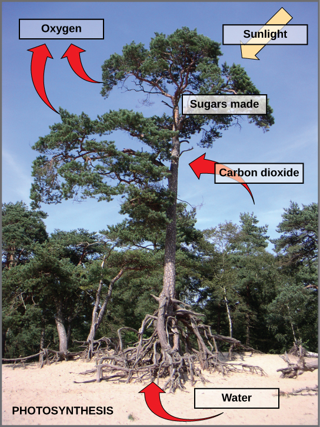

By the end of this section, you will be able to:
* Summarize the process of photosynthesis
* Explain the relevance of photosynthesis to other living things
* Identify the reactants and products of photosynthesis
* Describe the main structures involved in photosynthesis

All living organisms on earth consist of one or more cells. Each cell runs on the chemical energy found mainly in carbohydrate molecules (food), and the majority of these molecules are produced by one process: photosynthesis. Through photosynthesis, certain organisms convert solar energy (sunlight) into chemical energy, which is then used to build carbohydrate molecules. The energy used to hold these molecules together is released when an organism breaks down food. Cells then use this energy to perform work, such as cellular respiration.

The energy that is harnessed from photosynthesis enters the ecosystems of our planet continuously and is transferred from one organism to another. Therefore, directly or indirectly, the process of photosynthesis provides most of the energy required by living things on earth.

Photosynthesis also results in the release of oxygen into the atmosphere. In short, to eat and breathe, humans depend almost entirely on the organisms that carry out photosynthesis.

Concept in Action

 {: data-media-type="image/png"} 
Click the following [link][1]{: target="_window"} to learn more about photosynthesis.

# Solar Dependence and Food Production

Some organisms can carry out photosynthesis, whereas others cannot. An **autotroph**{: data-type="term"} is an organism that can produce its own food. The Greek roots of the word *autotroph* mean “self” (*auto*) “feeder” (*troph*). Plants are the best-known autotrophs, but others exist, including certain types of bacteria and algae ([\[link\]](#fig-ch05_01_01)). Oceanic algae contribute enormous quantities of food and oxygen to global food chains. Plants are also **photoautotrophs**{: data-type="term"}, a type of autotroph that uses sunlight and carbon from carbon dioxide to synthesize chemical energy in the form of carbohydrates. All organisms carrying out photosynthesis require sunlight.

  Plants, (b) algae, and (c) certain bacteria, called cyanobacteria, are photoautotrophs that can carry out photosynthesis. Algae can grow over enormous areas in water, at times completely covering the surface. (credit a: Steve Hillebrand, U.S. Fish and Wildlife Service; credit b: &quot;eutrophication&amp;hypoxia&quot;/Flickr; credit c: NASA; scale-bar data from Matt Russell)"){: #fig-ch05_01_01 data-media-type="image/jpg"}

**Heterotrophs**{: data-type="term"} are organisms incapable of photosynthesis that must therefore obtain energy and carbon from food by consuming other organisms. The Greek roots of the word *heterotroph* mean “other” (*hetero*) “feeder” (*troph*), meaning that their food comes from other organisms. Even if the food organism is another animal, this food traces its origins back to autotrophs and the process of photosynthesis. Humans are heterotrophs, as are all animals. Heterotrophs depend on autotrophs, either directly or indirectly. Deer and wolves are heterotrophs. A deer obtains energy by eating plants. A wolf eating a deer obtains energy that originally came from the plants eaten by that deer. The energy in the plant came from photosynthesis, and therefore it is the only autotroph in this example ([\[link\]](#fig-ch05_01_02)). Using this reasoning, all food eaten by humans also links back to autotrophs that carry out photosynthesis.

 "){: #fig-ch05_01_02 data-media-type="image/jpg"}

Biology in Action

Photosynthesis at the Grocery Store

"){: #fig-ch05_01_03 data-media-type="image/jpg"}

Major grocery stores in the United States are organized into departments, such as dairy, meats, produce, bread, cereals, and so forth. Each aisle contains hundreds, if not thousands, of different products for customers to buy and consume ([\[link\]](#fig-ch05_01_03)).

Although there is a large variety, each item links back to photosynthesis. Meats and dairy products link to photosynthesis because the animals were fed plant-based foods. The breads, cereals, and pastas come largely from grains, which are the seeds of photosynthetic plants. What about desserts and drinks? All of these products contain sugar—the basic carbohydrate molecule produced directly from photosynthesis. The photosynthesis connection applies to every meal and every food a person consumes.

# Main Structures and Summary of Photosynthesis

Photosynthesis requires sunlight, carbon dioxide, and water as starting reactants ([\[link\]](#fig-ch05_01_04)). After the process is complete, photosynthesis releases oxygen and produces carbohydrate molecules, most commonly glucose. These sugar molecules contain the energy that living things need to survive.

 {: #fig-ch05_01_04 data-media-type="image/jpg"}

The complex reactions of photosynthesis can be summarized by the chemical equation shown in [\[link\]](#fig-ch05_01_05).

 {: #fig-ch05_01_05 data-media-type="image/jpg"}

Although the equation looks simple, the many steps that take place during photosynthesis are actually quite complex, as in the way that the reaction summarizing cellular respiration represented many individual reactions. Before learning the details of how photoautotrophs turn sunlight into food, it is important to become familiar with the physical structures involved.

In plants, photosynthesis takes place primarily in leaves, which consist of many layers of cells and have differentiated top and bottom sides. The process of photosynthesis occurs not on the surface layers of the leaf, but rather in a middle layer called the **mesophyll**{: data-type="term"} ([\[link\]](#fig-ch05_01_06)). The gas exchange of carbon dioxide and oxygen occurs through small, regulated openings called **stomata**{: data-type="term"}.

In all autotrophic eukaryotes, photosynthesis takes place inside an organelle called a **chloroplast**{: data-type="term"}. In plants, chloroplast-containing cells exist in the mesophyll. Chloroplasts have a double (inner and outer) membrane. Within the chloroplast is a third membrane that forms stacked, disc-shaped structures called **thylakoids**{: data-type="term"}. Embedded in the thylakoid membrane are molecules of **chlorophyll**{: data-type="term"}, a **pigment**{: data-type="term"} (a molecule that absorbs light) through which the entire process of photosynthesis begins. Chlorophyll is responsible for the green color of plants. The thylakoid membrane encloses an internal space called the thylakoid space. Other types of pigments are also involved in photosynthesis, but chlorophyll is by far the most important. As shown in [\[link\]](#fig-ch05_01_06), a stack of thylakoids is called a **granum**{: data-type="term"}, and the space surrounding the granum is called **stroma**{: data-type="term"} (not to be confused with stomata, the openings on the leaves).

Art Connection

![The upper part of this illustration shows a leaf cross-section. In the cross-section, the mesophyll is sandwiched between an upper epidermis and a lower epidermis. The mesophyll has an upper part with rectangular cells aligned in a row, and a lower part with oval-shaped cells. An opening called a stomata exists in the lower epidermis. The middle part of this illustration shows a plant cell with a prominent central vacuole, a nucleus, ribosomes, mitochondria, and chloroplasts. The lower part of this illustration shows the chloroplast, which has pancake-like stacks of membranes inside.](../resources/Figure_05_01_06.png "Not all cells of a leaf carry out photosynthesis. Cells within the middle layer of a leaf have chloroplasts, which contain the photosynthetic apparatus. (credit &quot;leaf&quot;: modification of work by Cory Zanker)"){: #fig-ch05_01_06 data-media-type="image/png"}

On a hot, dry day, plants close their stomata to conserve water. What impact will this have on photosynthesis?

# The Two Parts of Photosynthesis

Photosynthesis takes place in two stages: the light-dependent reactions and the Calvin cycle. In the **light-dependent reactions**{: data-type="term"}, which take place at the thylakoid membrane, chlorophyll absorbs energy from sunlight and then converts it into chemical energy with the use of water. The light-dependent reactions release oxygen from the hydrolysis of water as a byproduct. In the Calvin cycle, which takes place in the stroma, the chemical energy derived from the light-dependent reactions drives both the capture of carbon in carbon dioxide molecules and the subsequent assembly of sugar molecules. The two reactions use carrier molecules to transport the energy from one to the other. The carriers that move energy from the light-dependent reactions to the Calvin cycle reactions can be thought of as “full” because they bring energy. After the energy is released, the “empty” energy carriers return to the light-dependent reactions to obtain more energy.

# Section Summary

The process of photosynthesis transformed life on earth. By harnessing energy from the sun, photosynthesis allowed living things to access enormous amounts of energy. Because of photosynthesis, living things gained access to sufficient energy, allowing them to evolve new structures and achieve the biodiversity that is evident today.

Only certain organisms, called autotrophs, can perform photosynthesis; they require the presence of chlorophyll, a specialized pigment that can absorb light and convert light energy into chemical energy. Photosynthesis uses carbon dioxide and water to assemble carbohydrate molecules (usually glucose) and releases oxygen into the air. Eukaryotic autotrophs, such as plants and algae, have organelles called chloroplasts in which photosynthesis takes place.

# Art Connections

[[link]](#fig-ch05_01_06) On a hot, dry day, plants close their stomata to conserve water. What impact will this have on photosynthesis?

[[link]](#fig-ch05_01_06) Levels of carbon dioxide (a reactant) will fall, and levels of oxygen (a product) will rise. As a result, the rate of photosynthesis will slow down.

# Multiple Choice

What two products result from photosynthesis?

1.  water and carbon dioxide
2.  water and oxygen
3.  glucose and oxygen
4.  glucose and carbon dioxide
{: data-number-style="lower-alpha"}

C

Which statement about thylakoids in eukaryotes is *not* correct?

1.  Thylakoids are assembled into stacks.
2.  Thylakoids exist as a maze of folded membranes.
3.  The space surrounding thylakoids is called stroma.
4.  Thylakoids contain chlorophyll.
{: data-number-style="lower-alpha"}

B

From where does a heterotroph directly obtain its energy?

1.  the sun
2.  the sun and eating other organisms
3.  eating other organisms
4.  simple chemicals in the environment
{: data-number-style="lower-alpha"}

C

# Free Response

What is the overall purpose of the light reactions in photosynthesis?

To convert solar energy into chemical energy that cells can use to do work.

Why are carnivores, such as lions, dependent on photosynthesis to survive?

Because lions eat animals that eat plants.

[1]: http://openstaxcollege.org/l/photosynthesis2
