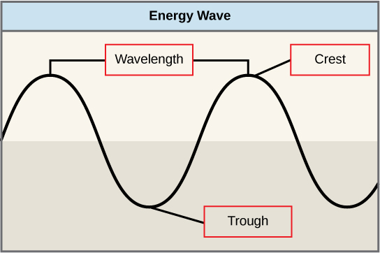
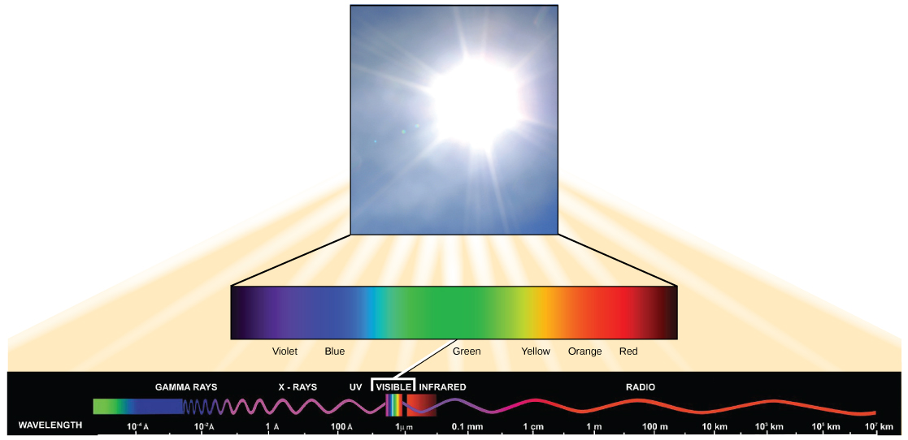

By the end of this section, you will be able to:
* Explain how plants absorb energy from sunlight
* Describe how the wavelength of light affects its energy and color
* Describe how and where photosynthesis takes place within a plant

How can light be used to make food? It is easy to think of light as something that exists and allows living organisms, such as humans, to see, but light is a form of energy. Like all energy, light can travel, change form, and be harnessed to do work. In the case of photosynthesis, light energy is transformed into chemical energy, which autotrophs use to build carbohydrate molecules. However, autotrophs only use a specific component of sunlight ([\[link\]](#fig-ch05_02_01)).

 "){: #fig-ch05_02_01}

Concept in Action

  
Watch the [process of photosynthesis][1]{: target="_window"} within a leaf in this video.

### What Is Light Energy?

The sun emits an enormous amount of electromagnetic radiation (solar energy). Humans can see only a fraction of this energy, which is referred to as “visible light.” The manner in which solar energy travels can be described and measured as waves. Scientists can determine the amount of energy of a wave by measuring its **wavelength**{: data-type="term"}, the distance between two consecutive, similar points in a series of waves, such as from crest to crest or trough to trough ([\[link\]](#fig-ch05_02_02)).

 {: #fig-ch05_02_02}

Visible light constitutes only one of many types of electromagnetic radiation emitted from the sun. The **electromagnetic spectrum**{: data-type="term"} is the range of all possible wavelengths of radiation ([\[link\]](#fig-ch05_02_03)). Each wavelength corresponds to a different amount of energy carried.

 {: #fig-ch05_02_03}

Each type of electromagnetic radiation has a characteristic range of wavelengths. The longer the wavelength (or the more stretched out it appears), the less energy is carried. Short, tight waves carry the most energy. This may seem illogical, but think of it in terms of a piece of moving rope. It takes little effort by a person to move a rope in long, wide waves. To make a rope move in short, tight waves, a person would need to apply significantly more energy.

The sun emits ([\[link\]](#fig-ch05_02_03)) a broad range of electromagnetic radiation, including X-rays and ultraviolet (UV) rays. The higher-energy waves are dangerous to living things; for example, X-rays and UV rays can be harmful to humans.

### Absorption of Light

Light energy enters the process of photosynthesis when pigments absorb the light. In plants, pigment molecules absorb only visible light for photosynthesis. The visible light seen by humans as white light actually exists in a rainbow of colors. Certain objects, such as a prism or a drop of water, disperse white light to reveal these colors to the human eye. The visible light portion of the electromagnetic spectrum is perceived by the human eye as a rainbow of colors, with violet and blue having shorter wavelengths and, therefore, higher energy. At the other end of the spectrum toward red, the wavelengths are longer and have lower energy.

### Understanding Pigments

Different kinds of pigments exist, and each absorbs only certain wavelengths (colors) of visible light. Pigments reflect the color of the wavelengths that they cannot absorb.

All photosynthetic organisms contain a pigment called **chlorophyll *a***{: data-type="term"}, which humans see as the common green color associated with plants. Chlorophyll *a* absorbs wavelengths from either end of the visible spectrum (blue and red), but not from green. Because green is reflected, chlorophyll appears green.

Other pigment types include **chlorophyll *b***{: data-type="term"} (which absorbs blue and red-orange light) and the carotenoids. Each type of pigment can be identified by the specific pattern of wavelengths it absorbs from visible light, which is its **absorption spectrum**{: data-type="term"}.

Many photosynthetic organisms have a mixture of pigments; between them, the organism can absorb energy from a wider range of visible-light wavelengths. Not all photosynthetic organisms have full access to sunlight. Some organisms grow underwater where light intensity decreases with depth, and certain wavelengths are absorbed by the water. Other organisms grow in competition for light. Plants on the rainforest floor must be able to absorb any bit of light that comes through, because the taller trees block most of the sunlight ([\[link\]](#fig-ch05_02_04)).

 "){: #fig-ch05_02_04}

### How Light-Dependent Reactions Work

The overall purpose of the light-dependent reactions is to convert light energy into chemical energy. This chemical energy will be used by the Calvin cycle to fuel the assembly of sugar molecules.

The light-dependent reactions begin in a grouping of pigment molecules and proteins called a **photosystem**{: data-type="term"}. Photosystems exist in the membranes of thylakoids. A pigment molecule in the photosystem absorbs one **photon**{: data-type="term"}, a quantity or “packet” of light energy, at a time.

A photon of light energy travels until it reaches a molecule of chlorophyll. The photon causes an electron in the chlorophyll to become “excited.” The energy given to the electron allows it to break free from an atom of the chlorophyll molecule. Chlorophyll is therefore said to “donate” an electron ([\[link\]](#fig-ch05_02_05)).

To replace the electron in the chlorophyll, a molecule of water is split. This splitting releases an electron and results in the formation of oxygen (O2) and hydrogen ions (H+) in the thylakoid space. Technically, each breaking of a water molecule releases a pair of electrons, and therefore can replace two donated electrons.

 {: #fig-ch05_02_05}

The replacing of the electron enables chlorophyll to respond to another photon. The oxygen molecules produced as byproducts find their way to the surrounding environment. The hydrogen ions play critical roles in the remainder of the light-dependent reactions.

Keep in mind that the purpose of the light-dependent reactions is to convert solar energy into chemical carriers that will be used in the Calvin cycle. In eukaryotes and some prokaryotes, two photosystems exist. The first is called photosystem II, which was named for the order of its discovery rather than for the order of the function.

After the photon hits, photosystem II transfers the free electron to the first in a series of proteins inside the thylakoid membrane called the electron transport chain. As the electron passes along these proteins, energy from the electron fuels membrane pumps that actively move hydrogen ions against their concentration gradient from the stroma into the thylakoid space. This is quite analogous to the process that occurs in the mitochondrion in which an electron transport chain pumps hydrogen ions from the mitochondrial stroma across the inner membrane and into the intermembrane space, creating an electrochemical gradient. After the energy is used, the electron is accepted by a pigment molecule in the next photosystem, which is called photosystem I ([\[link\]](#fig-ch05_02_06)).

 {: #fig-ch05_02_06}

### Generating an Energy Carrier: ATP

In the light-dependent reactions, energy absorbed by sunlight is stored by two types of energy-carrier molecules: ATP and NADPH. The energy that these molecules carry is stored in a bond that holds a single atom to the molecule. For ATP, it is a phosphate atom, and for NADPH, it is a hydrogen atom. Recall that NADH was a similar molecule that carried energy in the mitochondrion from the citric acid cycle to the electron transport chain. When these molecules release energy into the Calvin cycle, they each lose atoms to become the lower-energy molecules ADP and NADP+.

The buildup of hydrogen ions in the thylakoid space forms an electrochemical gradient because of the difference in the concentration of protons (H+) and the difference in the charge across the membrane that they create. This potential energy is harvested and stored as chemical energy in ATP through chemiosmosis, the movement of hydrogen ions down their electrochemical gradient through the transmembrane enzyme ATP synthase, just as in the mitochondrion.

The hydrogen ions are allowed to pass through the thylakoid membrane through an embedded protein complex called ATP synthase. This same protein generated ATP from ADP in the mitochondrion. The energy generated by the hydrogen ion stream allows ATP synthase to attach a third phosphate to ADP, which forms a molecule of ATP in a process called photophosphorylation. The flow of hydrogen ions through ATP synthase is called chemiosmosis, because the ions move from an area of high to low concentration through a semi-permeable structure.

### Generating Another Energy Carrier: NADPH

The remaining function of the light-dependent reaction is to generate the other energy-carrier molecule, NADPH. As the electron from the electron transport chain arrives at photosystem I, it is re-energized with another photon captured by chlorophyll. The energy from this electron drives the formation of NADPH from NADP+ and a hydrogen ion (H+). Now that the solar energy is stored in energy carriers, it can be used to make a sugar molecule.

### Section Summary

In the first part of photosynthesis, the light-dependent reaction, pigment molecules absorb energy from sunlight. The most common and abundant pigment is chlorophyll *a*. A photon strikes photosystem II to initiate photosynthesis. Energy travels through the electron transport chain, which pumps hydrogen ions into the thylakoid space. This forms an electrochemical gradient. The ions flow through ATP synthase from the thylakoid space into the stroma in a process called chemiosmosis to form molecules of ATP, which are used for the formation of sugar molecules in the second stage of photosynthesis. Photosystem I absorbs a second photon, which results in the formation of an NADPH molecule, another energy carrier for the Calvin cycle reactions.

### Multiple Choice

What is the energy of a photon first used to do in photosynthesis?

1.  split a water molecule
2.  energize an electron
3.  produce ATP
4.  synthesize glucose
{: type="a"}

B

Which molecule absorbs the energy of a photon in photosynthesis?

1.  ATP
2.  glucose
3.  chlorophyll
4.  water
{: type="a"}

C

Plants produce oxygen when they photosynthesize. Where does the oxygen come from?

1.  splitting water molecules
2.  ATP synthesis
3.  the electron transport chain
4.  chlorophyll
{: type="a"}

A

Which color(s) of light does chlorophyll *a* reflect?

1.  red and blue
2.  green
3.  red
4.  blue
{: type="a"}

B

### Free Response

Describe the pathway of energy in light-dependent reactions.

The energy is present initially as light. A photon of light hits chlorophyll, causing an electron to be energized. The free electron travels through the electron transport chain, and the energy of the electron is used to pump hydrogen ions into the thylakoid space, transferring the energy into the electrochemical gradient. The energy of the electrochemical gradient is used to power ATP synthase, and the energy is transferred into a bond in the ATP molecule. In addition, energy from another photon can be used to create a high-energy bond in the molecule NADPH.

### Glossary
{: data-type="glossary-title"}

absorption spectrum
: the specific pattern of absorption for a substance that absorbs electromagnetic radiation
^

chlorophyll *a*
: the form of chlorophyll that absorbs violet-blue and red light
^

chlorophyll *b*
: the form of chlorophyll that absorbs blue and red-orange light
^

electromagnetic spectrum
: the range of all possible frequencies of radiation
^

photon
: a distinct quantity or “packet” of light energy
^

photosystem
: a group of proteins, chlorophyll, and other pigments that are used in the light-dependent reactions of photosynthesis to absorb light energy and convert it into chemical energy
^

wavelength
: the distance between consecutive points of a wave

[1]: http://openstaxcollege.org/l/light_reaction2
