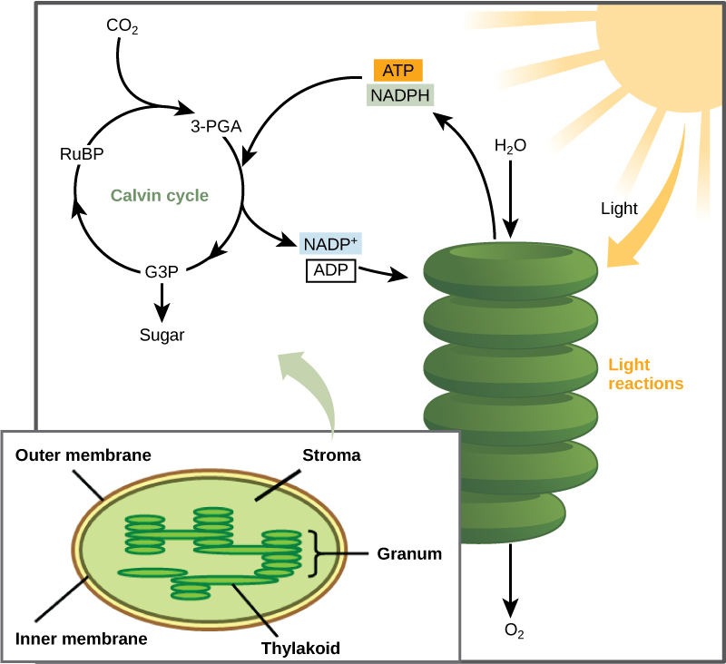

By the end of this section, you will be able to:
* Describe the Calvin cycle
* Define carbon fixation
* Explain how photosynthesis works in the energy cycle of all living organisms

After the energy from the sun is converted and packaged into ATP and NADPH, the cell has the fuel needed to build food in the form of carbohydrate molecules. The carbohydrate molecules made will have a backbone of carbon atoms. Where does the carbon come from? The carbon atoms used to build carbohydrate molecules comes from carbon dioxide, the gas that animals exhale with each breath. The **Calvin cycle**{: data-type="term"} is the term used for the reactions of photosynthesis that use the energy stored by the light-dependent reactions to form glucose and other carbohydrate molecules.

# The Interworkings of the Calvin Cycle

In plants, carbon dioxide (CO2) enters the chloroplast through the stomata and diffuses into the stroma of the chloroplast—the site of the Calvin cycle reactions where sugar is synthesized. The reactions are named after the scientist who discovered them, and reference the fact that the reactions function as a cycle. Others call it the Calvin-Benson cycle to include the name of another scientist involved in its discovery ([\[link\]](#fig-ch05_03_01)).

 {: #fig-ch05_03_01 data-media-type="image/jpg"}

The Calvin cycle reactions ([\[link\]](#fig-ch05_03_02)) can be organized into three basic stages: fixation, reduction, and regeneration. In the stroma, in addition to CO2, two other chemicals are present to initiate the Calvin cycle: an enzyme abbreviated RuBisCO, and the molecule ribulose bisphosphate (RuBP). RuBP has five atoms of carbon and a phosphate group on each end.

RuBisCO catalyzes a reaction between CO2 and RuBP, which forms a six-carbon compound that is immediately converted into two three-carbon compounds. This process is called **carbon fixation**{: data-type="term"}, because CO2 is “fixed” from its inorganic form into organic molecules.

ATP and NADPH use their stored energy to convert the three-carbon compound, 3-PGA, into another three-carbon compound called G3P. This type of reaction is called a reduction reaction, because it involves the gain of electrons. A reduction is the gain of an electron by an atom or molecule. The molecules of ADP and NAD+, resulting from the reduction reaction, return to the light-dependent reactions to be re-energized.

One of the G3P molecules leaves the Calvin cycle to contribute to the formation of the carbohydrate molecule, which is commonly glucose (C6H12O6). Because the carbohydrate molecule has six carbon atoms, it takes six turns of the Calvin cycle to make one carbohydrate molecule (one for each carbon dioxide molecule fixed). The remaining G3P molecules regenerate RuBP, which enables the system to prepare for the carbon-fixation step. ATP is also used in the regeneration of RuBP.

 ![This illustration shows a circular cycle with three stages. Three molecules of carbon dioxide enter the cycle. In the first stage, the enzyme RuBisCO incorporates the carbon dioxide into an organic molecule. Six ATP molecules are converted into six ADP molecules. In the second stage, the organic molecule is reduced. Six NADPH molecules are converted into six NADP+ ions and one hydrogen ion. Sugar is produced. In stage three, RuBP is regenerated, and three ATP molecules are converted into three ADP molecules. RuBP then starts the cycle again.](../resources/Figure_05_03_02.jpg "The Calvin cycle has three stages. In stage 1, the enzyme RuBisCO incorporates carbon dioxide into an organic molecule. In stage 2, the organic molecule is reduced. In stage 3, RuBP, the molecule that starts the cycle, is regenerated so that the cycle can continue."){: #fig-ch05_03_02 data-media-type="image/jpg"}

In summary, it takes six turns of the Calvin cycle to fix six carbon atoms from CO2. These six turns require energy input from 12 ATP molecules and 12 NADPH molecules in the reduction step and 6 ATP molecules in the regeneration step.

Concept in Action

 {: data-media-type="image/png"} 
The following is a [link][1]{: target="_window"} to an animation of the Calvin cycle. Click Stage 1, Stage 2, and then Stage 3 to see G3P and ATP regenerate to form RuBP.

Evolution in Action

PhotosynthesisThe shared evolutionary history of all photosynthetic organisms is conspicuous, as the basic process has changed little over eras of time. Even between the giant tropical leaves in the rainforest and tiny cyanobacteria, the process and components of photosynthesis that use water as an electron donor remain largely the same. Photosystems function to absorb light and use electron transport chains to convert energy. The Calvin cycle reactions assemble carbohydrate molecules with this energy.

However, as with all biochemical pathways, a variety of conditions leads to varied adaptations that affect the basic pattern. Photosynthesis in dry-climate plants ([\[link\]](#fig-ch05_03_03)) has evolved with adaptations that conserve water. In the harsh dry heat, every drop of water and precious energy must be used to survive. Two adaptations have evolved in such plants. In one form, a more efficient use of CO2 allows plants to photosynthesize even when CO2 is in short supply, as when the stomata are closed on hot days. The other adaptation performs preliminary reactions of the Calvin cycle at night, because opening the stomata at this time conserves water due to cooler temperatures. In addition, this adaptation has allowed plants to carry out low levels of photosynthesis without opening stomata at all, an extreme mechanism to face extremely dry periods.

"){: #fig-ch05_03_03 data-media-type="image/jpg"}

# Photosynthesis in Prokaryotes

The two parts of photosynthesis—the light-dependent reactions and the Calvin cycle—have been described, as they take place in chloroplasts. However, prokaryotes, such as cyanobacteria, lack membrane-bound organelles. Prokaryotic photosynthetic autotrophic organisms have infoldings of the plasma membrane for chlorophyll attachment and photosynthesis ([\[link\]](#fig-ch05_03_04)). It is here that organisms like cyanobacteria can carry out photosynthesis.

 "){: #fig-ch05_03_04 data-media-type="image/jpg"}

# The Energy Cycle

Living things access energy by breaking down carbohydrate molecules. However, if plants make carbohydrate molecules, why would they need to break them down? Carbohydrates are storage molecules for energy in all living things. Although energy can be stored in molecules like ATP, carbohydrates are much more stable and efficient reservoirs for chemical energy. Photosynthetic organisms also carry out the reactions of respiration to harvest the energy that they have stored in carbohydrates, for example, plants have mitochondria in addition to chloroplasts.

You may have noticed that the overall reaction for photosynthesis:

<math xmlns="http://www.w3.org/1998/Math/MathML" display="block"> <mrow> <mn>6</mn><msub> <mrow> <mtext>CO</mtext> </mrow> <mn>2</mn> </msub> <mo>+</mo><mn>6</mn><msub> <mtext>H</mtext> <mn>2</mn> </msub> <mtext>O</mtext><mrow><mo>→</mo></mrow><msub> <mtext>C</mtext> <mtext>6</mtext> </msub> <msub> <mtext>H</mtext> <mrow> <mtext>12</mtext> </mrow> </msub> <msub> <mtext>O</mtext> <mtext>6</mtext> </msub> <mo>+</mo><msub> <mrow> <mtext>6O</mtext> </mrow> <mtext>2</mtext> </msub> </mrow> </math>

is the reverse of the overall reaction for cellular respiration:

<math xmlns="http://www.w3.org/1998/Math/MathML" display="block"> <mrow> <msub> <mrow> <mtext>6O</mtext> </mrow> <mtext>2</mtext> </msub> <mo>+</mo><msub> <mtext>C</mtext> <mtext>6</mtext> </msub> <msub> <mtext>H</mtext> <mrow> <mtext>12</mtext> </mrow> </msub> <msub> <mtext>O</mtext> <mtext>6</mtext> </msub> <mrow><mo>→</mo></mrow><mn>6</mn><msub> <mrow> <mtext>CO</mtext> </mrow> <mn>2</mn> </msub> <mo>+</mo><mn>6</mn><msub> <mtext>H</mtext> <mn>2</mn> </msub> <mtext>O</mtext> </mrow> </math>

Photosynthesis produces oxygen as a byproduct, and respiration produces carbon dioxide as a byproduct.

In nature, there is no such thing as waste. Every single atom of matter is conserved, recycling indefinitely. Substances change form or move from one type of molecule to another, but never disappear ([\[link\]](#fig-ch05_03_05)).

CO2 is no more a form of waste produced by respiration than oxygen is a waste product of photosynthesis. Both are byproducts of reactions that move on to other reactions. Photosynthesis absorbs energy to build carbohydrates in chloroplasts, and aerobic cellular respiration releases energy by using oxygen to break down carbohydrates. Both organelles use electron transport chains to generate the energy necessary to drive other reactions. Photosynthesis and cellular respiration function in a biological cycle, allowing organisms to access life-sustaining energy that originates millions of miles away in a star.

"){: #fig-ch05_03_05 data-media-type="image/jpg"}

# Section Summary

Using the energy carriers formed in the first stage of photosynthesis, the Calvin cycle reactions fix CO2 from the environment to build carbohydrate molecules. An enzyme, RuBisCO, catalyzes the fixation reaction, by combining CO2 with RuBP. The resulting six-carbon compound is broken down into two three-carbon compounds, and the energy in ATP and NADPH is used to convert these molecules into G3P. One of the three-carbon molecules of G3P leaves the cycle to become a part of a carbohydrate molecule. The remaining G3P molecules stay in the cycle to be formed back into RuBP, which is ready to react with more CO2. Photosynthesis forms a balanced energy cycle with the process of cellular respiration. Plants are capable of both photosynthesis and cellular respiration, since they contain both chloroplasts and mitochondria.

# Multiple Choice

Where in plant cells does the Calvin cycle take place?

1.  thylakoid membrane
2.  thylakoid space
3.  stroma
4.  granum
{: data-number-style="lower-alpha"}

C

Which statement correctly describes carbon fixation?

1.  the conversion of CO2 to an organic compound
2.  the use of RUBISCO to form 3-PGA
3.  the production of carbohydrate molecules from G3P
4.  the formation of RuBP from G3P molecules
5.  the use of ATP and NADPH to reduce CO2
{: data-number-style="lower-alpha"}

A

What is the molecule that leaves the Calvin cycle to be converted into glucose?

1.  ADP
2.  G3P
3.  RuBP
4.  3-PGA
{: data-number-style="lower-alpha"}

B

# Free Response

Which part of the Calvin cycle would be affected if a cell could not produce the enzyme RuBisCO?

None of the cycle could take place, because RuBisCO is essential in fixing carbon dioxide. Specifically, RuBisCO catalyzes the reaction between carbon dioxide and RuBP at the start of the cycle.

Explain the reciprocal nature of the net chemical reactions for photosynthesis and respiration.

Photosynthesis takes the energy of sunlight and combines water and carbon dioxide to produce sugar and oxygen as a waste product. The reactions of respiration take sugar and consume oxygen to break it down into carbon dioxide and water, releasing energy. Thus, the reactants of photosynthesis are the products of respiration, and vice versa.

[1]: http://openstaxcollege.org/l/calvin_cycle2
