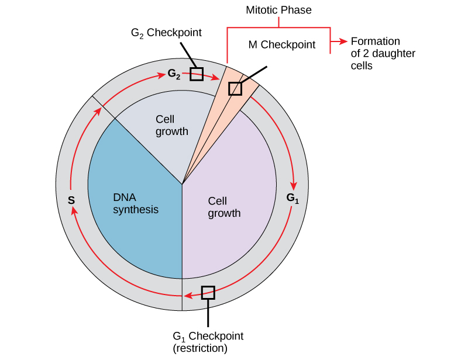

By the end of this section, you will be able to:
* Describe the three stages of interphase
* Discuss the behavior of chromosomes during mitosis and how the cytoplasmic content divides during cytokinesis
* Define the quiescent G0 phase
* Explain how the three internal control checkpoints occur at the end of G1, at the G2–M transition, and during metaphase

The **cell cycle**{: data-type="term"} is an ordered series of events involving cell growth and cell division that produces two new daughter cells. Cells on the path to cell division proceed through a series of precisely timed and carefully regulated stages of growth, DNA replication, and division that produce two genetically identical cells. The cell cycle has two major phases: interphase and the mitotic phase ([\[link\]](#fig-ch06_02_01)). During **interphase**{: data-type="term"}, the cell grows and DNA is replicated. During the **mitotic**{: data-type="term"} **phase**{: data-type="term"}, the replicated DNA and cytoplasmic contents are separated and the cell divides. Watch this video about the cell cycle: [https://www.youtube.com/watch?v=Wy3N5NCZBHQ][1]

{: #fig-ch06_02_01}

### Interphase

During interphase, the cell undergoes normal processes while also preparing for cell division. For a cell to move from interphase to the mitotic phase, many internal and external conditions must be met. The three stages of interphase are called G1, S, and G2.

#### G1 Phase

The first stage of interphase is called the **G1 phase**{: data-type="term"}, or first gap, because little change is visible. However, during the G1 stage, the cell is quite active at the biochemical level. The cell is accumulating the building blocks of chromosomal DNA and the associated proteins, as well as accumulating enough energy reserves to complete the task of replicating each chromosome in the nucleus.

#### S Phase

Throughout interphase, nuclear DNA remains in a semi-condensed chromatin configuration. In the **S phase**{: data-type="term"} (synthesis phase), DNA replication results in the formation of two identical copies of each chromosome—sister chromatids—that are firmly attached at the centromere region. At this stage, each chromosome is made of two sister chromatids and is a duplicated chromosome. The centrosome is duplicated during the S phase. The two centrosomes will give rise to the **mitotic**{: data-type="term"} **spindle**{: data-type="term"}, the apparatus that orchestrates the movement of chromosomes during mitosis. The centrosome consists of a pair of rod-like **centrioles**{: data-type="term"} at right angles to each other. Centrioles help organize cell division. Centrioles are not present in the centrosomes of many eukaryotic species, such as plants and most fungi.

#### G2 Phase

In the **G2 phase**{: data-type="term"}, or second gap, the cell replenishes its energy stores and synthesizes the proteins necessary for chromosome manipulation. Some cell organelles are duplicated, and the cytoskeleton is dismantled to provide resources for the mitotic spindle. There may be additional cell growth during G2. The final preparations for the mitotic phase must be completed before the cell is able to enter the first stage of mitosis.

### The Mitotic Phase

To make two daughter cells, the contents of the nucleus and the cytoplasm must be divided. The mitotic phase is a multistep process during which the duplicated chromosomes are aligned, separated, and moved to opposite poles of the cell, and then the cell is divided into two new identical daughter cells. The first portion of the mitotic phase, **mitosis**{: data-type="term"}, is composed of five stages, which accomplish nuclear division. The second portion of the mitotic phase, called cytokinesis, is the physical separation of the cytoplasmic components into two daughter cells.

#### Mitosis

Mitosis is divided into a series of phases—prophase, prometaphase, metaphase, anaphase, and telophase—that result in the division of the cell nucleus ([\[link\]](#fig-ch06_02_02)).

Art Connection

![This diagram shows the five phases of mitosis, and cytokinesis. During prophase, the chromosomes condense and become visible, spindle fibers emerge from the centrosomes, the centrosomes move toward opposite poles, and the nuclear envelope breaks down. During prometaphase, the chromosomes continue to condense and kinetochores appear at the centromeres. Mitotic spindle microtubules attach to the kinetochores. During metaphase, the centrosomes are at opposite poles of the cell. Chromosomes line up at the metaphase plate and each sister chromatid is attached to spindle fibers originating from the opposite poles. During anaphase, the centromeres split in two. The sister chromatids, which are now called chromosomes, move toward opposite poles of the cell. Certain spindle fibers lengthen, elongating the cell. During telophase, the chromosomes arrive at the opposite poles and begin to decondense. The nuclear envelope re-forms. During cytokinesis in animals, a cleavage furrow separates the two daughter cells. In plants, a cell plate&#x2014;the precursor to a new cell wall&#x2014;separates the two daughter cells.](../resources/Figure_06_02_02.png "Animal cell mitosis is divided into five stages&#x2014;prophase, prometaphase, metaphase, anaphase, and telophase&#x2014;visualized here by light microscopy with fluorescence. Mitosis is usually accompanied by cytokinesis, shown here by a transmission electron microscope. (credit &quot;diagrams&quot;: modification of work by Mariana Ruiz Villareal; credit &quot;mitosis micrographs&quot;: modification of work by Roy van Heesbeen; credit &quot;cytokinesis micrograph&quot;: modification of work by the Wadsworth Center, NY State Department of Health; donated to the Wikimedia foundation; scale-bar data from Matt Russell)"){: #fig-ch06_02_02}

Which of the following is the correct order of events in mitosis?

1.  Sister chromatids line up at the metaphase plate. The kinetochore becomes attached to the mitotic spindle. The nucleus re-forms and the cell divides. The sister chromatids separate.
2.  The kinetochore becomes attached to the mitotic spindle. The sister chromatids separate. Sister chromatids line up at the metaphase plate. The nucleus re-forms and the cell divides.
3.  The kinetochore becomes attached to metaphase plate. Sister chromatids line up at the metaphase plate. The kinetochore breaks down and the sister chromatids separate. The nucleus re-forms and the cell divides.
4.  The kinetochore becomes attached to the mitotic spindle. Sister chromatids line up at the metaphase plate. The kinetochore breaks apart and the sister chromatids separate. The nucleus re-forms and the cell divides.
{: type="a"}

During **prophase**{: data-type="term"}, the “first phase,” several events must occur to provide access to the chromosomes in the nucleus. The nuclear envelope starts to break into small vesicles, and the Golgi apparatus and endoplasmic reticulum fragment and disperse to the periphery of the cell. The nucleolus disappears. The centrosomes begin to move to opposite poles of the cell. The microtubules that form the basis of the mitotic spindle extend between the centrosomes, pushing them farther apart as the microtubule fibers lengthen. The sister chromatids begin to coil more tightly and become visible under a light microscope.

During **prometaphase**{: data-type="term"}, many processes that were begun in prophase continue to advance and culminate in the formation of a connection between the chromosomes and cytoskeleton. The remnants of the nuclear envelope disappear. The mitotic spindle continues to develop as more microtubules assemble and stretch across the length of the former nuclear area. Chromosomes become more condensed and visually discrete. Each sister chromatid attaches to spindle microtubules at the centromere via a protein complex called the **kinetochore**{: data-type="term"}.

During **metaphase**{: data-type="term"}, all of the chromosomes are aligned in a plane called the **metaphase plate**{: data-type="term"}, or the equatorial plane, midway between the two poles of the cell. The sister chromatids are still tightly attached to each other. At this time, the chromosomes are maximally condensed.

During **anaphase**{: data-type="term"}, the sister chromatids at the equatorial plane are split apart at the centromere. Each chromatid, now called a chromosome, is pulled rapidly toward the centrosome to which its microtubule was attached. The cell becomes visibly elongated as the non-kinetochore microtubules slide against each other at the metaphase plate where they overlap.

During **telophase**{: data-type="term"}, all of the events that set up the duplicated chromosomes for mitosis during the first three phases are reversed. The chromosomes reach the opposite poles and begin to decondense (unravel). The mitotic spindles are broken down into monomers that will be used to assemble cytoskeleton components for each daughter cell. Nuclear envelopes form around chromosomes.

Concept in Action

  
[This page of movies][2]{: target="_window"} illustrates different aspects of mitosis. Watch the movie entitled “DIC microscopy of cell division in a newt lung cell” and identify the phases of mitosis.

#### Cytokinesis

**Cytokinesis**{: data-type="term"} is the second part of the mitotic phase during which cell division is completed by the physical separation of the cytoplasmic components into two daughter cells. Although the stages of mitosis are similar for most eukaryotes, the process of cytokinesis is quite different for eukaryotes that have cell walls, such as plant cells.

In cells such as animal cells that lack cell walls, cytokinesis begins following the onset of anaphase. A contractile ring composed of actin filaments forms just inside the plasma membrane at the former metaphase plate. The actin filaments pull the equator of the cell inward, forming a fissure. This fissure, or “crack,” is called the **cleavage furrow**{: data-type="term"}. The furrow deepens as the actin ring contracts, and eventually the membrane and cell are cleaved in two ([\[link\]](#fig-ch06_02_03)).

In plant cells, a cleavage furrow is not possible because of the rigid cell walls surrounding the plasma membrane. A new cell wall must form between the daughter cells. During interphase, the Golgi apparatus accumulates enzymes, structural proteins, and glucose molecules prior to breaking up into vesicles and dispersing throughout the dividing cell. During telophase, these Golgi vesicles move on microtubules to collect at the metaphase plate. There, the vesicles fuse from the center toward the cell walls; this structure is called a **cell plate**{: data-type="term"}. As more vesicles fuse, the cell plate enlarges until it merges with the cell wall at the periphery of the cell. Enzymes use the glucose that has accumulated between the membrane layers to build a new cell wall of cellulose. The Golgi membranes become the plasma membrane on either side of the new cell wall ([\[link\]](#fig-ch06_02_03)).

 , a cleavage furrow forms at the former metaphase plate in the animal cell. The plasma membrane is drawn in by a ring of actin fibers contracting just inside the membrane. The cleavage furrow deepens until the cells are pinched in two. In part (b), Golgi vesicles coalesce at the former metaphase plate in a plant cell. The vesicles fuse and form the cell plate. The cell plate grows from the center toward the cell walls. New cell walls are made from the vesicle contents."){: #fig-ch06_02_03}

### G0 Phase

Not all cells adhere to the classic cell-cycle pattern in which a newly formed daughter cell immediately enters interphase, closely followed by the mitotic phase. Cells in the **G0 phase**{: data-type="term"} are not actively preparing to divide. The cell is in a quiescent (inactive) stage, having exited the cell cycle. Some cells enter G0 temporarily until an external signal triggers the onset of G1. Other cells that never or rarely divide, such as mature cardiac muscle and nerve cells, remain in G0 permanently ([\[link\]](#fig-ch06_02_04)).

 {: #fig-ch06_02_04}

####  Control of the Cell Cycle

The length of the cell cycle is highly variable even within the cells of an individual organism. In humans, the frequency of cell turnover ranges from a few hours in early embryonic development to an average of two to five days for epithelial cells, or to an entire human lifetime spent in G0 by specialized cells such as cortical neurons or cardiac muscle cells. There is also variation in the time that a cell spends in each phase of the cell cycle. When fast-dividing mammalian cells are grown in culture (outside the body under optimal growing conditions), the length of the cycle is approximately 24 hours. In rapidly dividing human cells with a 24-hour cell cycle, the G1 phase lasts approximately 11 hours. The timing of events in the cell cycle is controlled by mechanisms that are both internal and external to the cell.

### Regulation at Internal Checkpoints

It is essential that daughter cells be exact duplicates of the parent cell. Mistakes in the duplication or distribution of the chromosomes lead to mutations that may be passed forward to every new cell produced from the abnormal cell. To prevent a compromised cell from continuing to divide, there are internal control mechanisms that operate at three main **cell cycle checkpoints**{: data-type="term"} at which the cell cycle can be stopped until conditions are favorable. These checkpoints occur near the end of G1, at the G2–M transition, and during metaphase ([\[link\]](#fig-ch6_02_05)).

{: #fig-ch6_02_05}

#### The G1 Checkpoint

The G1 checkpoint determines whether all conditions are favorable for cell division to proceed. The G1 checkpoint, also called the restriction point, is the point at which the cell irreversibly commits to the cell-division process. In addition to adequate reserves and cell size, there is a check for damage to the genomic DNA at the G1 checkpoint. A cell that does not meet all the requirements will not be released into the S phase.

#### The G2 Checkpoint

The G2 checkpoint bars the entry to the mitotic phase if certain conditions are not met. As in the G1 checkpoint, cell size and protein reserves are assessed. However, the most important role of the G2 checkpoint is to ensure that all of the chromosomes have been replicated and that the replicated DNA is not damaged.

#### The M Checkpoint

The M checkpoint occurs near the end of the metaphase stage of mitosis. The M checkpoint is also known as the spindle checkpoint because it determines if all the sister chromatids are correctly attached to the spindle microtubules. Because the separation of the sister chromatids during anaphase is an irreversible step, the cycle will not proceed until the kinetochores of each pair of sister chromatids are firmly anchored to spindle fibers arising from opposite poles of the cell.

Concept in Action

  
Watch what occurs at the G1, G2, and M checkpoints by visiting [this animation][3]{: target="_window"} of the cell cycle.

### Section Summary

The cell cycle is an orderly sequence of events. Cells on the path to cell division proceed through a series of precisely timed and carefully regulated stages. In eukaryotes, the cell cycle consists of a long preparatory period, called interphase. Interphase is divided into G1, S, and G2 phases. Mitosis consists of five stages: prophase, prometaphase, metaphase, anaphase, and telophase. Mitosis is usually accompanied by cytokinesis, during which the cytoplasmic components of the daughter cells are separated either by an actin ring (animal cells) or by cell plate formation (plant cells).

Each step of the cell cycle is monitored by internal controls called checkpoints. There are three major checkpoints in the cell cycle: one near the end of G1, a second at the G2–M transition, and the third during metaphase.

### Art Connections

[[link]](#fig-ch06_02_02) Which of the following is the correct order of events in mitosis?

1.  Sister chromatids line up at the metaphase plate. The kinetochore becomes attached to the mitotic spindle. The nucleus re-forms and the cell divides. The sister chromatids separate.
2.  The kinetochore becomes attached to the mitotic spindle. The sister chromatids separate. Sister chromatids line up at the metaphase plate. The nucleus re-forms and the cell divides.
3.  The kinetochore becomes attached to metaphase plate. Sister chromatids line up at the metaphase plate. The kinetochore breaks down and the sister chromatids separate. The nucleus re-forms and the cell divides.
4.  The kinetochore becomes attached to the mitotic spindle. Sister chromatids line up at the metaphase plate. The kinetochore breaks apart and the sister chromatids separate. The nucleus re-forms and the cell divides.
{: type="a"}

[[link]](#fig-ch06_02_02) D. The kinetochore becomes attached to the mitotic spindle. Sister chromatids line up at the metaphase plate. The kinetochore breaks apart and the sister chromatids separate. The nucleus reforms and the cell divides.

### Multiple Choice

Chromosomes are duplicated during what portion of the cell cycle?

1.  G1 phase
2.  S phase
3.  prophase
4.  prometaphase
{: type="a"}

B

Separation of the sister chromatids is a characteristic of which stage of mitosis?

1.  prometaphase
2.  metaphase
3.  anaphase
4.  telophase
{: type="a"}

C

The individual chromosomes become visible with a light microscope during which stage of mitosis?

1.  prophase
2.  prometaphase
3.  metaphase
4.  anaphase
{: type="a"}

A

What is necessary for a cell to pass the G2 checkpoint?

1.  cell has reached a sufficient size
2.  an adequate stockpile of nucleotides
3.  accurate and complete DNA replication
4.  proper attachment of mitotic spindle fibers to kinetochores
{: type="a"}

C

### Free Response

Describe the similarities and differences between the cytokinesis mechanisms found in animal cells versus those in plant cells.

There are very few similarities between animal cell and plant cell cytokinesis. In animal cells, a ring of actin fibers is formed around the periphery of the cell at the former metaphase plate. The actin ring contracts inward, pulling the plasma membrane toward the center of the cell until the cell is pinched in two. In plant cells, a new cell wall must be formed between the daughter cells. Because of the rigid cell walls of the parent cell, contraction of the middle of the cell is not possible. Instead, a cell plate is formed in the center of the cell at the former metaphase plate. The cell plate is formed from Golgi vesicles that contain enzymes, proteins, and glucose. The vesicles fuse and the enzymes build a new cell wall from the proteins and glucose. The cell plate grows toward, and eventually fuses with, the cell wall of the parent cell.

### Glossary
{: data-type="glossary-title"}

anaphase
: the stage of mitosis during which sister chromatids are separated from each other
^

cell cycle
: the ordered sequence of events that a cell passes through between one cell division and the next
^

cell cycle checkpoints
: mechanisms that monitor the preparedness of a eukaryotic cell to advance through the various cell cycle stages
^

cell plate
: a structure formed during plant-cell cytokinesis by Golgi vesicles fusing at the metaphase plate; will ultimately lead to formation of a cell wall to separate the two daughter cells
^

centriole
: a paired rod-like structure constructed of microtubules at the center of each animal cell centrosome
^

cleavage furrow
: a constriction formed by the actin ring during animal-cell cytokinesis that leads to cytoplasmic division
^

cytokinesis
: the division of the cytoplasm following mitosis to form two daughter cells
^

G0 phase
: a cell-cycle phase distinct from the G1 phase of interphase; a cell in G0 is not preparing to divide
^

G1 phase
: (also, first gap) a cell-cycle phase; first phase of interphase centered on cell growth during mitosis
^

G2 phase
: (also, second gap) a cell-cycle phase; third phase of interphase where the cell undergoes the final preparations for mitosis
^

interphase
: the period of the cell cycle leading up to mitosis; includes G1, S, and G2 phases; the interim between two consecutive cell divisions
^

kinetochore
: a protein structure in the centromere of each sister chromatid that attracts and binds spindle microtubules during prometaphase
^

metaphase plate
: the equatorial plane midway between two poles of a cell where the chromosomes align during metaphase
^

metaphase
: the stage of mitosis during which chromosomes are lined up at the metaphase plate
^

mitosis
: the period of the cell cycle at which the duplicated chromosomes are separated into identical nuclei; includes prophase, prometaphase, metaphase, anaphase, and telophase
^

mitotic phase
: the period of the cell cycle when duplicated chromosomes are distributed into two nuclei and the cytoplasmic contents are divided; includes mitosis and cytokinesis
^

mitotic spindle
: the microtubule apparatus that orchestrates the movement of chromosomes during mitosis
^

prometaphase
: the stage of mitosis during which mitotic spindle fibers attach to kinetochores
^

prophase
: the stage of mitosis during which chromosomes condense and the mitotic spindle begins to form
^

quiescent
: describes a cell that is performing normal cell functions and has not initiated preparations for cell division
^

S phase
: the second, or synthesis phase, of interphase during which DNA replication occurs
^

telophase
: the stage of mitosis during which chromosomes arrive at opposite poles, decondense, and are surrounded by new nuclear envelopes

[1]: https://www.youtube.com/watch?v=Wy3N5NCZBHQ
[2]: http://openstaxcollege.org/l/divisn_newtcell
[3]: https://www.youtube.com/watch?v=f-ldPgEfAHI
