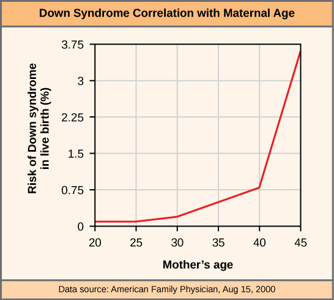

By the end of this section, you will be able to:
* Explain how nondisjunction leads to disorders in chromosome number
* Describe how errors in chromosome structure occur through inversions and translocations

Inherited disorders can arise when chromosomes behave abnormally during meiosis. Chromosome disorders can be divided into two categories: abnormalities in chromosome number and chromosome structural rearrangements. Because even small segments of chromosomes can span many genes, chromosomal disorders are characteristically dramatic and often fatal.

### Disorders in Chromosome Number

The isolation and microscopic observation of chromosomes forms the basis of cytogenetics and is the primary method by which clinicians detect chromosomal abnormalities in humans. A **karyotype**{: data-type="term"} is the number and appearance of chromosomes, including their length, banding pattern, and centromere position. To obtain a view of an individual’s karyotype, cytologists photograph the chromosomes and then cut and paste each chromosome into a chart, or **karyogram**{: data-type="term"} ([\[link\]](#fig-ch07_03_01)).

 "){: #fig-ch07_03_01}

Careers in Action

Geneticists Use Karyograms to Identify Chromosomal AberrationsThe karyotype is a method by which traits characterized by chromosomal abnormalities can be identified from a single cell. To observe an individual’s karyotype, a person’s cells (like white blood cells) are first collected from a blood sample or other tissue. In the laboratory, the isolated cells are stimulated to begin actively dividing. A chemical is then applied to the cells to arrest mitosis during metaphase. The cells are then fixed to a slide.

The geneticist then stains chromosomes with one of several dyes to better visualize the distinct and reproducible banding patterns of each chromosome pair. Following staining, chromosomes are viewed using bright-field microscopy. An experienced cytogeneticist can identify each band. In addition to the banding patterns, chromosomes are further identified on the basis of size and centromere location. To obtain the classic depiction of the karyotype in which homologous pairs of chromosomes are aligned in numerical order from longest to shortest, the geneticist obtains a digital image, identifies each chromosome, and manually arranges the chromosomes into this pattern ([\[link\]](#fig-ch07_03_01)).

At its most basic, the karyogram may reveal genetic abnormalities in which an individual has too many or too few chromosomes per cell. Examples of this are Down syndrome, which is identified by a third copy of chromosome 21, and Turner syndrome, which is characterized by the presence of only one X chromosome in women instead of two. Geneticists can also identify large deletions or insertions of DNA. For instance, Jacobsen syndrome, which involves distinctive facial features as well as heart and bleeding defects, is identified by a deletion on chromosome 11. Finally, the karyotype can pinpoint **translocations**{: data-type="term"}, which occur when a segment of genetic material breaks from one chromosome and reattaches to another chromosome or to a different part of the same chromosome. Translocations are implicated in certain cancers, including chronic myelogenous leukemia.

By observing a karyogram, geneticists can actually visualize the chromosomal composition of an individual to confirm or predict genetic abnormalities in offspring even before birth.

#### Nondisjunctions, Duplications, and Deletions

Of all the chromosomal disorders, abnormalities in chromosome number are the most easily identifiable from a karyogram. Disorders of chromosome number include the duplication or loss of entire chromosomes, as well as changes in the number of complete sets of chromosomes. They are caused by **nondisjunction**{: data-type="term"}, which occurs when pairs of homologous chromosomes or sister chromatids fail to separate during meiosis. The risk of nondisjunction increases with the age of the parents.

Nondisjunction can occur during either meiosis I or II, with different results ([\[link\]](#fig-ch07_03_02)). If homologous chromosomes fail to separate during meiosis I, the result is two gametes that lack that chromosome and two gametes with two copies of the chromosome. If sister chromatids fail to separate during meiosis II, the result is one gamete that lacks that chromosome, two normal gametes with one copy of the chromosome, and one gamete with two copies of the chromosome.

  or sister chromatids (meiosis II) fail to separate during meiosis."){: #fig-ch07_03_02}

An individual with the appropriate number of chromosomes for their species is called **euploid**{: data-type="term"}; in humans, euploidy corresponds to 22 pairs of **autosomes**{: data-type="term"} and one pair of sex chromosomes. An individual with an error in chromosome number is described as **aneuploid**{: data-type="term"}, a term that includes **monosomy**{: data-type="term"} (loss of one chromosome) or **trisomy**{: data-type="term"} (gain of an extraneous chromosome). Monosomic human zygotes missing any one copy of an autosome invariably fail to develop to birth because they have only one copy of essential genes. Most autosomal trisomies also fail to develop to birth; however, duplications of some of the smaller chromosomes (13, 15, 18, 21, or 22) can result in offspring that survive for several weeks to many years. Trisomic individuals suffer from a different type of genetic imbalance: an excess in gene dose. Cell functions are calibrated to the amount of gene product produced by two copies (doses) of each gene; adding a third copy (dose) disrupts this balance. The most common trisomy is that of chromosome 21, which leads to Down syndrome. Individuals with this inherited disorder have characteristic physical features and developmental delays in growth and cognition. The incidence of Down syndrome is correlated with maternal age, such that older women are more likely to give birth to children with Down syndrome ([\[link\]](#fig-ch07_03_03)).

 {: #fig-ch07_03_03}

Concept in Action

Visualize the addition of a chromosome that leads to Down syndrome in this [video simulation][1]{: target="_window"}.

Humans display dramatic deleterious effects with autosomal trisomies and monosomies. Therefore, it may seem counterintuitive that human females and males can function normally, despite carrying different numbers of the X chromosome. In part, this occurs because of a process called **X inactivation**{: data-type="term"}. Early in development, when female mammalian embryos consist of just a few thousand cells, one X chromosome in each cell inactivates by condensing into a structure called a Barr body. The genes on the inactive X chromosome are not expressed. The particular X chromosome (maternally or paternally derived) that is inactivated in each cell is random, but once the inactivation occurs, all cells descended from that cell will have the same inactive X chromosome. By this process, females compensate for their double genetic dose of X chromosome.

In so-called “tortoiseshell” cats, X inactivation is observed as coat-color variegation ([\[link\]](#fig-ch07_03_04)). Females heterozygous for an X-linked coat color gene will express one of two different coat colors over different regions of their body, corresponding to whichever X chromosome is inactivated in the embryonic cell progenitor of that region. When you see a tortoiseshell cat, you will know that it has to be a female.

 "){: #fig-ch07_03_04}

In an individual carrying an abnormal number of X chromosomes, cellular mechanisms will inactivate all but one X in each of her cells. As a result, X-chromosomal abnormalities are typically associated with mild mental and physical defects, as well as sterility. If the X chromosome is absent altogether, the individual will not develop.

Several errors in sex chromosome number have been characterized. Individuals with three X chromosomes, called triplo-X, appear female but express developmental delays and reduced fertility. The XXY chromosome complement, corresponding to one type of Klinefelter syndrome, corresponds to male individuals with small testes, enlarged breasts, and reduced body hair. The extra X chromosome undergoes inactivation to compensate for the excess genetic dosage. Turner syndrome, characterized as an X0 chromosome complement (i.e., only a single sex chromosome), corresponds to a female individual with short stature, webbed skin in the neck region, hearing and cardiac impairments, and sterility.

An individual with more than the correct number of chromosome sets (two for diploid species) is called **polyploid**{: data-type="term"}. For instance, fertilization of an abnormal diploid egg with a normal haploid sperm would yield a triploid zygote. Polyploid animals are extremely rare, with only a few examples among the flatworms, crustaceans, amphibians, fish, and lizards. Triploid animals are sterile because meiosis cannot proceed normally with an odd number of chromosome sets. In contrast, polyploidy is very common in the plant kingdom, and polyploid plants tend to be larger and more robust than euploids of their species.

### Chromosome Structural Rearrangements

Cytologists have characterized numerous structural rearrangements in chromosomes, including partial duplications, deletions, inversions, and translocations. Duplications and deletions often produce offspring that survive but exhibit physical and mental abnormalities. Cri-du-chat (from the French for “cry of the cat”) is a syndrome associated with nervous system abnormalities and identifiable physical features that results from a deletion of most of the small arm of chromosome 5 ([\[link\]](#fig-ch07_03_05)). Infants with this genotype emit a characteristic high-pitched cry upon which the disorder’s name is based.

  age two, (B) age four, (C) age nine, and (D) age 12. (credit: Paola Cerruti Mainardi)"){: #fig-ch07_03_05}

Chromosome inversions and translocations can be identified by observing cells during meiosis because homologous chromosomes with a rearrangement in one of the pair must contort to maintain appropriate gene alignment and pair effectively during prophase I.

A **chromosome inversion**{: data-type="term"} is the detachment, 180° rotation, and reinsertion of part of a chromosome ([\[link\]](#fig-ch07_03_06ab)). Unless they disrupt a gene sequence, inversions only change the orientation of genes and are likely to have more mild effects than aneuploid errors.

Evolution in Action

The Chromosome 18 InversionNot all structural rearrangements of chromosomes produce nonviable, impaired, or infertile individuals. In rare instances, such a change can result in the evolution of a new species. In fact, an inversion in chromosome 18 appears to have contributed to the evolution of humans. This inversion is not present in our closest genetic relatives, the chimpanzees.

The chromosome 18 inversion is believed to have occurred in early humans following their divergence from a common ancestor with chimpanzees approximately five million years ago. Researchers have suggested that a long stretch of DNA was duplicated on chromosome 18 of an ancestor to humans, but that during the duplication it was inverted (inserted into the chromosome in reverse orientation.

A comparison of human and chimpanzee genes in the region of this inversion indicates that two genes—*ROCK1* and *USP14*—are farther apart on human chromosome 18 than they are on the corresponding chimpanzee chromosome. This suggests that one of the inversion breakpoints occurred between these two genes. Interestingly, humans and chimpanzees express *USP14* at distinct levels in specific cell types, including cortical cells and fibroblasts. Perhaps the chromosome 18 inversion in an ancestral human repositioned specific genes and reset their expression levels in a useful way. Because both *ROCK1* and *USP14* code for enzymes, a change in their expression could alter cellular function. It is not known how this inversion contributed to hominid evolution, but it appears to be a significant factor in the divergence of humans from other primates.[1](#footnote1){: data-type="footnote-link"}

A translocation occurs when a segment of a chromosome dissociates and reattaches to a different, nonhomologous chromosome. Translocations can be benign or have devastating effects, depending on how the positions of genes are altered with respect to regulatory sequences. Notably, specific translocations have been associated with several cancers and with schizophrenia. Reciprocal translocations result from the exchange of chromosome segments between two nonhomologous chromosomes such that there is no gain or loss of genetic information ([\[link\]](#fig-ch07_03_06ab)).

 inversion occurs when a chromosome segment breaks from the chromosome, reverses its orientation, and then reattaches in the original position. A (b) reciprocal translocation occurs between two nonhomologous chromosomes and does not cause any genetic information to be lost or duplicated. (credit: modification of work by National Human Genome Research Institute (USA)"){: #fig-ch07_03_06ab}

### Section Summary

The number, size, shape, and banding pattern of chromosomes make them easily identifiable in a karyogram and allow for the assessment of many chromosomal abnormalities. Disorders in chromosome number, or aneuploidies, are typically lethal to the embryo, although a few trisomic genotypes are viable. Because of X inactivation, aberrations in sex chromosomes typically have milder effects on an individual. Aneuploidies also include instances in which segments of a chromosome are duplicated or deleted. Chromosome structures also may be rearranged, for example by inversion or translocation. Both of these aberrations can result in negative effects on development, or death. Because they force chromosomes to assume contorted pairings during meiosis I, inversions and translocations are often associated with reduced fertility because of the likelihood of nondisjunction.

### Multiple Choice

The genotype XXY corresponds to:

1.  Klinefelter syndrome
2.  Turner syndrome
3.  Triplo-X
4.  Jacob syndrome
{: data-number-style="lower-alpha"}

A

Abnormalities in the number of X chromosomes tend to be milder than the same abnormalities in autosomes because of \_\_\_\_\_\_\_\_.

1.  deletions
2.  nonhomologous recombination
3.  synapsis
4.  X inactivation
{: data-number-style="lower-alpha"}

D

Aneuploidies are deleterious for the individual because of what phenomenon?

1.  nondisjunction
2.  gene dosage
3.  meiotic errors
4.  X inactivation
{: data-number-style="lower-alpha"}

B

### Free Response

Individuals with trisomy 21 are more likely to survive to adulthood than individuals with trisomy 18. Based on what you know about aneuploidies from this module, what can you hypothesize about chromosomes 21 and 18?

The problems caused by trisomies arise because the genes on the chromosome that is present in three copies produce more product than genes on chromosomes with only two copies. The cell does not have a way to adjust the amount of product, and the lack of balance causes problems in development and the maintenance of the individual. Each chromosome is different, and the differences in survivability could have to do with the numbers of genes on the two chromosomes. Chromosome 21 may be a smaller chromosome, so there are fewer unbalanced gene products. It is also possible that chromosome 21 carries genes whose products are less sensitive to differences in dosage than chromosome 18. The genes may be less involved in critical pathways, or the differences in dosage may make less of a difference to those pathways.

### Footnotes
{: data-type="footnote-refs-title"}

* {: data-type="footnote-ref" #footnote1} [1](#footnote-ref1){: data-type="footnote-ref-link"} V Goidts, et al., “Segmental duplication associated with the human-specific inversion of chromosome 18: a further example of the impact of segmental duplications on karyotype and genome evolution in primates,” *Human Genetics*, 115 (2004):116–22.
{: data-list-type="bulleted" data-bullet-style="none"}

### Glossary
{: data-type="glossary-title"}

aneuploid
: an individual with an error in chromosome number; includes deletions and duplications of chromosome segments
^

autosome
: any of the non-sex chromosomes
^

chromosome inversion
: the detachment, 180° rotation, and reinsertion of a chromosome arm
^

euploid
: an individual with the appropriate number of chromosomes for their species
^

karyogram
: the photographic image of a karyotype
^

karyotype
: the number and appearance of an individuals chromosomes, including the size, banding patterns, and centromere position
^

monosomy
: an otherwise diploid genotype in which one chromosome is missing
^

nondisjunction
: the failure of synapsed homologs to completely separate and migrate to separate poles during the first cell division of meiosis
^

polyploid
: an individual with an incorrect number of chromosome sets
^

translocation
: the process by which one segment of a chromosome dissociates and reattaches to a different, nonhomologous chromosome
^

trisomy
: an otherwise diploid genotype in which one entire chromosome is duplicated
^

X inactivation
: the condensation of X chromosomes into Barr bodies during embryonic development in females to compensate for the double genetic dose

[1]: http://openstaxcollege.org/l/down_syndrome2
