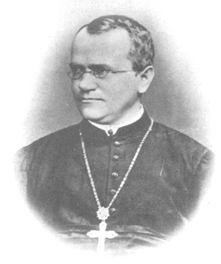

By the end of this section, you will be able to:
* Explain the scientific reasons for the success of Mendel’s experimental work
* Describe the expected outcomes of monohybrid crosses involving dominant and recessive alleles

 {: #fig-ch08_01_01}

Johann Gregor Mendel (1822–1884) ([\[link\]](#fig-ch08_01_01)) was a lifelong learner, teacher, scientist, and man of faith. As a young adult, he joined the Augustinian Abbey of St. Thomas in Brno in what is now the Czech Republic. Supported by the monastery, he taught physics, botany, and natural science courses at the secondary and university levels. In 1856, he began a decade-long research pursuit involving inheritance patterns in honeybees and plants, ultimately settling on pea plants as his primary **model system**{: data-type="term"} (a system with convenient characteristics that is used to study a specific biological phenomenon to gain understanding to be applied to other systems). In 1865, Mendel presented the results of his experiments with nearly 30,000 pea plants to the local natural history society. He demonstrated that traits are transmitted faithfully from parents to offspring in specific patterns. In 1866, he published his work, *Experiments in Plant Hybridization,*[1](#footnote1){: data-type="footnote-link"} in the proceedings of the Natural History Society of Brünn.

Mendel’s work went virtually unnoticed by the scientific community, which incorrectly believed that the process of inheritance involved a blending of parental traits that produced an intermediate physical appearance in offspring. This hypothetical process appeared to be correct because of what we know now as continuous variation. **Continuous variation**{: data-type="term"} is the range of small differences we see among individuals in a characteristic like human height. It does appear that offspring are a “blend” of their parents’ traits when we look at characteristics that exhibit continuous variation. Mendel worked instead with traits that show **discontinuous variation**{: data-type="term"}. Discontinuous variation is the variation seen among individuals when each individual shows one of two—or a very few—easily distinguishable traits, such as violet or white flowers. Mendel’s choice of these kinds of traits allowed him to see experimentally that the traits were not blended in the offspring as would have been expected at the time, but that they were inherited as distinct traits. In 1868, Mendel became abbot of the monastery and exchanged his scientific pursuits for his pastoral duties. He was not recognized for his extraordinary scientific contributions during his lifetime; in fact, it was not until 1900 that his work was rediscovered, reproduced, and revitalized by scientists on the brink of discovering the chromosomal basis of heredity.

### Mendel’s Crosses

Mendel’s seminal work was accomplished using the garden pea, *Pisum sativum*, to study inheritance. This species naturally self-fertilizes, meaning that pollen encounters ova within the same flower. The flower petals remain sealed tightly until pollination is completed to prevent the pollination of other plants. The result is highly inbred, or “true-breeding,” pea plants. These are plants that always produce offspring that look like the parent. By experimenting with true-breeding pea plants, Mendel avoided the appearance of unexpected traits in offspring that might occur if the plants were not true breeding. The garden pea also grows to maturity within one season, meaning that several generations could be evaluated over a relatively short time. Finally, large quantities of garden peas could be cultivated simultaneously, allowing Mendel to conclude that his results did not come about simply by chance.

Mendel performed **hybridizations**{: data-type="term"}, which involve mating two true-breeding individuals that have different traits. In the pea, which is naturally self-pollinating, this is done by manually transferring pollen from the anther of a mature pea plant of one variety to the stigma of a separate mature pea plant of the second variety.

Plants used in first-generation crosses were called **P**{: data-type="term"}, or parental generation, plants ([\[link\]](#fig-ch08_01_02)). Mendel collected the seeds produced by the P plants that resulted from each cross and grew them the following season. These offspring were called the **F1**{: data-type="term"}, or the first filial (filial = daughter or son), generation. Once Mendel examined the characteristics in the F1 generation of plants, he allowed them to self-fertilize naturally. He then collected and grew the seeds from the F1 plants to produce the **F2**{: data-type="term"}, or second filial, generation. Mendel’s experiments extended beyond the F2 generation to the F3 generation, F4 generation, and so on, but it was the ratio of characteristics in the P, F1, and F2 generations that were the most intriguing and became the basis of Mendel’s postulates.

{: #fig-ch08_01_02}

### Garden Pea Characteristics Revealed the Basics of Heredity

In his 1865 publication, Mendel reported the results of his crosses involving seven different characteristics, each with two contrasting traits. A **trait**{: data-type="term"} is defined as a variation in the physical appearance of a heritable characteristic. The characteristics included plant height, seed texture, seed color, flower color, pea-pod size, pea-pod color, and flower position. For the characteristic of flower color, for example, the two contrasting traits were white versus violet. To fully examine each characteristic, Mendel generated large numbers of F1 and F2 plants and reported results from thousands of F2 plants.

What results did Mendel find in his crosses for flower color? First, Mendel confirmed that he was using plants that bred true for white or violet flower color. Irrespective of the number of generations that Mendel examined, all self-crossed offspring of parents with white flowers had white flowers, and all self-crossed offspring of parents with violet flowers had violet flowers. In addition, Mendel confirmed that, other than flower color, the pea plants were physically identical. This was an important check to make sure that the two varieties of pea plants only differed with respect to one trait, flower color.

Once these validations were complete, Mendel applied the pollen from a plant with violet flowers to the stigma of a plant with white flowers. After gathering and sowing the seeds that resulted from this cross, Mendel found that 100 percent of the F1 hybrid generation had violet flowers. Conventional wisdom at that time would have predicted the hybrid flowers to be pale violet or for hybrid plants to have equal numbers of white and violet flowers. In other words, the contrasting parental traits were expected to blend in the offspring. Instead, Mendel’s results demonstrated that the white flower trait had completely disappeared in the F1 generation.

Importantly, Mendel did not stop his experimentation there. He allowed the F1 plants to self-fertilize and found that 705 plants in the F2 generation had violet flowers and 224 had white flowers. This was a ratio of 3.15 violet flowers to one white flower, or approximately 3:1. When Mendel transferred pollen from a plant with violet flowers to the stigma of a plant with white flowers and vice versa, he obtained approximately the same ratio irrespective of which parent—male or female—contributed which trait. This is called a **reciprocal cross**{: data-type="term"}—a paired cross in which the respective traits of the male and female in one cross become the respective traits of the female and male in the other cross. For the other six characteristics that Mendel examined, the F1 and F2 generations behaved in the same way that they behaved for flower color. One of the two traits would disappear completely from the F1 generation, only to reappear in the F2 generation at a ratio of roughly 3:1 ([\[link\]](#fig-ch08_01_03)).

 {: #fig-ch08_01_03}

Upon compiling his results for many thousands of plants, Mendel concluded that the characteristics could be divided into expressed and latent traits. He called these dominant and recessive traits, respectively. **Dominant**{: data-type="term"} traits are those that are inherited unchanged in a hybridization. **Recessive**{: data-type="term"} traits become latent, or disappear in the offspring of a hybridization. The recessive trait does, however, reappear in the progeny of the hybrid offspring. An example of a dominant trait is the violet-colored flower trait. For this same characteristic (flower color), white-colored flowers are a recessive trait. The fact that the recessive trait reappeared in the F2 generation meant that the traits remained separate (and were not blended) in the plants of the F1 generation. Mendel proposed that this was because the plants possessed two copies of the trait for the flower-color characteristic, and that each parent transmitted one of their two copies to their offspring, where they came together. Moreover, the physical observation of a dominant trait could mean that the genetic composition of the organism included two dominant versions of the characteristic, or that it included one dominant and one recessive version. Conversely, the observation of a recessive trait meant that the organism lacked any dominant versions of this characteristic.

Concept in Action

For an excellent review of Mendel’s experiments and to perform your own crosses and identify patterns of inheritance, visit the [Mendel’s Peas][1]{: target="_window"} web lab.

### Section Summary

Working with garden pea plants, Mendel found that crosses between parents that differed for one trait produced F1 offspring that all expressed one parent’s traits. The traits that were visible in the F1 generation are referred to as dominant, and traits that disappear in the F1 generation are described as recessive. When the F1 plants in Mendel’s experiment were self-crossed, the F2 offspring exhibited the dominant trait or the recessive trait in a 3:1 ratio, confirming that the recessive trait had been transmitted faithfully from the original P parent. Reciprocal crosses generated identical F1 and F2 offspring ratios. By examining sample sizes, Mendel showed that traits were inherited as independent events.

### Multiple Choice

Imagine that you are performing a cross involving seed color in garden pea plants. What traits would you expect to observe in the F1 offspring if you cross true-breeding parents with green seeds and yellow seeds? Yellow seed color is dominant over green.

1.  only yellow-green seeds
2.  only yellow seeds
3.  1:1 yellow seeds:green seeds
4.  1:3 green seeds:yellow seeds
{: data-number-style="lower-alpha"}

B

Imagine that you are performing a cross involving seed texture in garden pea plants. You cross true-breeding round and wrinkled parents to obtain F1 offspring. Which of the following experimental results in terms of numbers of plants are closest to what you expect in the F2 progeny?

1.  810 round seeds
2.  810 wrinkled seeds
3.  405:395 round seeds:wrinkled seeds
4.  610:190 round seeds:wrinkled seeds
{: data-number-style="lower-alpha"}

D

### Free Response

Describe one of the reasons that made the garden pea an excellent choice of model system for studying inheritance.

The garden pea has flowers that close tightly during self-pollination. This helps to prevent accidental or unintentional fertilizations that could have diminished the accuracy of Mendel’s data.

### Footnotes
{: data-type="footnote-refs-title"}

* {: data-type="footnote-ref" #footnote1} [1](#footnote-ref1){: data-type="footnote-ref-link"} Johann Gregor Mendel, “Versuche über Pflanzenhybriden.” *Verhandlungen des naturforschenden Vereines in Brünn*, Bd. IV für das Jahr, 1865 Abhandlungen (1866):3–47. \[for English translation, see http://www.mendelweb.org/Mendel.plain.html\]
{: data-list-type="bulleted" data-bullet-style="none"}

### Glossary
{: data-type="glossary-title"}

continuous variation
: a variation in a characteristic in which individuals show a range of traits with small differences between them
^

discontinuous variation
: a variation in a characteristic in which individuals show two, or a few, traits with large differences between them
^

dominant
: describes a trait that masks the expression of another trait when both versions of the gene are present in an individual
^

F1
: the first filial generation in a cross; the offspring of the parental generation
^

F2
: the second filial generation produced when F1 individuals are self-crossed or fertilized with each other
^

hybridization
: the process of mating two individuals that differ, with the goal of achieving a certain characteristic in their offspring
^

model system
: a species or biological system used to study a specific biological phenomenon to gain understanding that will be applied to other species
^

P
: the parental generation in a cross
^

recessive
: describes a trait whose expression is masked by another trait when the alleles for both traits are present in an individual
^

reciprocal cross
: a paired cross in which the respective traits of the male and female in one cross become the respective traits of the female and male in the other cross
^

trait
: a variation in an inherited characteristic

[1]: http://openstaxcollege.org/l/mendels_peas
