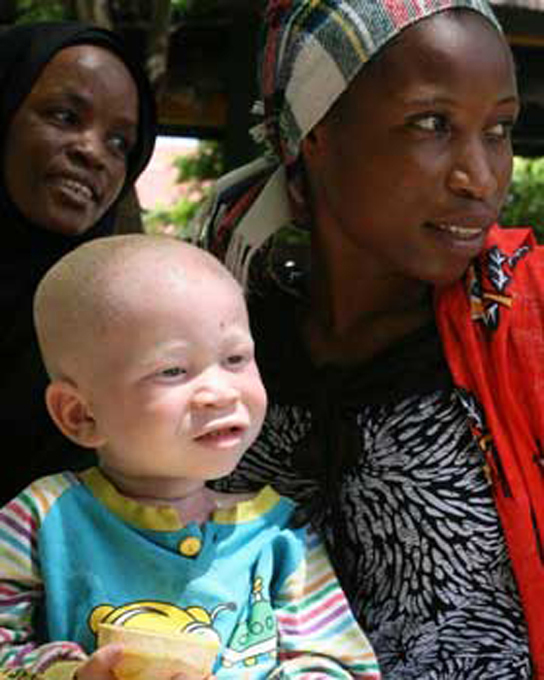
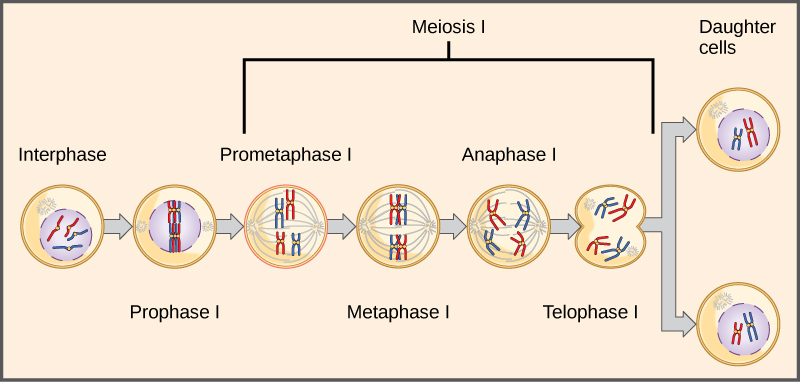

By the end of this section, you will be able to:
* Explain the relationship between genotypes and phenotypes in dominant and recessive gene systems
* Use a Punnett square to calculate the expected proportions of genotypes and phenotypes in a monohybrid cross
* Explain Mendel’s law of segregation and independent assortment in terms of genetics and the events of meiosis
* Explain the purpose and methods of a test cross

The seven characteristics that Mendel evaluated in his pea plants were each expressed as one of two versions, or traits. Mendel deduced from his results that each individual had two discrete copies of the characteristic that are passed individually to offspring. We now call those two copies genes, which are carried on chromosomes. The reason we have two copies of each gene is that we inherit one from each parent. In fact, it is the chromosomes we inherit and the two copies of each gene are located on paired chromosomes. Recall that in meiosis these chromosomes are separated out into haploid gametes. This separation, or segregation, of the homologous chromosomes means also that only one of the copies of the gene gets moved into a gamete. The offspring are formed when that gamete unites with one from another parent and the two copies of each gene (and chromosome) are restored.

For cases in which a single gene controls a single characteristic, a diploid organism has two genetic copies that may or may not encode the same version of that characteristic. For example, one individual may carry a gene that determines white flower color and a gene that determines violet flower color. Gene variants that arise by mutation and exist at the same relative locations on homologous chromosomes are called **alleles**{: data-type="term"}. Mendel examined the inheritance of genes with just two allele forms, but it is common to encounter more than two alleles for any given gene in a natural population.

# Phenotypes and Genotypes

Two alleles for a given gene in a diploid organism are expressed and interact to produce physical characteristics. The observable traits expressed by an organism are referred to as its **phenotype**{: data-type="term"}. An organism’s underlying genetic makeup, consisting of both the physically visible and the non-expressed alleles, is called its **genotype**{: data-type="term"}. Mendel’s hybridization experiments demonstrate the difference between phenotype and genotype. For example, the phenotypes that Mendel observed in his crosses between pea plants with differing traits are connected to the diploid genotypes of the plants in the P, F1, and F2 generations. We will use a second trait that Mendel investigated, seed color, as an example. Seed color is governed by a single gene with two alleles. The yellow-seed allele is dominant and the green-seed allele is recessive. When true-breeding plants were cross-fertilized, in which one parent had yellow seeds and one had green seeds, all of the F1 hybrid offspring had yellow seeds. That is, the hybrid offspring were phenotypically identical to the true-breeding parent with yellow seeds. However, we know that the allele donated by the parent with green seeds was not simply lost because it reappeared in some of the F2 offspring ([\[link\]](#fig-ch08_02_01)). Therefore, the F1 plants must have been genotypically different from the parent with yellow seeds.

The P plants that Mendel used in his experiments were each homozygous for the trait he was studying. Diploid organisms that are **homozygous**{: data-type="term"} for a gene have two identical alleles, one on each of their homologous chromosomes. The genotype is often written as *YY* or *yy*, for which each letter represents one of the two alleles in the genotype. The dominant allele is capitalized and the recessive allele is lower case. The letter used for the gene (seed color in this case) is usually related to the dominant trait (yellow allele, in this case, or “*Y*”). Mendel’s parental pea plants always bred true because both produced gametes carried the same allele. When P plants with contrasting traits were cross-fertilized, all of the offspring were **heterozygous**{: data-type="term"} for the contrasting trait, meaning their genotype had different alleles for the gene being examined. For example, the F1 yellow plants that received a *Y* allele from their yellow parent and a *y* allele from their green parent had the genotype *Yy*.

 ![A graphic with 2 columns, the first with the heading &#x201C;Phenotype&#x201D; and the second with the heading &#x201C;Genotype.&#x201D; In the phenotype column, one yellow pea plant cross-fertilizes with one green pea plant. The first generation of offspring is 100 percent yellow pea plants. After self-fertilization of these yellow pea offspring, 75 percent of the second generation offspring have yellow peas and 25 percent have green peas. The genotype column shows the first generation offspring as 100 percent Yy, and the second generation as 25 percent YY, 50 percent Yy, and 25 percent yy.](../resources/Figure_08_02_01.jpg "Phenotypes are physical expressions of traits that are transmitted by alleles. Capital letters represent dominant alleles and lowercase letters represent recessive alleles. The phenotypic ratios are the ratios of visible characteristics. The genotypic ratios are the ratios of gene combinations in the offspring, and these are not always distinguishable in the phenotypes."){: #fig-ch08_02_01 data-media-type="image/jpg"}

## Law of Dominance

Our discussion of homozygous and heterozygous organisms brings us to why the F1 heterozygous offspring were identical to one of the parents, rather than expressing both alleles. In all seven pea-plant characteristics, one of the two contrasting alleles was dominant, and the other was recessive. Mendel called the dominant allele the expressed unit factor; the recessive allele was referred to as the latent unit factor. We now know that these so-called unit factors are actually genes on homologous chromosomes. For a gene that is expressed in a dominant and recessive pattern, homozygous dominant and heterozygous organisms will look identical (that is, they will have different genotypes but the same phenotype), and the recessive allele will only be observed in homozygous recessive individuals ([\[link\]](#tab-ch08_02_01)).

<table id="tab-ch08_02_01" summary=""><thead>
<tr>
<th colspan="4">Correspondence between Genotype and Phenotype for a Dominant-Recessive Characteristic.</th>
</tr>
<tr>
<th /><th>Homozygous</th><th>Heterozygous</th><th>Homozygous</th>
</tr>
</thead><tbody>        
<tr><td>Genotype</td><td><em>YY</em></td><td><em>Yy</em></td><td><em>yy</em></td></tr>
<tr><td>Phenotype</td><td>yellow</td><td>yellow</td><td>green</td></tr>
</tbody></table>

Mendel’s **law of dominance**{: data-type="term"} states that in a heterozygote, one trait will conceal the presence of another trait for the same characteristic. For example, when crossing true-breeding violet-flowered plants with true-breeding white-flowered plants, all of the offspring were violet-flowered, even though they all had one allele for violet and one allele for white. Rather than both alleles contributing to a phenotype, the dominant allele will be expressed exclusively. The recessive allele will remain latent, but will be transmitted to offspring in the same manner as that by which the dominant allele is transmitted. The recessive trait will only be expressed by offspring that have two copies of this allele ([\[link\]](#fig-ch08_02_02)), and these offspring will breed true when self-crossed.

 {: #fig-ch08_02_02 data-media-type="image/jpg"}

# Monohybrid Cross and the Punnett Square

When fertilization occurs between two true-breeding parents that differ by only the characteristic being studied, the process is called a **monohybrid**{: data-type="term"} cross, and the resulting offspring are called monohybrids. Mendel performed seven types of monohybrid crosses, each involving contrasting traits for different characteristics. Out of these crosses, all of the F1 offspring had the phenotype of one parent, and the F2 offspring had a 3:1 phenotypic ratio. On the basis of these results, Mendel postulated that each parent in the monohybrid cross contributed one of two paired unit factors to each offspring, and every possible combination of unit factors was equally likely.

The results of Mendel’s research can be explained in terms of probabilities, which are mathematical measures of likelihood. The probability of an event is calculated by the number of times the event occurs divided by the total number of opportunities for the event to occur. A probability of one (100 percent) for some event indicates that it is guaranteed to occur, whereas a probability of zero (0 percent) indicates that it is guaranteed to not occur, and a probability of 0.5 (50 percent) means it has an equal chance of occurring or not occurring.

To demonstrate this with a monohybrid cross, consider the case of true-breeding pea plants with yellow versus green seeds. The dominant seed color is yellow; therefore, the parental genotypes were <em>YY </em>for the plants with yellow seeds<em> </em>and *yy* for the plants with green seeds. A **Punnett square**{: data-type="term"}, devised by the British geneticist Reginald Punnett, is useful for determining probabilities because it is drawn to predict all possible outcomes of all possible random fertilization events and their expected frequencies. [\[link\]](#fig-ch08_02_05) shows a Punnett square for a cross between a plant with yellow peas and one with green peas. To prepare a Punnett square, all possible combinations of the parental alleles (the genotypes of the gametes) are listed along the top (for one parent) and side (for the other parent) of a grid. The combinations of egg and sperm gametes are then made in the boxes in the table on the basis of which alleles are combining. Each box then represents the diploid genotype of a zygote, or fertilized egg. Because each possibility is equally likely, genotypic ratios can be determined from a Punnett square. If the pattern of inheritance (dominant and recessive) is known, the phenotypic ratios can be inferred as well. For a monohybrid cross of two true-breeding parents, each parent contributes one type of allele. In this case, only one genotype is possible in the F1 offspring. All offspring are *Yy* and have yellow seeds.

When the F1 offspring are crossed with each other, each has an equal probability of contributing either a *Y* or a *y* to the F2 offspring. The result is a 1 in 4 (25 percent) probability of both parents contributing a *Y*, resulting in an offspring with a yellow phenotype; a 25 percent probability of parent A contributing a *Y* and parent B a *y*, resulting in offspring with a yellow phenotype; a 25 percent probability of parent A contributing a *y* and parent B a *Y*, also resulting in a yellow phenotype; and a (25 percent) probability of both parents contributing a *y*, resulting in a green phenotype. When counting all four possible outcomes, there is a 3 in 4 probability of offspring having the yellow phenotype and a 1 in 4 probability of offspring having the green phenotype. This explains why the results of Mendel’s F2 generation occurred in a 3:1 phenotypic ratio. Using large numbers of crosses, Mendel was able to calculate probabilities, found that they fit the model of inheritance, and use these to predict the outcomes of other crosses.

# Law of Segregation

Observing that true-breeding pea plants with contrasting traits gave rise to F1 generations that all expressed the dominant trait and F2 generations that expressed the dominant and recessive traits in a 3:1 ratio, Mendel proposed the **law of segregation**{: data-type="term"}. This law states that paired unit factors (genes) must segregate equally into gametes such that offspring have an equal likelihood of inheriting either factor. For the F2 generation of a monohybrid cross, the following three possible combinations of genotypes result: homozygous dominant, heterozygous, or homozygous recessive. Because heterozygotes could arise from two different pathways (receiving one dominant and one recessive allele from either parent), and because heterozygotes and homozygous dominant individuals are phenotypically identical, the law supports Mendel’s observed 3:1 phenotypic ratio. The equal segregation of alleles is the reason we can apply the Punnett square to accurately predict the offspring of parents with known genotypes. The physical basis of Mendel’s law of segregation is the first division of meiosis in which the homologous chromosomes with their different versions of each gene are segregated into daughter nuclei. This process was not understood by the scientific community during Mendel’s lifetime ([\[link\]](#fig-ch08_02_03)).

 {: #fig-ch08_02_03 data-media-type="image/jpg"}

## Test Cross

Beyond predicting the offspring of a cross between known homozygous or heterozygous parents, Mendel also developed a way to determine whether an organism that expressed a dominant trait was a heterozygote or a homozygote. Called the **test cross**{: data-type="term"}, this technique is still used by plant and animal breeders. In a test cross, the dominant-expressing organism is crossed with an organism that is homozygous recessive for the same characteristic. If the dominant-expressing organism is a homozygote, then all F1 offspring will be heterozygotes expressing the dominant trait ([\[link\]](#fig-ch08_02_04)). Alternatively, if the dominant-expressing organism is a heterozygote, the F1 offspring will exhibit a 1:1 ratio of heterozygotes and recessive homozygotes ([\[link\]](#fig-ch08_02_04)). The test cross further validates Mendel’s postulate that pairs of unit factors segregate equally.

 {: #fig-ch08_02_04 data-media-type="image/jpg"}

Art Connection

![This illustration shows a monohybrid cross. In the P generation, one parent has a dominant yellow phenotype and the genotype YY, and the other parent has the recessive green phenotype and the genotype yy. Each parent produces one kind of gamete, resulting in an F\_\{1} generation with a dominant yellow phenotype and the genotype Yy. Self-pollination of the F\_\{1} generation results in an F\_\{2} generation with a 3 to 1 ratio of yellow to green peas. One out of three of the yellow pea plants has a dominant genotype of YY, and 2 out of 3 has the heterozygous genotype Yy. The homozygous recessive plant has the green phenotype and the genotype yy.](../resources/Figure_08_02_05.png "This Punnett square shows the cross between plants with yellow seeds and green seeds. The cross between the true-breeding P plants produces F1 heterozygotes that can be self-fertilized. The self-cross of the F1 generation can be analyzed with a Punnett square to predict the genotypes of the F2 generation. Given an inheritance pattern of dominant&#x2013;recessive, the genotypic and phenotypic ratios can then be determined."){: #fig-ch08_02_05 data-media-type="image/png"}

In pea plants, round peas (*R*) are dominant to wrinkled peas (*r*). You do a test cross between a pea plant with wrinkled peas (genotype *rr*) and a plant of unknown genotype that has round peas. You end up with three plants, all which have round peas. From this data, can you tell if the parent plant is homozygous dominant or heterozygous?

<!-- <para><link target-id="fig-ch08_02_05" document=""/> You cannot be sure if the plant is homozygous or heterozygous as the data set is too small: by random chance, all three plants might have acquired only the dominant gene even if the recessive one is present.</para> -->

# Law of Independent Assortment

Mendel’s **law of independent assortment**{: data-type="term"} states that genes do not influence each other with regard to the sorting of alleles into gametes, and every possible combination of alleles for every gene is equally likely to occur. Independent assortment of genes can be illustrated by the **dihybrid**{: data-type="term"} cross, a cross between two true-breeding parents that express different traits for two characteristics. Consider the characteristics of seed color and seed texture for two pea plants, one that has wrinkled, green seeds (*rryy*) and another that has round, yellow seeds (*RRYY*). Because each parent is homozygous, the law of segregation indicates that the gametes for the wrinkled–green plant all are *ry*, and the gametes for the round–yellow plant are all *RY*. Therefore, the F1 generation of offspring all are <em>RrYy </em>([\[link\]](#fig-ch08_02_06)).

Art Connection

![This illustration shows a dihybrid cross between pea plants. In the P generation, a plant that has the homozygous dominant phenotype of yellow, round peas is crossed with a plant with the homozygous recessive phenotype of green, wrinkled peas. The resulting F\_\{1} offspring have a heterozygous genotype and yellow, round peas. Self-pollination of the F\_\{1} generation results in F\_\{2} offspring with a phenotypic ratio of 9:3:3:1 for round&#x2013;yellow, round&#x2013;green, wrinkled&#x2013;yellow, and wrinkled&#x2013;green peas, respectively.](../resources/Figure_08_02_06.png "A dihybrid cross in pea plants involves the genes for seed color and texture. The P cross produces F1 offspring that are all heterozygous for both characteristics. The resulting 9:3:3:1 F2 phenotypic ratio is obtained using a Punnett square."){: #fig-ch08_02_06 data-media-type="image/png"}

In pea plants, purple flowers (*P*) are dominant to white (*p*), and yellow peas (*Y*) are dominant to green (*y*). What are the possible genotypes and phenotypes for a cross between *PpYY* and *ppYy* pea plants? How many squares would you need to complete a Punnett square analysis of this cross?

<!-- <solution>
<para><link target-id="fig-ch08_02_06" document=""/> The possible genotypes are <emphasis effect="italics">PpYY</emphasis>, <emphasis effect="italics">PpYy</emphasis>, <emphasis effect="italics">ppYY</emphasis>, and <emphasis effect="italics">ppYy</emphasis>. The former two genotypes would result in plants with purple flowers and yellow peas, while the latter two genotypes would result in plants with white flowers with yellow peas, for a 1:1 ratio of each phenotype. You only need a 2 &#215; 2 Punnett square (four squares total) to do this analysis because two of the alleles are homozygous.</para>
</solution>-->

The gametes produced by the F1 individuals must have one allele from each of the two genes. For example, a gamete could get an *R* allele for the seed shape gene and either a *Y* or a *y* allele for the seed color gene. It cannot get both an *R* and an *r* allele; each gamete can have only one allele per gene. The law of independent assortment states that a gamete into which an *r* allele is sorted would be equally likely to contain either a *Y* or a *y* allele. Thus, there are four equally likely gametes that can be formed when the *RrYy* heterozygote is self-crossed, as follows: *RY*, *rY*, *Ry*, and *ry*. Arranging these gametes along the top and left of a 4 × 4 Punnett square ([\[link\]](#fig-ch08_02_06)) gives us 16 equally likely genotypic combinations. From these genotypes, we find a phenotypic ratio of 9 round–yellow:3 round–green:3 wrinkled–yellow:1 wrinkled–green ([\[link\]](#fig-ch08_02_06)). These are the offspring ratios we would expect, assuming we performed the crosses with a large enough sample size.

The physical basis for the law of independent assortment also lies in meiosis I, in which the different homologous pairs line up in random orientations. Each gamete can contain any combination of paternal and maternal chromosomes (and therefore the genes on them) because the orientation of tetrads on the metaphase plane is random ([\[link\]](#fig-ch08_02_07)).

 {: #fig-ch08_02_07 data-media-type="image/jpg"}

# Section Summary

When true-breeding, or homozygous, individuals that differ for a certain trait are crossed, all of the offspring will be heterozygous for that trait. If the traits are inherited as dominant and recessive, the F1 offspring will all exhibit the same phenotype as the parent homozygous for the dominant trait. If these heterozygous offspring are self-crossed, the resulting F2 offspring will be equally likely to inherit gametes carrying the dominant or recessive trait, giving rise to offspring of which one quarter are homozygous dominant, half are heterozygous, and one quarter are homozygous recessive. Because homozygous dominant and heterozygous individuals are phenotypically identical, the observed traits in the F2 offspring will exhibit a ratio of three dominant to one recessive.

Mendel postulated that genes (characteristics) are inherited as pairs of alleles (traits) that behave in a dominant and recessive pattern. Alleles segregate into gametes such that each gamete is equally likely to receive either one of the two alleles present in a diploid individual. In addition, genes are assorted into gametes independently of one another. That is, in general, alleles are not more likely to segregate into a gamete with a particular allele of another gene.

# Art Connections

[[link]](#fig-ch08_02_05) In pea plants, round peas (*R*) are dominant to wrinkled peas (*r*). You do a test cross between a pea plant with wrinkled peas (genotype *rr*) and a plant of unknown genotype that has round peas. You end up with three plants, all which have round peas. From this data, can you tell if the parent plant is homozygous dominant or heterozygous?

[[link]](#fig-ch08_02_05) You cannot be sure if the plant is homozygous or heterozygous as the data set is too small: by random chance, all three plants might have acquired only the dominant gene even if the recessive one is present.

[[link]](#fig-ch08_02_06) In pea plants, purple flowers (*P*) are dominant to white (*p*), and yellow peas (*Y*) are dominant to green (*y*). What are the possible genotypes and phenotypes for a cross between *PpYY* and *ppYy* pea plants? How many squares would you need to complete a Punnett square analysis of this cross?

[[link]](#fig-ch08_02_06) The possible genotypes are *PpYY*, *PpYy*, *ppYY*, and *ppYy*. The former two genotypes would result in plants with purple flowers and yellow peas, while the latter two genotypes would result in plants with white flowers with yellow peas, for a 1:1 ratio of each phenotype. You only need a 2 × 2 Punnett square (four squares total) to do this analysis because two of the alleles are homozygous.

# Multiple Choice

The observable traits expressed by an organism are described as its \_\_\_\_\_\_\_\_.

1.  phenotype
2.  genotype
3.  alleles
4.  zygote
{: data-number-style="lower-alpha"}

A

A recessive trait will be observed in individuals that are \_\_\_\_\_\_\_\_ for that trait.

1.  heterozygous
2.  homozygous or heterozygous
3.  homozygous
4.  diploid
{: data-number-style="lower-alpha"}

C

What are the types of gametes that can be produced by an individual with the genotype *AaBb*?

1.  *Aa*, *Bb*
2.  *AA*, *aa*, *BB*, *bb*
3.  *AB*, *Ab*, *aB*, *ab*
4.  *AB*, *ab*
{: data-number-style="lower-alpha"}

C

What is the reason for doing a test cross?

1.  to identify heterozygous individuals with the dominant phenotype
2.  to determine which allele is dominant and which is recessive
3.  to identify homozygous recessive individuals in the F2
4.  to determine if two genes assort independently
{: data-number-style="lower-alpha"}

A

# Free Response

Use a Punnett square to predict the offspring in a cross between a dwarf pea plant (homozygous recessive) and a tall pea plant (heterozygous). What is the phenotypic ratio of the offspring?

The Punnett square would be 2 × 2 and will have *T* and *T* along the top and *T* and *t* along the left side. Clockwise from the top left, the genotypes listed within the boxes will be *Tt*, *Tt*, *tt*, and *tt*. The phenotypic ratio will be 1 tall:1 dwarf.

Use a Punnett square to predict the offspring in a cross between a tall pea plant (heterozygous) and a tall pea plant (heterozygous). What is the genotypic ratio of the offspring?

The Punnett square will be 2 × 2 and will have *T* and *t* along the top and *T* and *t* along the left side. Clockwise from the top left, the genotypes listed within the boxes will be *TT*, *Tt*, *Tt*, and *tt*. The genotypic ratio will be 1*TT*:2*Tt*:1*tt*.

