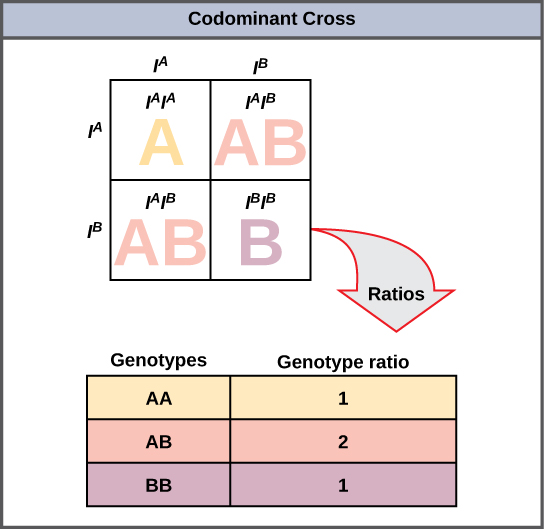
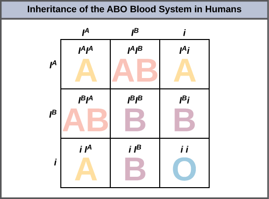
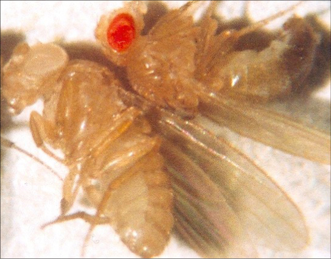

By the end of this section, you will be able to:
* Identify non-Mendelian inheritance patterns such as incomplete dominance, codominance, multiple alleles, and sex linkage from the results of crosses
* Explain the effect of linkage and recombination on gamete genotypes
* Explain the phenotypic outcomes of epistatic effects among genes

Mendel studied traits with only one mode of inheritance in pea plants. The inheritance of the traits he studied all followed the relatively simple pattern of dominant and recessive alleles for a single characteristic. There are several important modes of inheritance, discovered after Mendel’s work, that do not follow the dominant and recessive, single-gene model.

### Alternatives to Dominance and Recessiveness

Mendel’s experiments with pea plants suggested that: 1) two types of “units” or alleles exist for every gene; 2) alleles maintain their integrity in each generation (no blending); and 3) in the presence of the dominant allele, the recessive allele is hidden, with no contribution to the phenotype. Therefore, recessive alleles can be “carried” and not expressed by individuals. Such heterozygous individuals are sometimes referred to as “carriers.” Since then, genetic studies in other organisms have shown that much more complexity exists, but that the fundamental principles of Mendelian genetics still hold true. In the sections to follow, we consider some of the extensions of Mendelism.

#### Incomplete Dominance

Mendel’s results, demonstrating that traits are inherited as dominant and recessive pairs, contradicted the view at that time that offspring exhibited a blend of their parents’ traits. However, the heterozygote phenotype occasionally does appear to be intermediate between the two parents. For example, in the snapdragon, *Antirrhinum majus* ([\[link\]](#fig-ch08_03_01)), a cross between a homozygous parent with white flowers (*CWCW*) and a homozygous parent with red flowers (*CRCR*) will produce offspring with pink flowers (*CRCW*). (Note that different genotypic abbreviations are used for Mendelian extensions to distinguish these patterns from simple dominance and recessiveness.) This pattern of inheritance is described as **incomplete dominance**{: data-type="term"}, meaning that one of the alleles appears in the phenotype in the heterozygote, but not to the exclusion of the other, which can also be seen. The allele for red flowers is incompletely dominant over the allele for white flowers. However, the results of a heterozygote self-cross can still be predicted, just as with Mendelian dominant and recessive crosses. In this case, the genotypic ratio would be 1 *CRCR*\:2 *CRCW*\:1 *CWCW*, and the phenotypic ratio would be 1:2:1 for red:pink:white. The basis for the intermediate color in the heterozygote is simply that the pigment produced by the red allele (anthocyanin) is diluted in the heterozygote and therefore appears pink because of the white background of the flower petals.

 "){: #fig-ch08_03_01}

#### Codominance

A variation on incomplete dominance is **codominance**{: data-type="term"}, in which both alleles for the same characteristic are simultaneously expressed in the heterozygote. An example of codominance occurs in the ABO blood groups of humans. The A and B alleles are expressed in the form of A or B molecules present on the surface of red blood cells. Homozygotes (*IAIA* and *IBIB*) express either the A or the B phenotype, and heterozygotes (*IAIB*) express both phenotypes equally. The *IAIB* individual has blood type AB. In a self-cross between heterozygotes expressing a codominant trait, the three possible offspring genotypes are phenotypically distinct. However, the 1:2:1 genotypic ratio characteristic of a Mendelian monohybrid cross still applies ([\[link\]](#fig-ch08_03_02)).

 {: #fig-ch08_03_02}

#### Multiple Alleles

Mendel implied that only two alleles, one dominant and one recessive, could exist for a given gene. We now know that this is an oversimplification. Although individual humans (and all diploid organisms) can only have two alleles for a given gene, multiple alleles may exist at the population level, such that many combinations of two alleles are observed. Note that when many alleles exist for the same gene, the convention is to denote the most common phenotype or genotype in the natural population as the **wild type**{: data-type="term"} (often abbreviated “+”). All other phenotypes or genotypes are considered variants (mutants) of this typical form, meaning they deviate from the wild type. The variant may be recessive or dominant to the wild-type allele.

An example of multiple alleles is the ABO blood-type system in humans. In this case, there are three alleles circulating in the population. The *IA* allele codes for A molecules on the red blood cells, the *IB* allele codes for B molecules on the surface of red blood cells, and the *i* allele codes for no molecules on the red blood cells. In this case, the *IA* and *IB* alleles are codominant with each other and are both dominant over the *i* allele. Although there are three alleles present in a population, each individual only gets two of the alleles from their parents. This produces the genotypes and phenotypes shown in [\[link\]](#fig-ch08_03_03). Notice that instead of three genotypes, there are six different genotypes when there are three alleles. The number of possible phenotypes depends on the dominance relationships between the three alleles.

 {: #fig-ch08_03_03}

Evolution in Action

Multiple Alleles Confer Drug Resistance in the Malaria ParasiteMalaria is a parasitic disease in humans that is transmitted by infected female mosquitoes, including *Anopheles gambiae*, and is characterized by cyclic high fevers, chills, flu-like symptoms, and severe anemia. <em>Plasmodium falciparum </em>and <em>P. vivax </em>are the most common causative agents of malaria, and <em>P. falciparum </em>is the most deadly. When promptly and correctly treated, *P. falciparum* malaria has a mortality rate of 0.1 percent. However, in some parts of the world, the parasite has evolved resistance to commonly used malaria treatments, so the most effective malarial treatments can vary by geographic region.

In Southeast Asia, Africa, and South America, *P. falciparum* has developed resistance to the anti-malarial drugs chloroquine, mefloquine, and sulfadoxine-pyrimethamine. *P. falciparum*, which is haploid during the life stage in which it is infective to humans, has evolved multiple drug-resistant mutant alleles of the <em>dhps </em>gene. Varying degrees of sulfadoxine resistance are associated with each of these alleles. Being haploid, <em>P. falciparum </em>needs only one drug-resistant allele to express this trait.

In Southeast Asia, different sulfadoxine-resistant alleles of the *dhps* gene are localized to different geographic regions. This is a common evolutionary phenomenon that comes about because drug-resistant mutants arise in a population and interbreed with other <em>P. falciparum </em>isolates in close proximity. Sulfadoxine-resistant parasites cause considerable human hardship in regions in which this drug is widely used as an over-the-counter malaria remedy. As is common with pathogens that multiply to large numbers within an infection cycle, *P. falciparum* evolves relatively rapidly (over a decade or so) in response to the selective pressure of commonly used anti-malarial drugs. For this reason, scientists must constantly work to develop new drugs or drug combinations to combat the worldwide malaria burden.[1](#footnote1){: data-type="footnote-link"}

#### Sex-Linked Traits

In humans, as well as in many other animals and some plants, the sex of the individual is determined by sex chromosomes—one pair of non-homologous chromosomes. Until now, we have only considered inheritance patterns among non-sex chromosomes, or autosomes. In addition to 22 homologous pairs of autosomes, human females have a homologous pair of X chromosomes, whereas human males have an XY chromosome pair. Although the Y chromosome contains a small region of similarity to the X chromosome so that they can pair during meiosis, the Y chromosome is much shorter and contains fewer genes. When a gene being examined is present on the X, but not the Y, chromosome, it is **X-linked**{: data-type="term"}.

Eye color in *Drosophila*, the common fruit fly, was the first X-linked trait to be identified. Thomas Hunt Morgan mapped this trait to the X chromosome in 1910. Like humans, *Drosophila* males have an XY chromosome pair, and females are XX. In flies the wild-type eye color is red (X*W*) and is dominant to white eye color (X*w*) ([\[link\]](#fig-ch08_03_04)). Because of the location of the eye-color gene, reciprocal crosses do not produce the same offspring ratios. Males are said to be **hemizygous**{: data-type="term"}, in that they have only one allele for any X-linked characteristic. Hemizygosity makes descriptions of dominance and recessiveness irrelevant for XY males. *Drosophila* males lack the white gene on the Y chromosome; that is, their genotype can only be XWY or X*w*Y. In contrast, females have two allele copies of this gene and can be X*W*X*W*, X*W*X*w*, or X*w*X*w*.

 {: #fig-ch08_03_04}

In an X-linked cross, the genotypes of F1 and F2 offspring depend on whether the recessive trait was expressed by the male or the female in the P generation. With respect to *Drosophila* eye color, when the P male expresses the white-eye phenotype and the female is homozygously red-eyed, all members of the F1 generation exhibit red eyes ([\[link\]](#fig-ch08_03_05)). The F1 females are heterozygous (X*W*X*w*), and the males are all X*W*Y, having received their X chromosome from the homozygous dominant P female and their Y chromosome from the P male. A subsequent cross between the X*W*X*w* female and the X*W*Y<em> </em>male would produce only red-eyed females (with X*W*X*W* or X*W*X*w* genotypes) and both red- and white-eyed males (with X*W*Y or XwY genotypes). Now, consider a cross between a homozygous white-eyed female and a male with red eyes. The F1 generation would exhibit only heterozygous red-eyed females (XWXw) and only white-eyed males (XwY). Half of the F2 females would be red-eyed (XWXw) and half would be white-eyed (XwXw). Similarly, half of the F2 males would be red-eyed (XWY) and half would be white-eyed (XwY).

Art Connection

![This illustration shows a Punnett square analysis of fruit fly eye color, which is a sex-linked trait. A red-eyed male fruit fly with the genotype X^\{w}Y is crossed with a white-eyed female fruit fly with the genotype X^\{w}X^\{w}. All of the female offspring acquire a dominant X^\{W} allele from the father and a recessive X^\{w} allele from the mother, and are therefore heterozygous dominant with red eye color. All the male offspring acquire a recessive X^\{w} allele from the mother and a Y chromosome from the father and are therefore hemizygous recessive with white eye color.](../resources/Figure_08_03_05.png "Crosses involving sex-linked traits often give rise to different phenotypes for the different sexes of offspring, as is the case for this cross involving red and white eye color in Drosophila. In the diagram, w is the white-eye mutant allele and W is the wild-type, red-eye allele."){: #fig-ch08_03_05}

What ratio of offspring would result from a cross between a white-eyed male and a female that is heterozygous for red eye color?

<!-- 
    <solution>
    <para><link target-id="fig-ch08_03_05" document=""/> Half of the female offspring would be heterozygous (XWXw) with red eyes, and half would be homozygous recessive (XwXw) with white eyes. Half of the male offspring would be hemizygous dominant (XWY) with red eyes, and half would be hemizygous recessive (XwY) with white eyes.</para>
</solution> -->

Discoveries in fruit fly genetics can be applied to human genetics. When a female parent is homozygous for a recessive X-linked trait, she will pass the trait on to 100 percent of her male offspring, because the males will receive the Y chromosome from the male parent. In humans, the alleles for certain conditions (some color-blindness, hemophilia, and muscular dystrophy) are X-linked. Females who are heterozygous for these diseases are said to be carriers and may not exhibit any phenotypic effects. These females will pass the disease to half of their sons and will pass carrier status to half of their daughters; therefore, X-linked traits appear more frequently in males than females.

In some groups of organisms with sex chromosomes, the sex with the non-homologous sex chromosomes is the female rather than the male. This is the case for all birds. In this case, sex-linked traits will be more likely to appear in the female, in whom they are hemizygous.

Concept in Action

  
Watch [this video][1]{: target="_window"} to learn more about sex-linked traits.

### Linked Genes Violate the Law of Independent Assortment

Although all of Mendel’s pea plant characteristics behaved according to the law of independent assortment, we now know that some allele combinations are not inherited independently of each other. Genes that are located on separate, non-homologous chromosomes will always sort independently. However, each chromosome contains hundreds or thousands of genes, organized linearly on chromosomes like beads on a string. The segregation of alleles into gametes can be influenced by **linkage**{: data-type="term"}, in which genes that are located physically close to each other on the same chromosome are more likely to be inherited as a pair. However, because of the process of recombination, or “crossover,” it is possible for two genes on the same chromosome to behave independently, or as if they are not linked. To understand this, let us consider the biological basis of gene linkage and recombination.

Homologous chromosomes possess the same genes in the same order, though the specific alleles of the gene can be different on each of the two chromosomes. Recall that during interphase and prophase I of meiosis, homologous chromosomes first replicate and then synapse, with like genes on the homologs aligning with each other. At this stage, segments of homologous chromosomes exchange linear segments of genetic material ([\[link\]](#fig-ch08_03_06)). This process is called **recombination**{: data-type="term"}, or crossover, and it is a common genetic process. Because the genes are aligned during recombination, the gene order is not altered. Instead, the result of recombination is that maternal and paternal alleles are combined onto the same chromosome. Across a given chromosome, several recombination events may occur, causing extensive shuffling of alleles.

 {: #fig-ch08_03_06}

When two genes are located on the same chromosome, they are considered linked, and their alleles tend to be transmitted through meiosis together. To exemplify this, imagine a dihybrid cross involving flower color and plant height in which the genes are next to each other on the chromosome. If one homologous chromosome has alleles for tall plants and red flowers, and the other chromosome has genes for short plants and yellow flowers, then when the gametes are formed, the tall and red alleles will tend to go together into a gamete and the short and yellow alleles will go into other gametes. These are called the parental genotypes because they have been inherited intact from the parents of the individual producing gametes. But unlike if the genes were on different chromosomes, there will be no gametes with tall and yellow alleles and no gametes with short and red alleles. If you create a Punnett square with these gametes, you will see that the classical Mendelian prediction of a 9:3:3:1 outcome of a dihybrid cross would not apply. As the distance between two genes increases, the probability of one or more crossovers between them increases and the genes behave more like they are on separate chromosomes. Geneticists have used the proportion of recombinant gametes (the ones not like the parents) as a measure of how far apart genes are on a chromosome. Using this information, they have constructed linkage maps of genes on chromosomes for well-studied organisms, including humans.

Mendel’s seminal publication makes no mention of linkage, and many researchers have questioned whether he encountered linkage but chose not to publish those crosses out of concern that they would invalidate his independent assortment postulate. The garden pea has seven chromosomes, and some have suggested that his choice of seven characteristics was not a coincidence. However, even if the genes he examined were not located on separate chromosomes, it is possible that he simply did not observe linkage because of the extensive shuffling effects of recombination.

### Epistasis

Mendel’s studies in pea plants implied that the sum of an individual’s phenotype was controlled by genes (or as he called them, unit factors), such that every characteristic was distinctly and completely controlled by a single gene. In fact, single observable characteristics are almost always under the influence of multiple genes (each with two or more alleles) acting in unison. For example, at least eight genes contribute to eye color in humans.

Concept in Action

  
Eye color in humans is determined by multiple alleles. Use the [Eye Color Calculator][2]{: target="_window"} to predict the eye color of children from parental eye color.

In some cases, several genes can contribute to aspects of a common phenotype without their gene products ever directly interacting. In the case of organ development, for instance, genes may be expressed sequentially, with each gene adding to the complexity and specificity of the organ. Genes may function in complementary or synergistic fashions, such that two or more genes expressed simultaneously affect a phenotype. An apparent example of this occurs with human skin color, which appears to involve the action of at least three (and probably more) genes. Cases in which inheritance for a characteristic like skin color or human height depend on the combined effects of numerous genes are called polygenic inheritance.

Genes may also oppose each other, with one gene suppressing the expression of another. In **epistasis**{: data-type="term"}, the interaction between genes is antagonistic, such that one gene masks or interferes with the expression of another. “Epistasis” is a word composed of Greek roots meaning “standing upon.” The alleles that are being masked or silenced are said to be hypostatic to the epistatic alleles that are doing the masking. Often the biochemical basis of epistasis is a gene pathway in which expression of one gene is dependent on the function of a gene that precedes or follows it in the pathway.

An example of epistasis is pigmentation in mice. The wild-type coat color, agouti (AA) is dominant to solid-colored fur (aa). However, a separate gene C, when present as the recessive homozygote (cc), negates any expression of pigment from the A gene and results in an albino mouse ([\[link\]](#fig-ch08_03_07)). Therefore, the genotypes *AAcc*, *Aacc*, and *aacc* all produce the same albino phenotype. A cross between heterozygotes for both genes (*AaCc* x *AaCc*) would generate offspring with a phenotypic ratio of 9 agouti:3 black:4 albino ([\[link\]](#fig-ch08_03_07)). In this case, the *C* gene is epistatic to the *A* gene.

 masks the expression of another (A) for coat color. When the C allele is present, coat color is expressed; when it is absent (cc), no coat color is expressed. Coat color depends on the A gene, which shows dominance, with the recessive homozygote showing a different phenotype than the heterozygote or dominant homozygote."){: #fig-ch08_03_07}

### Section Summary

Alleles do not always behave in dominant and recessive patterns. Incomplete dominance describes situations in which the heterozygote exhibits a phenotype that is intermediate between the homozygous phenotypes. Codominance describes the simultaneous expression of both of the alleles in the heterozygote. Although diploid organisms can only have two alleles for any given gene, it is common for more than two alleles for a gene to exist in a population. In humans, as in many animals and some plants, females have two X chromosomes and males have one X and one Y chromosome. Genes that are present on the X but not the Y chromosome are said to be X-linked, such that males only inherit one allele for the gene, and females inherit two.

According to Mendel’s law of independent assortment, genes sort independently of each other into gametes during meiosis. This occurs because chromosomes, on which the genes reside, assort independently during meiosis and crossovers cause most genes on the same chromosomes to also behave independently. When genes are located in close proximity on the same chromosome, their alleles tend to be inherited together. This results in offspring ratios that violate Mendel\'s law of independent assortment. However, recombination serves to exchange genetic material on homologous chromosomes such that maternal and paternal alleles may be recombined on the same chromosome. This is why alleles on a given chromosome are not always inherited together. Recombination is a random event occurring anywhere on a chromosome. Therefore, genes that are far apart on the same chromosome are likely to still assort independently because of recombination events that occurred in the intervening chromosomal space.

Whether or not they are sorting independently, genes may interact at the level of gene products, such that the expression of an allele for one gene masks or modifies the expression of an allele for a different gene. This is called epistasis.

### Art Connections

[[link]](#fig-ch08_03_05) What ratio of offspring would result from a cross between a white-eyed male and a female that is heterozygous for red eye color?

[[link]](#fig-ch08_03_05) Half of the female offspring would be heterozygous (X*W*X*w*) with red eyes, and half would be homozygous recessive (X*w*X*w*) with white eyes. Half of the male offspring would be hemizygous dominant (X*W*Y) with red eyes, and half would be hemizygous recessive (X*w*Y) with white eyes.

### Multiple Choice

If black and white true-breeding mice are mated and the result is all gray offspring, what inheritance pattern would this be indicative of?

1.  dominance
2.  codominance
3.  multiple alleles
4.  incomplete dominance
{: type="a"}

D

The ABO blood groups in humans are expressed as the *IA*, *IB*, and *i* alleles. The *IA* allele encodes the A blood group antigen, *IB* encodes B, and *i* encodes O. Both A and B are dominant to O. If a heterozygous blood type A parent (*IAi*) and a heterozygous blood type B parent (*IBi*) mate, one quarter of their offspring are expected to have the AB blood type (*IAIB*) in which both antigens are expressed equally. Therefore, ABO blood groups are an example of:

1.  multiple alleles and incomplete dominance
2.  codominance and incomplete dominance
3.  incomplete dominance only
4.  multiple alleles and codominance
{: type="a"}

D

In a cross between a homozygous red-eyed female fruit fly and a white-eyed male fruit fly, what is the expected outcome?

1.  all white-eyed male offspring
2.  all white-eyed female offspring
3.  all red-eyed offspring
4.  half white-eyed make offspring
{: type="a"}

C

When a population has a gene with four alleles circulating, how many possible genotypes are there?

1.  3
2.  6
3.  10
4.  16
{: type="a"}

C

### Free Response

Can a male be a carrier of red-green color blindness?

No, males can only express color blindness and cannot carry it because an individual needs two X chromosomes to be a carrier.

Could an individual with blood type O (genotype *ii*) be a legitimate child of parents in which one parent had blood type A and the other parent had blood type B?

Yes this child could have come from these parents. The child would have inherited an *i* allele from each parent and for this to happen the type A parent had to have genotype *IAi* and the type b parent had to have genotype *IBi*.

### Footnotes
{: data-type="footnote-refs-title"}

* {: data-type="footnote-ref" #footnote1} [1](#footnote-ref1){: data-type="footnote-ref-link"} Sumiti Vinayak et al., “Origin and Evolution of Sulfadoxine Resistant *Plasmodium falciparum,” PLoS Pathogens* 6 (2010): e1000830.
{: data-list-type="bulleted" data-bullet-style="none"}

### Glossary
{: data-type="glossary-title"}

codominance
: in a heterozygote, complete and simultaneous expression of both alleles for the same characteristic
^

epistasis
: an interaction between genes such that one gene masks or interferes with the expression of another
^

hemizygous
: the presence of only one allele for a characteristic, as in X-linkage; hemizygosity makes descriptions of dominance and recessiveness irrelevant
^

incomplete dominance
: in a heterozygote, expression of two contrasting alleles such that the individual displays an intermediate phenotype
^

linkage
: a phenomenon in which alleles that are located in close proximity to each other on the same chromosome are more likely to be inherited together
^

recombination
: the process during meiosis in which homologous chromosomes exchange linear segments of genetic material, thereby dramatically increasing genetic variation in the offspring and separating linked genes
^

wild type
: the most commonly occurring genotype or phenotype for a given characteristic found in a population
^

X-linked
: a gene present on the X chromosome, but not the Y chromosome

[1]: http://openstaxcollege.org/l/sex-linked_trts
[2]: http://openstaxcollege.org/l/eye_color_calc
