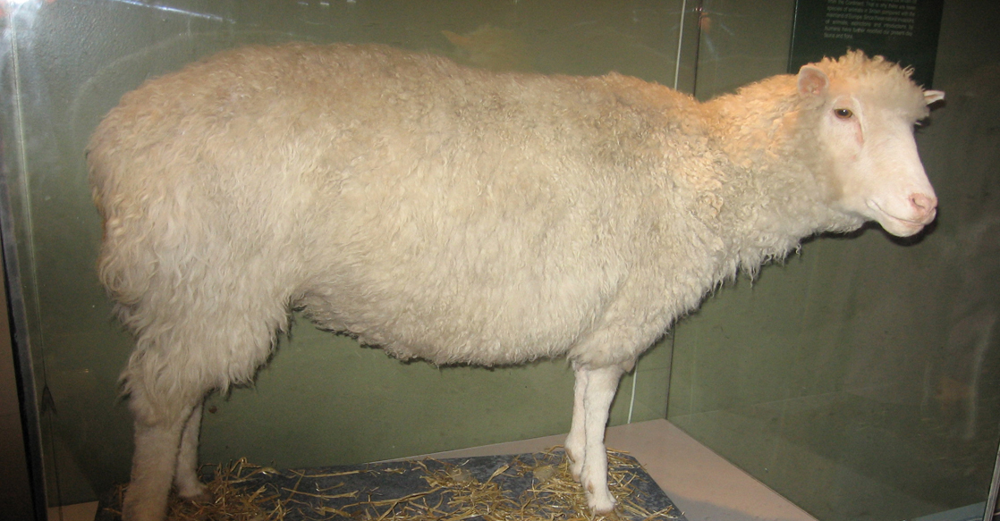

<cnx-pi data-type="cnx.flag.introduction"> class="introduction" </cnx-pi>

<cnx-pi data-type="cnx.eoc">class="summary" title="Sections Summary"</cnx-pi>

<cnx-pi data-type="cnx.eoc">class="art-exercise" title="Art Connections"</cnx-pi>

<cnx-pi data-type="cnx.eoc">class="multiple-choice" title="Multiple Choice"</cnx-pi>

<cnx-pi data-type="cnx.eoc">class="free-response" title="Free Response"</cnx-pi>

 {: #fig-ch09_00_01}

The three letters “DNA” have now become associated with crime solving, paternity testing, human identification, and genetic testing. DNA can be retrieved from hair, blood, or saliva. With the exception of identical twins, each person’s DNA is unique and it is possible to detect differences between human beings on the basis of their unique DNA sequence.

DNA analysis has many practical applications beyond forensics and paternity testing. DNA testing is used for tracing genealogy and identifying pathogens. In the medical field, DNA is used in diagnostics, new vaccine development, and cancer therapy. It is now possible to determine predisposition to many diseases by analyzing genes.

DNA is the genetic material passed from parent to offspring for all life on Earth. The technology of molecular genetics developed in the last half century has enabled us to see deep into the history of life to deduce the relationships between living things in ways never thought possible. It also allows us to understand the workings of evolution in populations of organisms. Over a thousand species have had their entire genome sequenced, and there have been thousands of individual human genome sequences completed. These sequences will allow us to understand human disease and the relationship of humans to the rest of the tree of life. Finally, molecular genetics techniques have revolutionized plant and animal breeding for human agricultural needs. All of these advances in biotechnology depended on basic research leading to the discovery of the structure of DNA in 1953, and the research since then that has uncovered the details of DNA replication and the complex process leading to the expression of DNA in the form of proteins in the cell.

