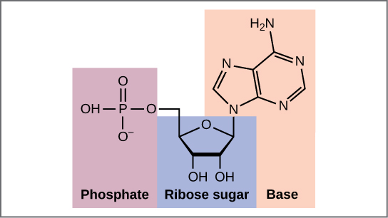

By the end of this section, you will be able to:
* Describe the structure of DNA
* Describe how eukaryotic and prokaryotic DNA is arranged in the cell

In the 1950s, Francis Crick and James Watson worked together at the University of Cambridge, England, to determine the structure of DNA. Other scientists, such as Linus Pauling and Maurice Wilkins, were also actively exploring this field. Pauling had discovered the secondary structure of proteins using X-ray crystallography. X-ray crystallography is a method for investigating molecular structure by observing the patterns formed by X-rays shot through a crystal of the substance. The patterns give important information about the structure of the molecule of interest. In Wilkins’ lab, researcher Rosalind Franklin was using X-ray crystallography to understand the structure of DNA. Watson and Crick were able to piece together the puzzle of the DNA molecule using Franklin\'s data ([\[link\]](#fig-ch09_01_01)). Watson and Crick also had key pieces of information available from other researchers such as Chargaff’s rules. Chargaff had shown that of the four kinds of monomers (nucleotides) present in a DNA molecule, two types were always present in equal amounts and the remaining two types were also always present in equal amounts. This meant they were always paired in some way. In 1962, James Watson, Francis Crick, and Maurice Wilkins were awarded the Nobel Prize in Medicine for their work in determining the structure of DNA.

  James Watson and Francis Crick are pictured here with American geneticist Maclyn McCarty. Scientist Rosalind Franklin discovered (b) the X-ray diffraction pattern of DNA, which helped to elucidate its double helix structure. (credit a: modification of work by Marjorie McCarty; b: modification of work by NIH)"){: #fig-ch09_01_01}

Now let’s consider the structure of the two types of nucleic acids, deoxyribonucleic acid (DNA) and ribonucleic acid (RNA). The building blocks of DNA are nucleotides, which are made up of three parts: a **deoxyribose**{: data-type="term"} (5-carbon sugar), a **phosphate group**{: data-type="term"}, and a **nitrogenous base**{: data-type="term"} ([\[link\]](#fig-ch09_01_02)). There are four types of nitrogenous bases in DNA. Adenine (A) and guanine (G) are double-ringed purines, and cytosine (C) and thymine (T) are smaller, single-ringed pyrimidines. The nucleotide is named according to the nitrogenous base it contains.

<figure markdown="1" id="fig-ch09_01_02" data-orient="horizontal">
<figcaption>
(a) Each DNA nucleotide is made up of a sugar, a phosphate group, and a base. (b) Cytosine and thymine are pyrimidines. Guanine and adenine are purines.
</figcaption>
{:}

{:}

</figure>

The phosphate group of one nucleotide bonds covalently with the sugar molecule of the next nucleotide, and so on, forming a long polymer of nucleotide monomers. The sugar–phosphate groups line up in a “backbone” for each single strand of DNA, and the nucleotide bases stick out from this backbone. The carbon atoms of the five-carbon sugar are numbered clockwise from the oxygen as 1\', 2\', 3\', 4\', and 5\' (1\' is read as “one prime”). The phosphate group is attached to the 5\' carbon of one nucleotide and the 3\' carbon of the next nucleotide. In its natural state, each DNA molecule is actually composed of two single strands held together along their length with hydrogen bonds between the bases.

Watson and Crick proposed that the DNA is made up of two strands that are twisted around each other to form a right-handed helix, called a **double helix**{: data-type="term"}. Base-pairing takes place between a purine and pyrimidine: namely, A pairs with T, and G pairs with C. In other words, adenine and thymine are complementary base pairs, and cytosine and guanine are also complementary base pairs. This is the basis for Chargaff’s rule; because of their complementarity, there is as much adenine as thymine in a DNA molecule and as much guanine as cytosine. Adenine and thymine are connected by two hydrogen bonds, and cytosine and guanine are connected by three hydrogen bonds. The two strands are anti-parallel in nature; that is, one strand will have the 3\' carbon of the sugar in the “upward” position, whereas the other strand will have the 5\' carbon in the upward position. The diameter of the DNA double helix is uniform throughout because a purine (two rings) always pairs with a pyrimidine (one ring) and their combined lengths are always equal. ([\[link\]](#fig-ch09_01_03)).

  forms a double stranded helix, and (b) adenine pairs with thymine and cytosine pairs with guanine. (credit a: modification of work by Jerome Walker, Dennis Myts)"){: #fig-ch09_01_03}

### The Structure of RNA

There is a second nucleic acid in all cells called ribonucleic acid, or RNA. Like DNA, RNA is a polymer of nucleotides. Each of the nucleotides in RNA is made up of a nitrogenous base, a five-carbon sugar, and a phosphate group. In the case of RNA, the five-carbon sugar is ribose, not deoxyribose. Ribose has a hydroxyl group at the 2\' carbon, unlike deoxyribose, which has only a hydrogen atom ([\[link\]](#fig-ch09_01_04)).

 {: #fig-ch09_01_04}

RNA nucleotides contain the nitrogenous bases adenine, cytosine, and guanine. However, they do not contain thymine, which is instead replaced by uracil, symbolized by a “U.” RNA exists as a single-stranded molecule rather than a double-stranded helix. Molecular biologists have named several kinds of RNA on the basis of their function. These include messenger RNA (mRNA), transfer RNA (tRNA), and ribosomal RNA (rRNA)—molecules that are involved in the production of proteins from the DNA code.

### How DNA Is Arranged in the Cell

DNA is a working molecule; it must be replicated when a cell is ready to divide, and it must be “read” to produce the molecules, such as proteins, to carry out the functions of the cell. For this reason, the DNA is protected and packaged in very specific ways. In addition, DNA molecules can be very long. Stretched end-to-end, the DNA molecules in a single human cell would come to a length of about 2 meters. Thus, the DNA for a cell must be packaged in a very ordered way to fit and function within a structure (the cell) that is not visible to the naked eye. The chromosomes of prokaryotes are much simpler than those of eukaryotes in many of their features ([\[link\]](#fig-ch09_01_05)). Most prokaryotes contain a single, circular chromosome that is found in an area in the cytoplasm called the nucleoid.

 {: #fig-ch09_01_05}

The size of the genome in one of the most well-studied prokaryotes, *Escherichia coli,* is 4.6 million base pairs, which would extend a distance of about 1.6 mm if stretched out. So how does this fit inside a small bacterial cell? The DNA is twisted beyond the double helix in what is known as supercoiling. Some proteins are known to be involved in the supercoiling; other proteins and enzymes help in maintaining the supercoiled structure.

Eukaryotes, whose chromosomes each consist of a linear DNA molecule, employ a different type of packing strategy to fit their DNA inside the nucleus ([\[link\]](#fig-ch09_01_06)). At the most basic level, DNA is wrapped around proteins known as histones to form structures called nucleosomes. The DNA is wrapped tightly around the histone core. This nucleosome is linked to the next one by a short strand of DNA that is free of histones. This is also known as the “beads on a string” structure; the nucleosomes are the “beads” and the short lengths of DNA between them are the “string.” The nucleosomes, with their DNA coiled around them, stack compactly onto each other to form a 30-nm–wide fiber. This fiber is further coiled into a thicker and more compact structure. At the metaphase stage of mitosis, when the chromosomes are lined up in the center of the cell, the chromosomes are at their most compacted. They are approximately 700 nm in width, and are found in association with scaffold proteins.

In interphase, the phase of the cell cycle between mitoses at which the chromosomes are decondensed, eukaryotic chromosomes have two distinct regions that can be distinguished by staining. There is a tightly packaged region that stains darkly, and a less dense region. The darkly staining regions usually contain genes that are not active, and are found in the regions of the centromere and telomeres. The lightly staining regions usually contain genes that are active, with DNA packaged around nucleosomes but not further compacted.

 {: #fig-ch09_01_06}

Concept in Action

  
Watch this [animation][1]{: target="_window"} of DNA packaging.

### Section Summary

The model of the double-helix structure of DNA was proposed by Watson and Crick. The DNA molecule is a polymer of nucleotides. Each nucleotide is composed of a nitrogenous base, a five-carbon sugar (deoxyribose), and a phosphate group. There are four nitrogenous bases in DNA, two purines (adenine and guanine) and two pyrimidines (cytosine and thymine). A DNA molecule is composed of two strands. Each strand is composed of nucleotides bonded together covalently between the phosphate group of one and the deoxyribose sugar of the next. From this backbone extend the bases. The bases of one strand bond to the bases of the second strand with hydrogen bonds. Adenine always bonds with thymine, and cytosine always bonds with guanine. The bonding causes the two strands to spiral around each other in a shape called a double helix. Ribonucleic acid (RNA) is a second nucleic acid found in cells. RNA is a single-stranded polymer of nucleotides. It also differs from DNA in that it contains the sugar ribose, rather than deoxyribose, and the nucleotide uracil rather than thymine. Various RNA molecules function in the process of forming proteins from the genetic code in DNA.

Prokaryotes contain a single, double-stranded circular chromosome. Eukaryotes contain double-stranded linear DNA molecules packaged into chromosomes. The DNA helix is wrapped around proteins to form nucleosomes. The protein coils are further coiled, and during mitosis and meiosis, the chromosomes become even more greatly coiled to facilitate their movement. Chromosomes have two distinct regions which can be distinguished by staining, reflecting different degrees of packaging and determined by whether the DNA in a region is being expressed (euchromatin) or not (heterochromatin).

### Multiple Choice

Which of the following does cytosine pair with?

1.  guanine
2.  thymine
3.  adenine
4.  a pyrimidine
{: type="a"}

A

Prokaryotes contain a \_\_\_\_\_\_\_\_chromosome, and eukaryotes contain \_\_\_\_\_\_\_\_ chromosomes.

1.  single-stranded circular; single-stranded linear
2.  single-stranded linear; single-stranded circular
3.  double-stranded circular; double-stranded linear
4.  double-stranded linear; double-stranded circular
{: type="a"}

C

### Free Response

Describe the organization of the eukaryotic chromosome.

The DNA is wound around proteins called histones. The histones then stack together in a compact form that creates a fiber that is 30-nm thick. The fiber is further coiled for greater compactness. During metaphase of mitosis, the chromosome is at its most compact to facilitate chromosome movement. During interphase, there are denser areas of chromatin, called heterochromatin, that contain DNA that is not expressed, and less dense euchromatin that contains DNA that is expressed.

Describe the structure and complementary base pairing of DNA.

A single strand of DNA is a polymer of nucleic acids joined covalently between the phosphate group of one and the deoxyribose sugar of the next to for a “backbone” from which the nitrogenous bases stick out. In its natural state, DNA has two strands wound around each other in a double helix. The bases on each strand are bonded to each other with hydrogen bonds. Only specific bases bond with each other; adenine bonds with thymine, and cytosine bonds with guanine.

### Glossary
{: data-type="glossary-title"}

deoxyribose
: a five-carbon sugar molecule with a hydrogen atom rather than a hydroxyl group in the 2\' position; the sugar component of DNA nucleotides
^

double helix
: the molecular shape of DNA in which two strands of nucleotides wind around each other in a spiral shape
^

nitrogenous base
: a nitrogen-containing molecule that acts as a base; often referring to one of the purine or pyrimidine components of nucleic acids
^

phosphate group
: a molecular group consisting of a central phosphorus atom bound to four oxygen atoms

[1]: http://openstax.org/l/DNA_packaging
