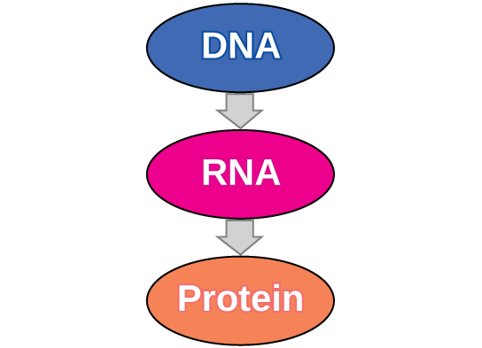
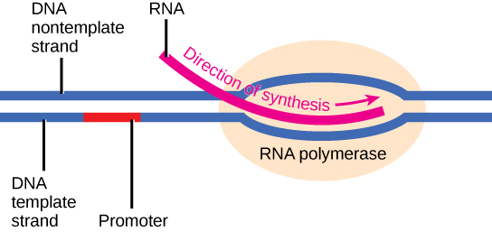
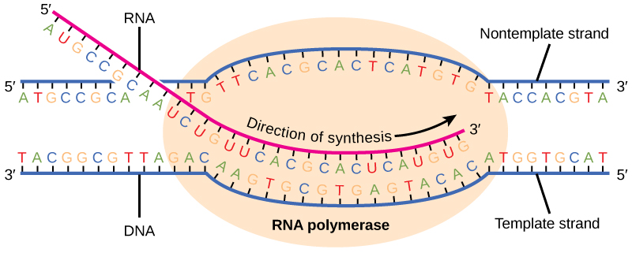
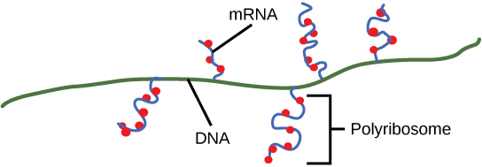
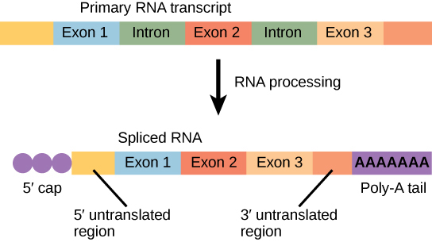

By the end of this section, you will be able to:
* Explain the central dogma
* Explain the main steps of transcription
* Describe how eukaryotic mRNA is processed

In both prokaryotes and eukaryotes, the second function of DNA (the first was replication) is to provide the information needed to construct the proteins necessary so that the cell can perform all of its functions. To do this, the DNA is “read” or transcribed into an **mRNA**{: data-type="term"} molecule. The mRNA then provides the code to form a protein by a process called translation. Through the processes of transcription and translation, a protein is built with a specific sequence of amino acids that was originally encoded in the DNA. This module discusses the details of transcription.

# The Central Dogma: DNA Encodes RNA; RNA Encodes Protein

The flow of genetic information in cells from DNA to mRNA to protein is described by the central dogma ([\[link\]](#fig-ch09_03_01)), which states that genes specify the sequences of mRNAs, which in turn specify the sequences of proteins.

 {: #fig-ch09_03_01 data-media-type="image/jpg"}

The copying of DNA to mRNA is relatively straightforward, with one nucleotide being added to the mRNA strand for every complementary nucleotide read in the DNA strand. The translation to protein is more complex because groups of three mRNA nucleotides correspond to one amino acid of the protein sequence. However, as we shall see in the next module, the translation to protein is still systematic, such that nucleotides 1 to 3 correspond to amino acid 1, nucleotides 4 to 6 correspond to amino acid 2, and so on.

# Transcription: from DNA to mRNA

Both prokaryotes and eukaryotes perform fundamentally the same process of transcription, with the important difference of the membrane-bound nucleus in eukaryotes. With the genes bound in the nucleus, transcription occurs in the nucleus of the cell and the mRNA transcript must be transported to the cytoplasm. The prokaryotes, which include bacteria and archaea, lack membrane-bound nuclei and other organelles, and transcription occurs in the cytoplasm of the cell. In both prokaryotes and eukaryotes, transcription occurs in three main stages: initiation, elongation, and termination.

## Initiation

Transcription requires the DNA double helix to partially unwind in the region of mRNA synthesis. The region of unwinding is called a **transcription bubble**{: data-type="term"}. The DNA sequence onto which the proteins and enzymes involved in transcription bind to initiate the process is called a **promoter**{: data-type="term"}. In most cases, promoters exist upstream of the genes they regulate. The specific sequence of a promoter is very important because it determines whether the corresponding gene is transcribed all of the time, some of the time, or hardly at all ([\[link\]](#fig-ch09_03_02)).

 {: #fig-ch09_03_02 data-media-type="image/jpg"}

## Elongation

Transcription always proceeds from one of the two DNA strands, which is called the **template strand**{: data-type="term"}. The mRNA product is complementary to the template strand and is almost identical to the other DNA strand, called the **nontemplate strand**{: data-type="term"}, with the exception that RNA contains a uracil (U) in place of the thymine (T) found in DNA. During elongation, an enzyme called **RNA polymerase**{: data-type="term"} proceeds along the DNA template adding nucleotides by base pairing with the DNA template in a manner similar to DNA replication, with the difference that an RNA strand is being synthesized that does not remain bound to the DNA template. As elongation proceeds, the DNA is continuously unwound ahead of the core enzyme and rewound behind it ([\[link\]](#fig-ch09_03_03)).

 {: #fig-ch09_03_03 data-media-type="image/jpg"}

## Termination

Once a gene is transcribed, the prokaryotic polymerase needs to be instructed to dissociate from the DNA template and liberate the newly made mRNA. Depending on the gene being transcribed, there are two kinds of termination signals, but both involve repeated nucleotide sequences in the DNA template that result in RNA polymerase stalling, leaving the DNA template, and freeing the mRNA transcript.

On termination, the process of transcription is complete. In a prokaryotic cell, by the time termination occurs, the transcript would already have been used to partially synthesize numerous copies of the encoded protein because these processes can occur concurrently using multiple ribosomes (polyribosomes) ([\[link\]](#fig-ch09_03_04)). In contrast, the presence of a nucleus in eukaryotic cells precludes simultaneous transcription and translation.

 {: #fig-ch09_03_04 data-media-type="image/jpg"}

# Eukaryotic RNA Processing

The newly transcribed eukaryotic mRNAs must undergo several processing steps before they can be transferred from the nucleus to the cytoplasm and translated into a protein. The additional steps involved in eukaryotic mRNA maturation create a molecule that is much more stable than a prokaryotic mRNA. For example, eukaryotic mRNAs last for several hours, whereas the typical prokaryotic mRNA lasts no more than five seconds.

The mRNA transcript is first coated in RNA-stabilizing proteins to prevent it from degrading while it is processed and exported out of the nucleus. This occurs while the pre-mRNA still is being synthesized by adding a special nucleotide “cap” to the 5\' end of the growing transcript. In addition to preventing degradation, factors involved in protein synthesis recognize the cap to help initiate translation by ribosomes.

Once elongation is complete, an enzyme then adds a string of approximately 200 adenine residues to the 3\' end, called the poly-A tail. This modification further protects the pre-mRNA from degradation and signals to cellular factors that the transcript needs to be exported to the cytoplasm.

Eukaryotic genes are composed of protein-coding sequences called **exons**{: data-type="term"} (*ex-*on signifies that they are *ex*pressed) and *int*ervening sequences called **introns**{: data-type="term"} (*int-*ron denotes their *int*ervening role). Introns are removed from the pre-mRNA during processing. Intron sequences in mRNA do not encode functional proteins. It is essential that all of a pre-mRNA’s introns be completely and precisely removed before protein synthesis so that the exons join together to code for the correct amino acids. If the process errs by even a single nucleotide, the sequence of the rejoined exons would be shifted, and the resulting protein would be nonfunctional. The process of removing introns and reconnecting exons is called **splicing**{: data-type="term"} ([\[link\]](#fig-ch09_03_05)). Introns are removed and degraded while the pre-mRNA is still in the nucleus.

 {: #fig-ch09_03_05 data-media-type="image/jpg"}

# Section Summary

In prokaryotes, mRNA synthesis is initiated at a promoter sequence on the DNA template. Elongation synthesizes new mRNA. Termination liberates the mRNA and occurs by mechanisms that stall the RNA polymerase and cause it to fall off the DNA template. Newly transcribed eukaryotic mRNAs are modified with a cap and a poly-A tail. These structures protect the mature mRNA from degradation and help export it from the nucleus. Eukaryotic mRNAs also undergo splicing, in which introns are removed and exons are reconnected with single-nucleotide accuracy. Only finished mRNAs are exported from the nucleus to the cytoplasm.

# Multiple Choice

A promoter is \_\_\_\_\_\_\_\_.

1.  a specific sequence of DNA nucleotides
2.  a specific sequence of RNA nucleotides
3.  a protein that binds to DNA
4.  an enzyme that synthesizes RNA
{: data-number-style="lower-alpha"}

A

Portions of eukaryotic mRNA sequence that are removed during RNA processing are \_\_\_\_\_\_\_\_.

1.  exons
2.  caps
3.  poly-A tails
4.  introns
{: data-number-style="lower-alpha"}

D

