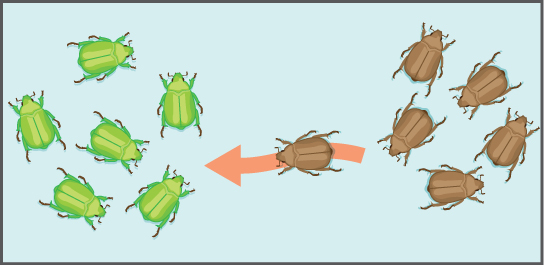

By the end of this section, you will be able to:
* Describe the four basic causes of evolution: natural selection, mutation, genetic drift, and gene flow
* Explain how each evolutionary force can influence the allele frequencies of a population

The Hardy-Weinberg equilibrium principle says that allele frequencies in a population will remain constant in the absence of the four factors that could change them. Those factors are natural selection, mutation, genetic drift, and migration (gene flow). In fact, we know they are probably always affecting populations.

# Natural Selection

Natural selection has already been discussed. Alleles are expressed in a phenotype. Depending on the environmental conditions, the phenotype confers an advantage or disadvantage to the individual with the phenotype relative to the other phenotypes in the population. If it is an advantage, then that individual will likely have more offspring than individuals with the other phenotypes, and this will mean that the allele behind the phenotype will have greater representation in the next generation. If conditions remain the same, those offspring, which are carrying the same allele, will also benefit. Over time, the allele will increase in frequency in the population.

# Mutation

Mutation is a source of new alleles in a population. Mutation is a change in the DNA sequence of the gene. A mutation can change one allele into another, but the net effect is a change in frequency. The change in frequency resulting from mutation is small, so its effect on evolution is small unless it interacts with one of the other factors, such as selection. A mutation may produce an allele that is selected against, selected for, or selectively neutral. Harmful mutations are removed from the population by selection and will generally only be found in very low frequencies equal to the mutation rate. Beneficial mutations will spread through the population through selection, although that initial spread is slow. Whether or not a mutation is beneficial or harmful is determined by whether it helps an organism survive to sexual maturity and reproduce. It should be noted that mutation is the ultimate source of genetic variation in all populations—new alleles, and, therefore, new genetic variations arise through mutation.

# Genetic Drift

Another way a population’s allele frequencies can change is genetic drift ([\[link\]](#fig-ch11_02_01)), which is simply the effect of chance. Genetic drift is most important in small populations. Drift would be completely absent in a population with infinite individuals, but, of course, no population is this large. Genetic drift occurs because the alleles in an offspring generation are a random sample of the alleles in the parent generation. Alleles may or may not make it into the next generation due to chance events including mortality of an individual, events affecting finding a mate, and even the events affecting which gametes end up in fertilizations. If one individual in a population of ten individuals happens to die before it leaves any offspring to the next generation, all of its genes—a tenth of the population’s gene pool—will be suddenly lost. In a population of 100, that 1 individual represents only 1 percent of the overall gene pool; therefore, it has much less impact on the population’s genetic structure and is unlikely to remove all copies of even a relatively rare allele.

Imagine a population of ten individuals, half with allele *A* and half with allele *a* (the individuals are haploid). In a stable population, the next generation will also have ten individuals. Choose that generation randomly by flipping a coin ten times and let heads be *A* and tails be *a*. It is unlikely that the next generation will have exactly half of each allele. There might be six of one and four of the other, or some different set of frequencies. Thus, the allele frequencies have changed and evolution has occurred. A coin will no longer work to choose the next generation (because the odds are no longer one half for each allele). The frequency in each generation will drift up and down on what is known as a random walk until at one point either all *A* or all *a* are chosen and that allele is fixed from that point on. This could take a very long time for a large population. This simplification is not very biological, but it can be shown that real populations behave this way. The effect of drift on frequencies is greater the smaller a population is. Its effect is also greater on an allele with a frequency far from one half. Drift will influence every allele, even those that are being naturally selected.

Art Connection

![A population has ten rabbits. Three of these rabbits are homozygous dominant for the A allele and have brown coat color. Five are heterozygous and also have brown coat color. Two are homozygous recessive and have white coat color. The frequency of the capital A allele, p, is .5 and the frequency of the small a allele, q, is also .5. Only five of the rabbits, including two homozygous dominant and three heterozygous individuals, produce offspring. Five of the resulting offspring are homozygous dominant, four are heterozygous, and one is homozygous recessive. The frequency of alleles in the second generation is p=.7 and q=.3. Only two rabbits in the second generation produce offspring, and both of these are homozygous dominant. As a result, the recessive small a allele is lost in the third generation, and all of the rabbits are heterozygous dominant with brown coat color.](../resources/Figure_11_02_01.png "Genetic drift in a population can lead to the elimination of an allele from a population by chance. In each generation, a random set of individuals reproduces to produce the next generation. The frequency of alleles in the next generation is equal to the frequency of alleles among the individuals reproducing."){: #fig-ch11_02_01}

Do you think genetic drift would happen more quickly on an island or on the mainland?

<!--<para><link target-id="fig-ch11_02_01" document=""/>Genetic drift is likely to occur more rapidly on an island, where smaller populations are expected to occur.</para>-->

Genetic drift can also be magnified by natural or human-caused events, such as a disaster that randomly kills a large portion of the population, which is known as the **bottleneck effect**{: data-type="term"} that results in a large portion of the genome suddenly being wiped out ([\[link\]](#fig-ch11_02_02)). In one fell swoop, the genetic structure of the survivors becomes the genetic structure of the entire population, which may be very different from the pre-disaster population. The disaster must be one that kills for reasons unrelated to the organism’s traits, such as a hurricane or lava flow. A mass killing caused by unusually cold temperatures at night, is likely to affect individuals differently depending on the alleles they possess that confer cold hardiness.

 {: #fig-ch11_02_02}

Another scenario in which populations might experience a strong influence of genetic drift is if some portion of the population leaves to start a new population in a new location, or if a population gets divided by a physical barrier of some kind. In this situation, those individuals are unlikely to be representative of the entire population which results in the **founder effect**{: data-type="term"}. The founder effect occurs when the genetic structure matches that of the new population’s founding fathers and mothers. The founder effect is believed to have been a key factor in the genetic history of the Afrikaner population of Dutch settlers in South Africa, as evidenced by mutations that are common in Afrikaners but rare in most other populations. This is likely due to a higher-than-normal proportion of the founding colonists, which were a small sample of the original population, carried these mutations. As a result, the population expresses unusually high incidences of Huntington’s disease (HD) and Fanconi anemia (FA), a genetic disorder known to cause bone marrow and congenital abnormalities, and even cancer.A. J. Tipping et al., “Molecular and Genealogical Evidence for a Founder Effect in Fanconi Anemia Families of the Afrikaner Population of South Africa,” *PNAS* 98, no. 10 (2001): 5734-5739, doi: 10.1073/pnas.091402398.

Concept in Action

  
Visit this [site][1]{: target="_window"} to learn more about genetic drift and to run simulations of allele changes caused by drift.

# Gene Flow

Another important evolutionary force is **gene flow**{: data-type="term"}, or the flow of alleles in and out of a population resulting from the migration of individuals or gametes ([\[link\]](#fig-ch11_02_03)). While some populations are fairly stable, others experience more flux. Many plants, for example, send their seeds far and wide, by wind or in the guts of animals; these seeds may introduce alleles common in the source population to a new population in which they are rare.

 {: #fig-ch11_02_03}

# Section Summary

There are four factors that can change the allele frequencies of a population. Natural selection works by selecting for alleles that confer beneficial traits or behaviors, while selecting against those for deleterious qualities. Mutations introduce new alleles into a population. Genetic drift stems from the chance occurrence that some individuals have more offspring than others and results in changes in allele frequencies that are random in direction. When individuals leave or join the population, allele frequencies can change as a result of gene flow.

# Art Connections

[[link]](#fig-ch11_02_01) Do you think genetic drift would happen more quickly on an island or on the mainland?

[[link]](#fig-ch11_02_01) Genetic drift is likely to occur more rapidly on an island, where smaller populations are expected to occur.

# Multiple Choice

Galápagos medium ground finches are found on Santa Cruz and San Cristóbal islands, which are separated by about 100 km of ocean. Occasionally, individuals from either island fly to the other island to stay. This can alter the allele frequencies of the population through which of the following mechanisms?

1.  natural selection
2.  genetic drift
3.  gene flow
4.  mutation
{: data-number-style="lower-alpha"}

C

In which of the following pairs do both evolutionary processes introduce new genetic variation into a population?

1.  natural selection and genetic drift
2.  mutation and gene flow
3.  natural selection and gene flow
4.  gene flow and genetic drift
{: data-number-style="lower-alpha"}

B

# Free Response

Describe natural selection and give an example of natural selection at work in a population.

The theory of natural selection stems from the observation that some individuals in a population survive longer and have more offspring than others, thus passing on more of their genes to the next generation. For example, a big, powerful male gorilla is much more likely than a smaller, weaker gorilla to become the population’s silverback, the pack’s leader who mates far more than the other males of the group. The pack leader will, therefore, father more offspring, who share half of his genes, and are thus likely to also grow bigger and stronger like their father. Over time, the genes for bigger size will increase in frequency in the population, and the population will, as a result, grow larger on average.

[1]: http://openstaxcollege.org/l/genetic_drift2
