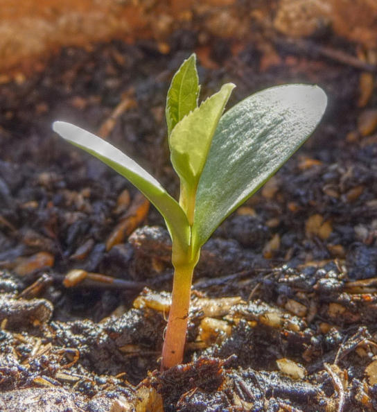

By the end of this section, you will be able to:
* Describe the major characteristics of the plant kingdom
* Discuss the challenges to plant life on land
* Describe the adaptations that allowed plants to colonize land

Plants are a large and varied group of organisms. There are close to 300,000 species of catalogued plants.[1](#footnote1){: data-type="footnote-number" name="footnote-ref1"} Of these, about 260,000 are plants that produce seeds. Mosses, ferns, conifers, and flowering plants are all members of the plant kingdom. The plant kingdom contains mostly photosynthetic organisms; a few parasitic forms have lost the ability to photosynthesize. The process of photosynthesis uses chlorophyll, which is located in organelles called chloroplasts. Plants possess cell walls containing cellulose. Most plants reproduce sexually, but they also have diverse methods of asexual reproduction. Plants exhibit indeterminate growth, meaning they do not have a final body form, but continue to grow body mass until they die.

# Plant Adaptations to Life on Land

As organisms adapt to life on land, they have to contend with several challenges in the terrestrial environment. Water has been described as “the stuff of life.” The cell’s interior—the medium in which most small molecules dissolve and diffuse, and in which the majority of the chemical reactions of metabolism take place—is a watery soup. Desiccation, or drying out, is a constant danger for an organism exposed to air. Even when parts of a plant are close to a source of water, their aerial structures are likely to dry out. Water provides buoyancy to organisms that live in aquatic habitats. On land, plants need to develop structural support in air—a medium that does not give the same lift. Additionally, the male gametes must reach the female gametes using new strategies because swimming is no longer possible. Finally, both gametes and zygotes must be protected from drying out. The successful land plants evolved strategies to deal with all of these challenges, although not all adaptations appeared at once. Some species did not move far from an aquatic environment, whereas others left the water and went on to conquer the driest environments on Earth.

To balance these survival challenges, life on land offers several advantages. First, sunlight is abundant. On land, the spectral quality of light absorbed by the photosynthetic pigment, chlorophyll, is not filtered out by water or competing photosynthetic species in the water column above. Second, carbon dioxide is more readily available because its concentration is higher in air than in water. Additionally, land plants evolved before land animals; therefore, until dry land was colonized by animals, no predators threatened the well-being of plants. This situation changed as animals emerged from the water and found abundant sources of nutrients in the established flora. In turn, plants evolved strategies to deter predation: from spines and thorns to toxic chemicals.

The early land plants, like the early land animals, did not live far from an abundant source of water and developed survival strategies to combat dryness. One of these strategies is drought tolerance. Mosses, for example, can dry out to a brown and brittle mat, but as soon as rain makes water available, mosses will soak it up and regain their healthy, green appearance. Another strategy is to colonize environments with high humidity where droughts are uncommon. Ferns, an early lineage of plants, thrive in damp and cool places, such as the understory of temperate forests. Later, plants moved away from aquatic environments using resistance to desiccation, rather than tolerance. These plants, like the cactus, minimize water loss to such an extent they can survive in the driest environments on Earth.

In addition to adaptations specific to life on land, land plants exhibit adaptations that were responsible for their diversity and predominance in terrestrial ecosystems. Four major adaptations are found in many terrestrial plants: the alternation of generations, a sporangium in which spores are formed, a gametangium that produces haploid cells, and in vascular plants, apical meristem tissue in roots and shoots.

## Alternation of Generations

Alternation of generations describes a life cycle in which an organism has both haploid and diploid multicellular stages ([\[link\]](#fig-ch14_01_01)).

  gametophyte and diploid (2n) sporophyte is shown. (credit: modification of work by Peter Coxhead)"){: #fig-ch14_01_01}

**Haplontic**{: data-type="term"} refers to a life cycle in which there is a dominant haploid stage. **Diplontic**{: data-type="term"} refers to a life cycle in which the diploid stage is the dominant stage, and the haploid chromosome number is only seen for a brief time in the life cycle during sexual reproduction. Humans are diplontic, for example. Most plants exhibit alternation of generations, which is described as **haplodiplontic**{: data-type="term"}\: the haploid multicellular form known as a gametophyte is followed in the development sequence by a multicellular diploid organism, the **sporophyte**{: data-type="term"}. The **gametophyte**{: data-type="term"} gives rise to the gametes, or reproductive cells, by mitosis. It can be the most obvious phase of the life cycle of the plant, as in the mosses, or it can occur in a microscopic structure, such as a pollen grain in the higher plants (the collective term for the vascular plants). The sporophyte stage is barely noticeable in lower plants (the collective term for the plant groups of mosses, liverworts, and hornworts). Towering trees are the diplontic phase in the lifecycles of plants such as sequoias and pines.

## Sporangia in the Seedless Plants

The sporophyte of seedless plants is diploid and results from **syngamy**{: data-type="term"} or the fusion of two gametes ([\[link\]](#fig-ch14_01_01)). The sporophyte bears the **sporangia**{: data-type="term"} (singular, sporangium), organs that first appeared in the land plants. The term “sporangia” literally means “spore in a vessel,” as it is a reproductive sac that contains spores. Inside the multicellular sporangia, the diploid sporocytes, or mother cells, produce haploid spores by meiosis, which reduces the 2*n* chromosome number to 1*n*. The spores are later released by the sporangia and disperse in the environment. Two different types of spores are produced in land plants, resulting in the separation of sexes at different points in the life cycle. Seedless nonvascular plants (more appropriately referred to as “seedless nonvascular plants with a dominant gametophyte phase”) produce only one kind of spore, and are called **homosporous**{: data-type="term"}. After germinating from a spore, the gametophyte produces both male and female **gametangia**{: data-type="term"}, usually on the same individual. In contrast, **heterosporous**{: data-type="term"} plants produce two morphologically different types of spores. The male spores are called microspores because of their smaller size; the comparatively larger megaspores will develop into the female gametophyte. Heterospory is observed in a few seedless vascular plants and in all seed plants.

When the haploid spore germinates, it generates a multicellular gametophyte by mitosis. The gametophyte supports the zygote formed from the fusion of gametes and the resulting young sporophyte or vegetative form, and the cycle begins anew ([\[link\]](#fig-ch14_01_02) and [\[link\]](#fig-ch14_01_03)).

 "){: #fig-ch14_01_02}

"){: #fig-ch14_01_03}

The spores of seedless plants and the pollen of seed plants are surrounded by thick cell walls containing a tough polymer known as sporopollenin. This substance is characterized by long chains of organic molecules related to fatty acids and carotenoids, and gives most pollen its yellow color. Sporopollenin is unusually resistant to chemical and biological degradation. Its toughness explains the existence of well-preserved fossils of pollen. Sporopollenin was once thought to be an innovation of land plants; however, the green algae <em>Coleochaetes </em>is now known to form spores that contain sporopollenin.

Protection of the embryo is a major requirement for land plants. The vulnerable embryo must be sheltered from desiccation and other environmental hazards. In both seedless and seed plants, the female gametophyte provides nutrition, and in seed plants, the embryo is also protected as it develops into the new generation of sporophyte.

## Gametangia in the Seedless Plants

Gametangia (singular, gametangium) are structures on the gametophytes of seedless plants in which gametes are produced by mitosis. The male gametangium, the antheridium, releases sperm. Many seedless plants produce sperm equipped with flagella that enable them to swim in a moist environment to the archegonia, the female gametangium. The embryo develops inside the archegonium as the sporophyte.

## Apical Meristems

The shoots and roots of plants increase in length through rapid cell division within a tissue called the **apical meristem**{: data-type="term"} ([\[link\]](#fig-ch14_01_04)). The apical meristem is a cap of cells at the shoot tip or root tip made of undifferentiated cells that continue to proliferate throughout the life of the plant. Meristematic cells give rise to all the specialized tissues of the plant. Elongation of the shoots and roots allows a plant to access additional space and resources: light in the case of the shoot, and water and minerals in the case of roots. A separate meristem, called the lateral meristem, produces cells that increase the diameter of stems and tree trunks. Apical meristems are an adaptation to allow vascular plants to grow in directions essential to their survival: upward to greater availability of sunlight, and downward into the soil to obtain water and essential minerals.

 {: #fig-ch14_01_04}

# Additional Land Plant Adaptations

As plants adapted to dry land and became independent of the constant presence of water in damp habitats, new organs and structures made their appearance. Early land plants did not grow above a few inches off the ground, and on these low mats, they competed for light. By evolving a shoot and growing taller, individual plants captured more light. Because air offers substantially less support than water, land plants incorporated more rigid molecules in their stems (and later, tree trunks). The evolution of vascular tissue for the distribution of water and solutes was a necessary prerequisite for plants to evolve larger bodies. The vascular system contains xylem and phloem tissues. Xylem conducts water and minerals taken from the soil up to the shoot; phloem transports food derived from photosynthesis throughout the entire plant. The root system that evolved to take up water and minerals also anchored the increasingly taller shoot in the soil.

In land plants, a waxy, waterproof cover called a cuticle coats the aerial parts of the plant: leaves and stems. The cuticle also prevents intake of carbon dioxide needed for the synthesis of carbohydrates through photosynthesis. Stomata, or pores, that open and close to regulate traffic of gases and water vapor therefore appeared in plants as they moved into drier habitats.

Plants cannot avoid predatory animals. Instead, they synthesize a large range of poisonous secondary metabolites: complex organic molecules such as alkaloids, whose noxious smells and unpleasant taste deter animals. These toxic compounds can cause severe diseases and even death.

Additionally, as plants coevolved with animals, sweet and nutritious metabolites were developed to lure animals into providing valuable assistance in dispersing pollen grains, fruit, or seeds. Plants have been coevolving with animal associates for hundreds of millions of years ([\[link\]](#fig-ch14_01_05)).

  Early plants grew close to the ground, like this moss, to avoid desiccation. (b) Later plants developed a waxy cuticle to prevent desiccation. (c) To grow taller, like these maple trees, plants had to evolve new structural chemicals to strengthen their stems and vascular systems to transport water and minerals from the soil and nutrients from the leaves. (d) Plants developed physical and chemical defenses to avoid being eaten by animals. (credit a, b: modification of work by Cory Zanker; credit c: modification of work by Christine Cimala; credit d: modification of work by Jo Naylor)"){: #fig-ch14_01_05}

Evolution in Action

PaleobotanyHow organisms acquired traits that allow them to colonize new environments, and how the contemporary ecosystem is shaped, are fundamental questions of evolution. Paleobotany addresses these questions by specializing in the study of extinct plants. Paleobotanists analyze specimens retrieved from field studies, reconstituting the morphology of organisms that have long disappeared. They trace the evolution of plants by following the modifications in plant morphology, and shed light on the connection between existing plants by identifying common ancestors that display the same traits. This field seeks to find transitional species that bridge gaps in the path to the development of modern organisms. Fossils are formed when organisms are trapped in sediments or environments where their shapes are preserved ([\[link\]](#fig-ch14_01_06)). Paleobotanists determine the geological age of specimens and the nature of their environment using the geological sediments and fossil organisms surrounding them. The activity requires great care to preserve the integrity of the delicate fossils and the layers in which they are found.

One of the most exciting recent developments in paleobotany is the use of analytical chemistry and molecular biology to study fossils. Preservation of molecular structures requires an environment free of oxygen, since oxidation and degradation of material through the activity of microorganisms depend on the presence of oxygen. One example of the use of analytical chemistry and molecular biology is in the identification of oleanane, a compound that deters pests and which, up to this point, appears to be unique to flowering plants. Oleanane was recovered from sediments dating from the Permian, much earlier than the current dates given for the appearance of the first flowering plants. Fossilized nucleic acids—DNA and RNA—yield the most information. Their sequences are analyzed and compared to those of living and related organisms. Through this analysis, evolutionary relationships can be built for plant lineages.

Some paleobotanists are skeptical of the conclusions drawn from the analysis of molecular fossils. For one, the chemical materials of interest degrade rapidly during initial isolation when exposed to air, as well as in further manipulations. There is always a high risk of contaminating the specimens with extraneous material, mostly from microorganisms. Nevertheless, as technology is refined, the analysis of DNA from fossilized plants will provide invaluable information on the evolution of plants and their adaptation to an ever-changing environment.

 discovered in Wyoming dates to about 40 million years ago."){: #fig-ch14_01_06}

# The Major Divisions of Land Plants

Land plants are classified into two major groups according to the absence or presence of vascular tissue, as detailed in [\[link\]](#fig-ch14_01_07). Plants that lack vascular tissue formed of specialized cells for the transport of water and nutrients are referred to as **nonvascular plants**{: data-type="term"}. The bryophytes, liverworts, mosses, and hornworts are seedless and nonvascular, and likely appeared early in land plant evolution. **Vascular plants**{: data-type="term"} developed a network of cells that conduct water and solutes through the plant body. The first vascular plants appeared in the late Ordovician (461–444 million years ago) and were probably similar to lycophytes, which include club mosses (not to be confused with the mosses) and the pterophytes (ferns, horsetails, and whisk ferns). Lycophytes and pterophytes are referred to as seedless vascular plants. They do not produce seeds, which are embryos with their stored food reserves protected by a hard casing. The seed plants form the largest group of all existing plants and, hence, dominate the landscape. Seed plants include gymnosperms, most notably conifers, which produce “naked seeds,” and the most successful plants, the flowering plants, or angiosperms, which protect their seeds inside chambers at the center of a flower. The walls of these chambers later develop into fruits.

![A table shows the division of plants. They are split into two main groups: vascular and non-vascular. The nonvascular bryophytes include liverworts, hornworts, and mosses. The vascular category has more subcategories. First it is broken into seedless plants and seed plants. Seedless plants have two categories: lycophytes, which include club mosses, quillworts, and spike mosses; and pterophytes, which include whisk ferns, horsetails, and ferns. The seed plants category has two subparts: gymnosperms and angiosperms.](../resources/Figure_14_01_07.jpg "This table shows the major divisions of plants."){: #fig-ch14_01_07}

# Section Summary

Land plants evolved traits that made it possible to colonize land and survive out of water. Adaptations to life on land include vascular tissues, roots, leaves, waxy cuticles, and a tough outer layer that protects the spores. Land plants include nonvascular plants and vascular plants. Vascular plants, which include seedless plants and plants with seeds, have apical meristems, and embryos with nutritional stores. All land plants share the following characteristics: alternation of generations, with the haploid plant called a gametophyte and the diploid plant called a sporophyte; formation of haploid spores in a sporangium; and formation of gametes in a gametangium.

# Multiple Choice

The land plants are probably descendants of which of these groups?

1.  green algae
2.  red algae
3.  brown algae
4.  angiosperms
{: data-number-style="lower-alpha"}

A

The event that leads from the haploid stage to the diploid stage in alternation of generations is \_\_\_\_\_\_\_\_.

1.  meiosis
2.  mitosis
3.  fertilization
4.  germination
{: data-number-style="lower-alpha"}

C

Moss is an example of which type of plant?

1.  haplontic plant
2.  vascular plant
3.  diplontic plant
4.  seed plant
{: data-number-style="lower-alpha"}

A

# Free Response

What adaptations do plants have that allow them to survive on land?

The sporangium of plants protects the spores from drying out. Apical meristems ensure that a plant is able to grow in the two directions required to acquire water and nutrients: up toward sunlight and down into the soil. The multicellular embryo is an important adaptation that improves survival of the developing plant in dry environments. The development of molecules that gave plants structural strength allowed them to grow higher on land and obtain more sunlight. A waxy cuticle prevents water loss from aerial surfaces.

## Footnotes
{: data-type="footnote-title"}

1.  [1](#footnote-ref1){: data-type="footnote-ref" name="footnote1"} A.D. Chapman (2009) *Numbers of Living Species in Australia and the World*. 2nd edition. A Report for the Australian Biological Resources Study. Australian Biodiversity Information Services, Toowoomba, Australia. Available online at http://www.environment.gov.au/biodiversity/abrs/publications/other/species-numbers/2009/04-03-groups-plants.html.

## Glossary
{: data-type="glossary-title"}

apical meristem
: the growing point in a vascular plant at the tip of a shoot or root where cell division occurs
{: .definition}

diplontic
: describes a life cycle in which the diploid stage is the dominant stage
{: .definition}

gametangium
: (plural: gametangia) the structure within which gametes are produced
{: .definition}

gametophyte
: the haploid plant that produces gametes
{: .definition}

haplodiplontic
: describes a life cycle in which the haploid and diploid stages alternate; also known as an alternation of generations life cycle
{: .definition}

haplontic
: describes a life cycle in which the haploid stage is the dominant stage
{: .definition}

heterosporous
: having two kinds of spores that give rise to male and female gametophytes
{: .definition}

homosporous
: having one kind of spore that gives rise to gametophytes that give rise to both male and female gametes
{: .definition}

nonvascular plant
: a plant that lacks vascular tissue formed of specialized cells for the transport of water and nutrients
{: .definition}

sporangium
: (plural: sporangia) the organ within which spores are produced
{: .definition}

sporophyte
: the diploid plant that produces spores
{: .definition}

syngamy
: the union of two gametes in fertilization
{: .definition}

vascular plant
: a plant in which there is a network of cells that conduct water and solutes through the organism
{: .definition}

