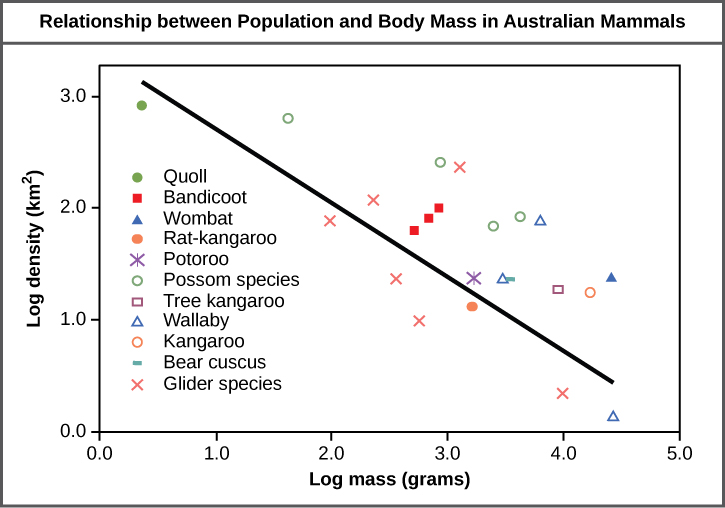

By the end of this section, you will be able to:
* Describe how ecologists measure population size and density
* Describe three different patterns of population distribution
* Use life tables to calculate mortality rates
* Describe the three types of survivorship curves and relate them to specific populations

Populations are dynamic entities. Their size and composition fluctuate in response to numerous factors, including seasonal and yearly changes in the environment, natural disasters such as forest fires and volcanic eruptions, and competition for resources between and within species. The statistical study of populations is called **demography**{: data-type="term"}\: a set of mathematical tools designed to describe populations and investigate how they change. Many of these tools were actually designed to study human populations. For example, **life tables**{: data-type="term"}, which detail the life expectancy of individuals within a population, were initially developed by life insurance companies to set insurance rates. In fact, while the term “demographics” is sometimes assumed to mean a study of human populations, all living populations can be studied using this approach.

# Population Size and Density

Populations are characterized by their **population size**{: data-type="term"} (total number of individuals) and their **population density**{: data-type="term"} (number of individuals per unit area). A population may have a large number of individuals that are distributed densely, or sparsely. There are also populations with small numbers of individuals that may be dense or very sparsely distributed in a local area. Population size can affect potential for adaptation because it affects the amount of genetic variation present in the population. Density can have effects on interactions within a population such as competition for food and the ability of individuals to find a mate. Smaller organisms tend to be more densely distributed than larger organisms ([\[link\]](#fig-ch19_01_01)).

Art Connection

{: #fig-ch19_01_01}

As this graph shows, population density typically decreases with increasing body size. Why do you think this is the case?

<!--<para><link target-id="fig-ch19_01_01" document=""/>Smaller animals require less food and others resources, so the environment can support more of them per unit area.</para>-->

## Estimating Population Size

The most accurate way to determine population size is to count all of the individuals within the area. However, this method is usually not logistically or economically feasible, especially when studying large areas. Thus, scientists usually study populations by sampling a representative portion of each habitat and use this sample to make inferences about the population as a whole. The methods used to sample populations to determine their size and density are typically tailored to the characteristics of the organism being studied. For immobile organisms such as plants, or for very small and slow-moving organisms, a quadrat may be used. A **quadrat**{: data-type="term"} is a wood, plastic, or metal square that is randomly located on the ground and used to count the number of individuals that lie within its boundaries. To obtain an accurate count using this method, the square must be placed at random locations within the habitat enough times to produce an accurate estimate. This counting method will provide an estimate of both population size and density. The number and size of quadrat samples depends on the type of organisms and the nature of their distribution.

For smaller mobile organisms, such as mammals, a technique called **mark and recapture**{: data-type="term"} is often used. This method involves marking a sample of captured animals in some way and releasing them back into the environment to mix with the rest of the population; then, a new sample is captured and scientists determine how many of the marked animals are in the new sample. This method assumes that the larger the population, the lower the percentage of marked organisms that will be recaptured since they will have mixed with more unmarked individuals. For example, if 80 field mice are captured, marked, and released into the forest, then a second trapping 100 field mice are captured and 20 of them are marked, the population size (*N*) can be determined using the following equation:

<math xmlns="http://www.w3.org/1998/Math/MathML" display="block"> <mrow> <mfrac> <mrow> <mtext>number marked first catch </mtext><mo>×</mo><mtext> total number second catch</mtext> </mrow> <mrow> <mtext>number marked second catch</mtext> </mrow> </mfrac> <mtext> </mtext><mo>=</mo><mtext> </mtext><mi>N</mi> </mrow> </math>

Using our example, the population size would be 400.

<math xmlns="http://www.w3.org/1998/Math/MathML" display="block"> <mrow> <mfrac> <mrow> <mn>80</mn><mtext> </mtext><mo>×</mo><mtext> 100</mtext> </mrow> <mrow> <mn>20</mn> </mrow> </mfrac> <mtext> </mtext><mo>=</mo><mtext> </mtext><mn>400</mn> </mrow> </math>

These results give us an estimate of 400 total individuals in the original population. The true number usually will be a bit different from this because of chance errors and possible bias caused by the sampling methods.

# Species Distribution

In addition to measuring density, further information about a population can be obtained by looking at the distribution of the individuals throughout their range. A **species distribution pattern**{: data-type="term"} is the distribution of individuals within a habitat at a particular point in time—broad categories of patterns are used to describe them.

Individuals within a population can be distributed at random, in groups, or equally spaced apart (more or less). These are known as random, clumped, and uniform distribution patterns, respectively ([\[link\]](#fig-ch19_01_02)). Different distributions reflect important aspects of the biology of the species; they also affect the mathematical methods required to estimate population sizes. An example of random distribution occurs with dandelion and other plants that have wind-dispersed seeds that germinate wherever they happen to fall in favorable environments. A clumped distribution, may be seen in plants that drop their seeds straight to the ground, such as oak trees; it can also be seen in animals that live in social groups (schools of fish or herds of elephants). Uniform distribution is observed in plants that secrete substances inhibiting the growth of nearby individuals (such as the release of toxic chemicals by sage plants). It is also seen in territorial animal species, such as penguins that maintain a defined territory for nesting. The territorial defensive behaviors of each individual create a regular pattern of distribution of similar-sized territories and individuals within those territories. Thus, the distribution of the individuals within a population provides more information about how they interact with each other than does a simple density measurement. Just as lower density species might have more difficulty finding a mate, solitary species with a random distribution might have a similar difficulty when compared to social species clumped together in groups.

 dandelions with wind-dispersed seeds tend to be randomly distributed. Animals such as (b) elephants that travel in groups exhibit a clumped distribution. Territorial birds such as (c) penguins tend to have a uniform distribution.&#10; (credit a: modification of work by Rosendahl; credit b: modification of work by Rebecca Wood; credit c: modification of work by Ben Tubby)"){: #fig-ch19_01_02}

# Demography

While population size and density describe a population at one particular point in time, scientists must use demography to study the dynamics of a population. Demography is the statistical study of population changes over time: birth rates, death rates, and life expectancies. These population characteristics are often displayed in a life table.

## Life Tables

Life tables provide important information about the life history of an organism and the life expectancy of individuals at each age. They are modeled after actuarial tables used by the insurance industry for estimating human life expectancy. Life tables may include the probability of each age group dying before their next birthday, the percentage of surviving individuals dying at a particular age interval (their **mortality rate**{: data-type="term"}, and their life expectancy at each interval. An example of a life table is shown in [\[link\]](#tab-ch19_01_01) from a study of Dall mountain sheep, a species native to northwestern North America. Notice that the population is divided into age intervals (column A). The mortality rate (per 1000) shown in column D is based on the number of individuals dying during the age interval (column B), divided by the number of individuals surviving at the beginning of the interval (Column C) multiplied by 1000.

<math xmlns="http://www.w3.org/1998/Math/MathML" display="block"> <mrow> <mtext>mortality rate </mtext><mo>=</mo><mtext> </mtext><mfrac> <mrow> <mtext>number of individuals dying</mtext> </mrow> <mrow> <mtext>number of individuals surviving</mtext> </mrow> </mfrac> <mtext> </mtext><mo>×</mo><mtext> </mtext><mn>1000</mn> </mrow> </math>

For example, between ages three and four, 12 individuals die out of the 776 that were remaining from the original 1000 sheep. This number is then multiplied by 1000 to give the mortality rate per thousand.

<math xmlns="http://www.w3.org/1998/Math/MathML" display="block"> <mrow> <mtext>mortality rate </mtext><mo>=</mo><mtext> </mtext><mfrac> <mrow> <mn>12</mn> </mrow> <mrow> <mn>776</mn> </mrow> </mfrac> <mtext> </mtext><mo>×</mo><mtext> </mtext><mn>1000</mn><mtext> </mtext><mo>≈</mo><mtext> </mtext><mn>15.5</mn> </mrow> </math>

As can be seen from the mortality rate data (column D), a high death rate occurred when the sheep were between six months and a year old, and then increased even more from 8 to 12 years old, after which there were few survivors. The data indicate that if a sheep in this population were to survive to age one, it could be expected to live another 7.7 years on average, as shown by the life-expectancy numbers in column E.

<table id="tab-ch19_01_01" summary=""><caption>This life table of <em>Ovis dalli</em> shows the number of deaths, number of survivors, mortality rate, and life expectancy at each age interval for Dall mountain sheep.</caption><thead>
<tr>
<th colspan="5">Life Table of Dall Mountain SheepData Adapted from Edward S. Deevey, Jr., “Life Tables for Natural Populations of Animals,” <em>The Quarterly Review of Biology</em> 22, no. 4 (December 1947): 283-314.</th>
</tr>
<tr>
<th>A</th>
<th>B</th>
<th>C</th>
<th>D</th>
<th>E</th>
</tr>
<tr>
        <th>Age interval (years)</th>
        <th>Number dying in age interval out of 1000 born</th>
        <th>Number surviving at beginning of age interval out of 1000 born</th>
        <th>Mortality rate per 1000 alive at beginning of age interval</th>
        <th>Life expectancy or mean lifetime remaining to those attaining age interval</th>
</tr>
</thead><tbody>
<tr>
<td>0–0.5</td>
<td>54</td>
<td>1000</td>
<td>54.0</td>
<td>7.06</td>
</tr>
<tr>
<td>0.5–1</td>
<td>145</td>
<td>946</td>
<td>153.3</td>
<td>—</td>
</tr>
<tr>
<td>1–2</td>
<td>12</td>
<td>801</td>
<td>15.0</td>
<td>7.7</td>
</tr>
<tr>
<td>2–3</td>
<td>13</td>
<td>789</td>
<td>16.5</td>
<td>6.8</td>
</tr>
<tr>
<td>3–4</td>
<td>12</td>
<td>776</td>
<td>15.5</td>
<td>5.9</td>
</tr>
<tr>
<td>4–5</td>
<td>30</td>
<td>764</td>
<td>39.3</td>
<td>5.0</td>
</tr>
<tr>
<td>5–6</td>
<td>46</td>
<td>734</td>
<td>62.7</td>
<td>4.2</td>
</tr>
<tr>
<td>6–7</td>
<td>48</td>
<td>688</td>
<td>69.8</td>
<td>3.4</td>
</tr>
<tr>
<td>7–8</td>
<td>69</td>
<td>640</td>
<td>107.8</td>
<td>2.6</td>
</tr>
<tr>
<td>8–9</td>
<td>132</td>
<td>571</td>
<td>231.2</td>
<td>1.9</td>
</tr>
<tr>
<td>9–10</td>
<td>187</td>
<td>439</td>
<td>426.0</td>
<td>1.3</td>
</tr>
<tr>
<td>10–11</td>
<td>156</td>
<td>252</td>
<td>619.0</td>
<td>0.9</td>
</tr>
<tr>
<td>11–12</td>
<td>90</td>
<td>96</td>
<td>937.5</td>
<td>0.6</td>
</tr>
<tr>
<td>12–13</td>
<td>3</td>
<td>6</td>
<td>500.0</td>
<td>1.2</td>
</tr>
<tr>
<td>13–14</td>
<td>3</td>
<td>3</td>
<td>1000</td>
<td>0.7</td>
</tr>
</tbody></table>

## Survivorship Curves

Another tool used by population ecologists is a **survivorship curve**{: data-type="term"}, which is a graph of the number of individuals surviving at each age interval versus time. These curves allow us to compare the life histories of different populations ([\[link\]](#fig-ch19_01_03)). There are three types of survivorship curves. In a type I curve, mortality is low in the early and middle years and occurs mostly in older individuals. Organisms exhibiting a type I survivorship typically produce few offspring and provide good care to the offspring increasing the likelihood of their survival. Humans and most mammals exhibit a type I survivorship curve. In type II curves, mortality is relatively constant throughout the entire life span, and mortality is equally likely to occur at any point in the life span. Many bird populations provide examples of an intermediate or type II survivorship curve. In type III survivorship curves, early ages experience the highest mortality with much lower mortality rates for organisms that make it to advanced years. Type III organisms typically produce large numbers of offspring, but provide very little or no care for them. Trees and marine invertebrates exhibit a type III survivorship curve because very few of these organisms survive their younger years, but those that do make it to an old age are more likely to survive for a relatively long period of time.

 {: #fig-ch19_01_03}

# Section Summary

Populations are individuals of a species that live in a particular habitat. Ecologists measure characteristics of populations: size, density, and distribution pattern. Life tables are useful to calculate life expectancies of individual population members. Survivorship curves show the number of individuals surviving at each age interval plotted versus time.

<section data-depth="1" class="art-exercise">

[[link]](#fig-ch19_01_01) As this graph shows, population density typically decreases with increasing body size. Why do you think this is the case?

[[link]](#fig-ch19_01_01) Smaller animals require less food and others resources, so the environment can support more of them per unit area.

</section>

# Multiple Choice

Which of the following methods will provide information to an ecologist about both the size and density of a population?

1.  mark and recapture
2.  mark and release
3.  quadrat
4.  life table
{: data-number-style="lower-alpha"}

C

Which of the following is best at showing the life expectancy of an individual within a population?

1.  quadrat
2.  mark and recapture
3.  survivorship curve
4.  life table
{: data-number-style="lower-alpha"}

D

Human populations have which type of survivorship curve?

1.  Type I
2.  Type II
3.  Type III
4.  Type IV
{: data-number-style="lower-alpha"}

A

# Free Response

Describe how a researcher would determine the size of a penguin population in Antarctica using the mark and release method.

The researcher would mark a certain number of penguins with a tag, release them back into the population, and, at a later time, recapture penguins to see what percentage was tagged. This percentage would allow an estimation of the size of the penguin population.

