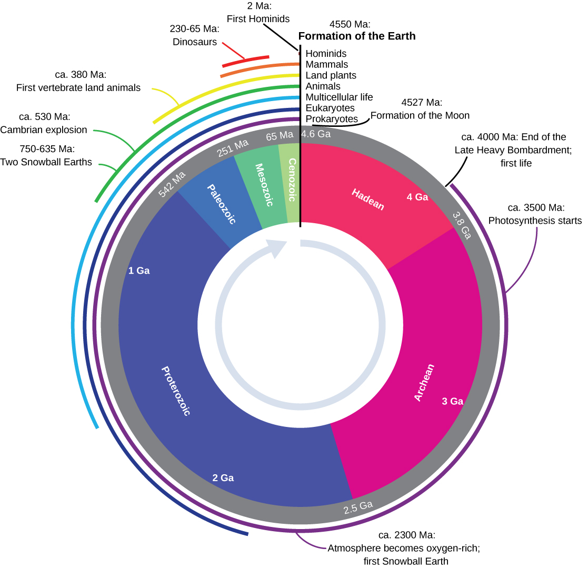

# Periodic Table of the Elements   {#eip-584}

 {: #fig-app01-01-01}

# Geological Time Clock   {#eip-928}

 {: #fig-app01-01-02}

# Geological Time Chart   {#eip-929}

 "){: #fig-app01-01-03}

# Measurements and the Metric System   {#eip-930}

<table id="tab-app01_01_01" summary="Measurements and the Metric System"><thead>
<tr><th colspan="5">Measurements and the Metric System</th></tr>
                <tr>
                    <th>Measurement</th>
                    <th>Unit</th>
                    <th>Abbreviation</th>
                    <th>Metric Equivalent</th>
                    <th>Approximate Standard Equivalent</th>
                </tr>
            </thead><tbody>
                <tr>
                    <td rowspan="6">Length</td>
                    <td>nanometer</td>
                    <td>nm</td>
                    <td>1 nm = 10−9 m</td>
                    <td rowspan="6">
                        <ul data-bullet-style=""><li>1 mm = 0.039 inch</li>
                            <li>1 cm = 0.394 inch</li>
                            <li>1 m = 39.37 inches</li>
                            <li>1 m = 3.28 feet</li>
                            <li>1 m = 1.093 yards</li>
                            <li>1 km = 0.621 miles</li>
                        </ul></td>
                </tr>        
                
                <tr>
                    <td>micrometer</td>
                    <td>µm</td>
                    <td>1 µm = 10−6 m</td>
                </tr>
                
                <tr>
                    <td>millimeter</td>
                    <td>mm</td>
                    <td>1 mm = 0.001 m</td>
                </tr>
                
                <tr>
                    <td>centimeter</td>
                    <td>cm</td>
                    <td>1 cm = 0.01 m</td>
                </tr>
                
                <tr>
                    <td>meter</td>
                    <td>m</td>
                    <td>
                        <ul data-bullet-style=""><li>1 m = 100 cm</li>
                            <li>1 m = 1000 mm</li>
                        </ul></td>
                </tr>
                <tr>
                    <td>kilometer</td>
                    <td>km</td>
                    <td>1 km = 1000 m</td>
                </tr>
              
                <tr>
                    <td rowspan="4">Mass</td>
                    <td>microgram</td>
                    <td>µg</td>
                    <td>1 µg = 10−6 g</td>
                    <td rowspan="4">
                        <ul data-bullet-style=""><li>1 g = 0.035 ounce</li>
                            <li>1 kg = 2.205 pounds</li>
                        </ul></td>
                </tr>
                <tr>
                    <td>milligram</td>
                    <td>mg</td>
                    <td>1 mg = 10−3 g</td>
                </tr>
                <tr>
                    <td>gram</td>
                    <td>g</td>
                    <td>1 g = 1000 mg</td>
                </tr>
                <tr>
                    <td>kilogram</td>
                    <td>kg</td>
                    <td>1 kg = 1000 g</td>
                </tr>                
                

                <tr>
                    <td rowspan="4">Volume</td>
                    <td>microliter</td>
                    <td>µl</td>
                    <td>1 µl = 10−6 l</td>
                    <td rowspan="4">
                        <ul data-bullet-style=""><li>1 ml = 0.034 fluid ounce</li>
                            <li>1 l = 1.057 quarts</li>
                            <li>1 kl = 264.172 gallons</li>
                        </ul></td>
                </tr>
                <tr>
                    <td>milliliter</td>
                    <td>ml</td>
                    <td>1 ml = 10−3 l</td>
                </tr>
                <tr>
                    <td>liter</td>
                    <td>l</td>
                    <td>1 l = 1000 ml</td>
                </tr>
                <tr>
                    <td>kiloliter</td>
                    <td>kl</td>
                    <td>1 kl = 1000 l</td>
                </tr>
                
                
                <tr>
                    <td rowspan="3">Area</td>
                    <td>square centimeter</td>
                    <td>cm2</td>
                    <td>1 cm2 = 100 mm2</td>
                    <td rowspan="3">
                        <ul data-bullet-style=""><li>1 cm2 = 0.155 square inch</li>                            
                            <li>1 m2 = 10.764 square feet</li>
                            <li>1 m2 = 1.196 square yards</li>
                            <li>1 ha = 2.471 acres</li>
                        </ul></td>
                </tr>
                <tr>
                    <td>square meter</td>
                    <td>m2</td>
                    <td>1 m2 = 10,000 cm2</td>
                </tr>
                <tr>
                    <td>hectare</td>
                    <td>ha</td>
                    <td>1 ha = 10,000 m2</td>
                </tr>                

                <tr>
                    <td>Temperature</td>
                    <td>Celsius</td>
                    <td>°C</td>
                    <td>—</td>
                    <td>1 °C = 5/9 × (°F − 32)</td>
                </tr>
                
            </tbody></table>

