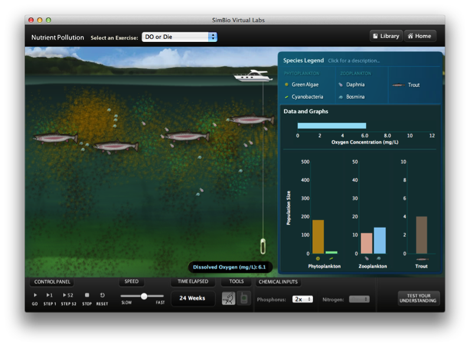

Concepts of Biology is intended for the introductory biology course for non-science majors taught at most two- and four-year colleges. The scope, sequence, and level of the program are designed to match typical course syllabi. This text includes interesting features that make connections between scientific concepts and the everyday world of students. Concepts of Biology conveys the major themes of biology, such as a foundation in evolution, and features a rich and engaging art program.

Welcome to *Concepts of Biology*, an OpenStax resource. This textbook has been created with several goals in mind: accessibility, customization, and student engagement—all while encouraging students toward high levels of academic scholarship. Instructors and students alike will find that this textbook offers a strong introduction to biology in an accessible format.

# About OpenStax   {#eip-723}

OpenStax is a non-profit organization committed to improving student access to quality learning materials. Our free textbooks are developed and peer-reviewed by educators to ensure they are readable, accurate, and meet the scope and sequence requirements of today’s college courses. Unlike traditional textbooks, OpenStax resources live online and are owned by the community of educators using them. Through our partnerships with companies and foundations committed to reducing costs for students, OpenStax is working to improve access to higher education for all. OpenStax is an initiative of Rice University and is made possible through the generous support of several philanthropic foundations.

# About OpenStax\'s Resources   {#eip-46}

OpenStax resources provide quality academic instruction. Three key features set our materials apart from others: they can be customized by instructors for each class, they are a “living” resource that grows online through contributions from science educators, and they are available free or for minimal cost.

## Customization   {#eip-189}

OpenStax learning resources are designed to be customized for each course. Our textbooks provide a solid foundation on which instructors can build, and our resources are conceived and written with flexibility in mind. Instructors can select the sections most relevant to their curricula and create a textbook that speaks directly to the needs of their classes and student body. Teachers are encouraged to expand on existing examples by adding unique context via geographically localized applications and topical connections.

*Concepts of Biology* can be easily customized using our online platform. Simply select the content most relevant to your syllabus and create a textbook that speaks directly to the needs of your class. *Concepts of Biology* is organized as a collection of sections that can be rearranged, modified, and enhanced through localized examples or to incorporate a specific theme of your course. This customization feature will help bring biology to life for your students and will ensure that your textbook truly reflects the goals of your course.

## Curation   {#eip-912}

To broaden access and encourage community curation, *Concepts of Biology* is “open source” licensed under a Creative Commons Attribution (CC-BY) license. The scientific community is invited to submit examples, emerging research, and other feedback to enhance and strengthen the material and keep it current and relevant for today’s students. You can submit your suggestions to info@openstaxcollege.org.

## Cost   {#eip-604}

Our textbooks are available for free online, and in low-cost print and e-book editions.

# About *Concepts of Biology*   {#eip-162}

*Concepts of Biology* is designed for the single-semester introduction to biology course for non-science majors, which for many students is their only college-level science course. As such, this course represents an important opportunity for students to develop the necessary knowledge, tools, and skills to make informed decisions as they continue with their lives. Rather than being mired down with facts and vocabulary, the typical non-science major student needs information presented in a way that is easy to read and understand. Even more importantly, the content should be meaningful. Students do much better when they understand why biology is relevant to their everyday lives. For these reasons, *Concepts of Biology* is grounded on an evolutionary basis and includes exciting features that highlight careers in the biological sciences and everyday applications of the concepts at hand. We also strive to show the interconnectedness of topics within this extremely broad discipline. In order to meet the needs of today’s instructors and students, we maintain the overall organization and coverage found in most syllabi for this course. A strength of *Concepts of Biology* is that instructors can customize the book, adapting it to the approach that works best in their classroom. Concepts of Biology also includes an innovative art program that incorporates critical thinking and clicker questions to help students understand—and apply—key concepts.

## Coverage and Scope   {#eip-643}

Our *Concepts of Biology* textbook adheres to the scope and sequence of most one-semester non-majors courses nationwide. We also strive to make biology, as a discipline, interesting and accessible to students. In addition to a comprehensive coverage of core concepts and foundational research, we have incorporated features that draw learners into the discipline in meaningful ways. Our scope of content was developed after surveying over a hundred biology professors and listening to their coverage needs. We provide a thorough treatment of biology’s fundamental concepts with a scope that is manageable for instructors and students alike.

* Unit 1: **The Cellular Foundation of Life**. Our opening unit introduces students to the sciences, including the process of science and the underlying concepts from the physical sciences that provide a framework within which learners comprehend biological processes. Additionally, students will gain solid understanding of the structures, functions, and processes of the most basic unit of life: the cell.
* Unit 2: **Cell Division and Genetics**. Our genetics unit takes learners from the foundations of cellular reproduction to the experiments that revealed the basis of genetics and laws of inheritance.
* Unit 3: **Molecular Biology and Biotechnology**. Students will learn the intricacies of DNA, protein synthesis, and gene regulation and current applications of biotechnology and genomics.
* Unit 4: **Evolution and the Diversity of Life**. The core concepts of evolution are discussed in this unit with examples illustrating evolutionary processes. Additionally, the evolutionary basis of biology reappears throughout the textbook in general discussion and is reinforced through special call-out features highlighting specific evolution-based topics. The diversity of life is explored with detailed study of various organisms and discussion of emerging phylogenetic relationships between and among bacteria, protist kingdoms, fungi, plants, and animals.
* Unit 5: **Animal Structure and Function**. An introduction to the form and function of the animal body is followed by chapters on the immune system and animal development. This unit touches on the biology of all organisms while maintaining an engaging focus on human anatomy and physiology that helps students connect to the topics.
* Unit 6: **Ecology**. Ecological concepts are broadly covered in this unit, with features highlighting localized, real-world issues of conservation and biodiversity.

## Pedagogical Foundation and Features   {#eip-443}

Because of the impact science has on students and society, an important goal of science education is to achieve a scientifically literate population that consistently makes informed decisions. Scientific literacy transcends a basic understanding of scientific principles and processes to include the ability to make sense of the myriad instances where people encounter science in day-to-day life. Thus, a scientifically literate person is one who uses science content knowledge to make informed decisions, either personally or socially, about topics or issues that have a connection with science. Concepts of Biology is grounded on a solid scientific base and designed to promote scientific literacy. Throughout the text, you will find features that engage the students in scientific inquiry by taking selected topics a step further.

* **Evolution in Action** features uphold the importance of evolution to all biological study through discussions like “Global Decline of Coral Reefs” and “The Red Queen Hypothesis.”
* **Career in Action** features present information on a variety of careers in the biological sciences, introducing students to the educational requirements and day-to-day work life of a variety of professions, such as forensic scientists, registered dietitians, and biogeographers.
* **Biology in Action** features tie biological concepts to emerging issues and discuss science in terms of everyday life. Topics include “Invasive Species” and “Photosynthesis at the Grocery Store.”

## Art and Animations that Engage   {#eip-793}

Our art program takes a straightforward approach designed to help students learn the concepts of biology through simple, effective illustrations, photos, and micrographs. Concepts of Biology also incorporates links to relevant animations and interactive exercises that help bring biology to life for students.

* **Art Connection** features call out core figures in each chapter for student attention. Questions about key figures, including clicker questions that can be used in the classroom, engage students’ critical thinking and analytical abilities to ensure their genuine understanding of the concept at hand.
* **Concepts in Action** features direct students to online interactive exercises and animations to add a fuller context and examples to core content.

# About Our Team   {#eip-759}

*Concepts of Biology* would not be possible if not for the tremendous contributions of the authors and community reviewing team

## Senior Contributing Authors   {#eip-id8320483}

| Samantha Fowler | Clayton State University |
| Rebecca Roush | Sandhills Community College |
| James Wise | Hampton University |
{: #eip-919 data-frame="none" data-colsep="0" data-rowsep="0" summary="A listing of senior contributors to Concepts of Biology" data-label=""}

## Contributing Authors and Reviewers   {#eip-id4438849}

| Mark Belk | Brigham Young University |
| Lisa Boggs | Southwestern Oklahoma State University |
| Sherryl Broverman | Duke University |
| David Byres | Florida State College at Jacksonville |
| Aaron Cassill | The University of Texas at San Antonio |
| Karen Champ | College of Central Florida |
| Sue Chaplin | University of St. Thomas |
| Diane Day | Clayton State University |
| Jean DeSaix | University of North Carolina at Chapel Hill |
| David Hunnicutt | St. Norbert College |
| Barbara Kuehner | Hawaii Community College |
| Brenda Leady | University of Toledo |
| Bernie Marcus | Genesee Community College |
| Flora Mhlanga | Lipscomb University |
| Madeline Mignone | Dominican College |
| Elizabeth Nash | Long Beach City College |
| Mark Newton | San Jose City College |
| Diana Oliveras | University of Colorado Boulder |
| Ann Paterson | Williams Baptist College |
| Joel Piperberg | Millersville University |
| Nick Reeves | Mt. San Jacinto College |
| Ann Reisenauer | San Jose State University |
| Lynn Rumfelt | Gordon College |
| Michael Rutledge | Middle Tennessee State University |
| Edward Saiff | Ramapo College of New Jersey |
| Brian Shmaefsky | Kingwood College |
| Gary Shultz | Marshall University |
| Donald Slish | SUNY Plattsburgh |
| Anh-Hue Tu | Georgia Southwestern State University |
| Elena Zoubina | Bridgewater State University |
{: #eip-825 data-colsep="0" data-rowsep="0" data-frame="none" summary="Faculty Contributors" data-label=""}

# Learning Resources   {#eip-128}

Wiley Plus for Biology-Fall 2013 PilotWileyPLUS provides an engaging online environment for effective teaching and learning. WileyPLUS builds students’ confidence because it takes the guesswork out of studying by providing a clear roadmap; what to do, how to do it, and if they did it right. With WileyPLUS, students take more initiative. Therefore, the course has a greater impact on their learning experience. Adaptive tools provide students with a personal, adaptive learning experience so they can build their proficiency on topics and use their study time most effectively. Please let us know if you would like to participate in a Fall 2013 Pilot.

Concepts of Biology Powerpoint Slides (faculty only)The PowerPoint slides are based on the extensive illustrations from College Physics. They can be edited, incorporated into lecture notes, and you are free to share with anyone in the community. This is a restricted item requiring faculty registration. NOTE: This file is very large and may take some time to download.

SimBio (Laboratory)SimBio’s interactive modules (virtual labs and interactive tutorials and chapters) provide engaging, discovery-based learning tools that complement many of the chapters of Concepts of Biology. SimBio is best known for their EcoBeaker® and EvoBeaker® suites of simulated ecology and evolution laboratories that guide students through the “discovery” of important concepts via a mix of structured and open-ended experimentation on simulated systems. In response to popular demand, SimBio has begun applying the same powerful approaches to topics in cell biology, genetics, and neurobiology. All of SimBio’s modules include instant-feedback questions that enhance student comprehension and auto-graded questions that facilitate implementation. * * *
{: data-type="newline"}

   

